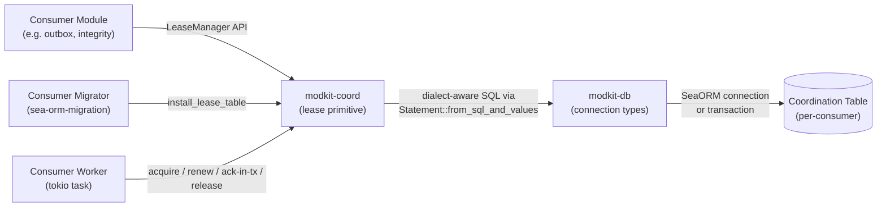
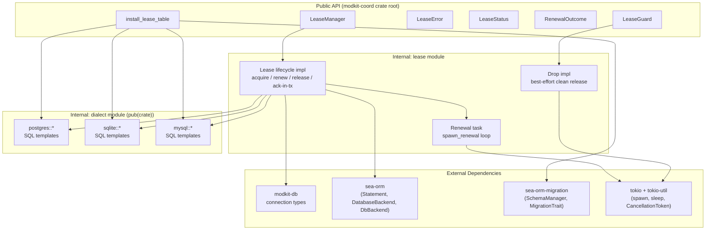
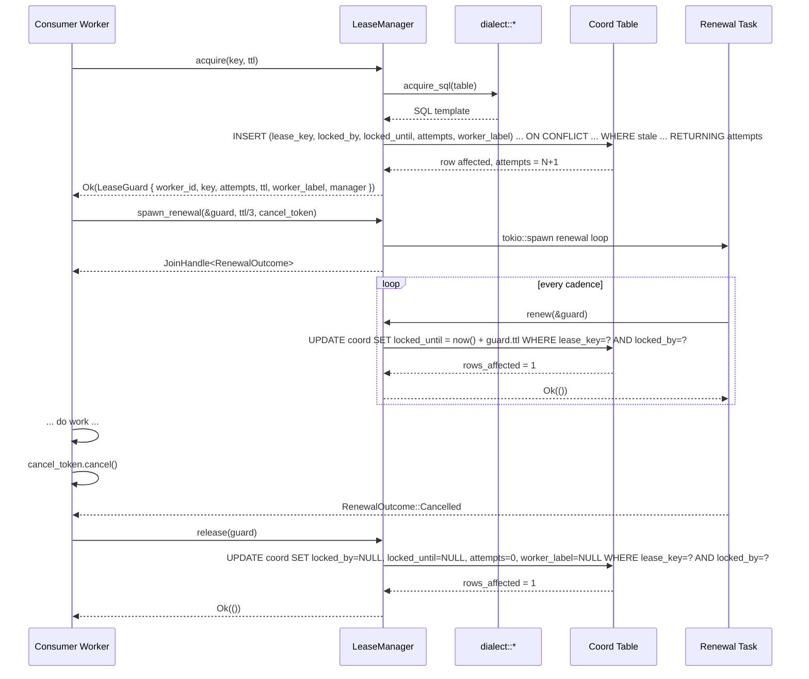
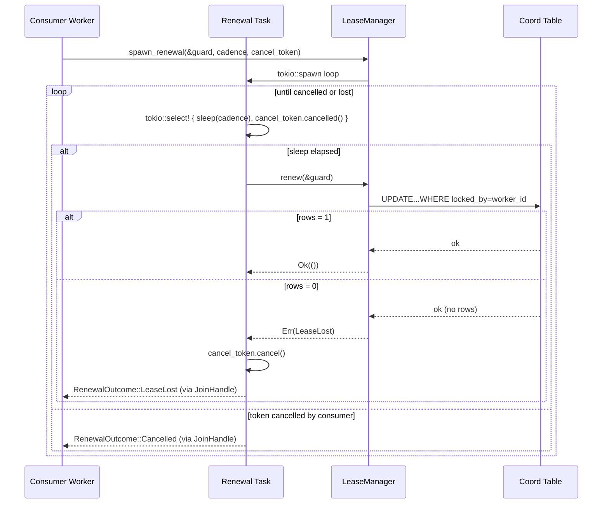

# Technical Design — modkit-coord

Created: 2026-05-07 by Diffora

- [ ] `p3` - **ID**: `cpt-modkit-coord-design-lease`

<!-- toc -->

- [1. Architecture Overview](#1-architecture-overview)
  - [1.1 Architectural Vision](#11-architectural-vision)
  - [1.2 Architecture Drivers](#12-architecture-drivers)
  - [1.3 Architecture Layers](#13-architecture-layers)
- [2. Principles & Constraints](#2-principles--constraints)
  - [2.1 Design Principles](#21-design-principles)
  - [2.2 Constraints](#22-constraints)
- [3. Technical Architecture](#3-technical-architecture)
  - [3.1 Domain Model](#31-domain-model)
  - [3.2 Component Model](#32-component-model)
  - [3.3 API Contracts](#33-api-contracts)
  - [3.4 Internal Dependencies](#34-internal-dependencies)
  - [3.5 External Dependencies](#35-external-dependencies)
  - [3.6 Interactions & Sequences](#36-interactions--sequences)
  - [3.7 Database schemas & tables](#37-database-schemas--tables)
- [4. Additional Context](#4-additional-context)
  - [4.1 Cargo Features and Module Layout](#41-cargo-features-and-module-layout)
  - [4.2 Reliability and Operations](#42-reliability-and-operations)
  - [4.3 Testing Architecture](#43-testing-architecture)
  - [4.4 Open Questions](#44-open-questions)
  - [4.5 Known Limitations](#45-known-limitations)
- [5. Traceability](#5-traceability)

<!-- /toc -->

## 1. Architecture Overview

### 1.1 Architectural Vision

`modkit-coord` is the Cyber Fabric platform's home crate for distributed coordination primitives. v1 ships exactly one primitive — an exclusive distributed lease for background-job consumers — implemented as a self-contained internal module behind a `lease` cargo feature that is enabled by default. The crate's public surface is intentionally narrow: a `LeaseManager` factory, an RAII `LeaseGuard`, a `LeaseError` enum, a `LeaseStatus` read-only struct, a `RenewalOutcome` enum, and a single `install_lease_table` migration helper. All dialect-aware SQL, all worker-identity bookkeeping, and all transaction-shape decisions live behind that surface so consumers neither write nor inspect coordination SQL.

The architecture is built on three load-bearing decisions. First, the lease primitive operates against a consumer-supplied coordination table by name via `sea_orm::Statement::from_sql_and_values`, **not** via a SeaORM `Entity`; this keeps `modkit-coord` independent of the consumer's storage layer and lets multiple consumers reuse the same library against differently-named tables in the same crate workspace. Second, dialect-specific SQL templates are emitted from a private `dialect` module (one submodule per backend: `postgres`, `sqlite`, `mysql`) parameterised by the runtime `sea_orm::DatabaseBackend` discriminator, mirroring the proven pattern in `libs/modkit-db/src/outbox/dialect.rs`. Third, the five `modkit-coord`-owned columns (`lease_key`, `locked_by`, `locked_until`, `attempts`, `worker_label`) are a fixed contract; consumers MAY co-locate their own state columns in the same coordination table, but the library reads and writes only its five columns, making consumer-added columns invisible to lease SQL by construction. Of the five, `locked_by` carries the fence-token role (UUIDv4 generated on every acquire); `worker_label` is the opaque human-readable text the library writes alongside `locked_by` for diagnostic logging only — it has no SQL semantics in any predicate.

The crate is structured as a multi-primitive home so that future coordination primitives (semaphore, barrier, counter) can land as additional opt-in cargo features without breaking the lease surface and without forcing consumers to depend on functionality they do not need. v1 declares the `lease`, `semaphore`, `barrier`, and `counter` feature names in `Cargo.toml`; only `lease` has an implementation, the others are empty placeholders so adding a real implementation later is an additive, non-breaking change.

The library targets the Cyber Fabric multi-replica deployment topology. It generalises one existing in-tree lease implementation (`modkit-db::outbox` per-partition lease) and provides the primitive that the planned `account-management/integrity_check_runs` reconciler is sized to adopt as its first implementation. The outbox migration is owned by the outbox team in a follow-up PR; the AM reconciler lands fresh as a `modkit-coord` consumer rather than as a port of pre-existing code (the AM module currently ships only `docs/`). The public surface defined here is sized to satisfy both shapes — partitioned consumers (key per partition, the outbox case) and singleton consumers (one fixed key, the AM case) — without API divergence.

#### System Context



**System actors by PRD ID**

- `cpt-modkit-coord-actor-module-author` writes consumer code that invokes `LeaseManager`, holds a `LeaseGuard`, and supplies the coordination-table name at construction time.
- `cpt-modkit-coord-actor-platform-maintainer` owns the dialect templates, the cross-backend test matrix, and any future feature additions that land in the crate.
- `cpt-modkit-coord-actor-consumer-migrator` calls `install_lease_table(manager, table_name)` once from the consumer's existing `MigrationTrait` impl.
- `cpt-modkit-coord-actor-consumer-worker` is a tokio task that acquires, optionally spawns a renewal heartbeat, performs work via lease-guarded transactions, and releases the lease.
- `cpt-modkit-coord-actor-database` is the PostgreSQL / SQLite / MySQL backend that hosts both the coordination table and the consumer's work data in the same database instance.

### 1.2 Architecture Drivers

#### Functional Drivers

| Requirement | Design Response |
|-------------|-----------------|
| `cpt-modkit-coord-fr-acquire` | `LeaseManager::acquire(key, ttl)` (with optional per-call worker-label override via `acquire_with_label`) emits a single dialect-specific `INSERT ... ON CONFLICT DO UPDATE SET locked_by = ?, locked_until = now() + ttl, attempts = ..., worker_label = ? WHERE locked_until IS NULL OR locked_until < now() RETURNING attempts` statement (PG/SQLite) or an explicit `BEGIN; INSERT IGNORE; UPDATE ... WHERE ...; SELECT attempts ...; COMMIT;` three-statement sequence inside one transaction (MySQL — see `cpt-modkit-coord-design-known-mysql-acquire-3-statement`) so contention is resolved atomically, the post-increment `attempts` value is returned for use in the `LeaseGuard`, and `worker_label` is overwritten on every acquire (so reclaim erases the previous holder's label by design). The library validates `key.as_bytes().len() <= 255` before the round-trip. The acquire-time `ttl` is captured by the returned `LeaseGuard` and reused as the default for subsequent `renew` and `with_ack_in_tx` calls. |
| `cpt-modkit-coord-fr-renew` | `LeaseManager::renew(&LeaseGuard)` emits `UPDATE coord_table SET locked_until = now() + guard.ttl WHERE lease_key = ? AND locked_by = ?` and treats zero affected rows as `LeaseError::LeaseLost`. `LeaseManager::renew_with(&LeaseGuard, ttl)` is the explicit-override variant; it emits the same statement with the override TTL bound. |
| `cpt-modkit-coord-fr-release` | `LeaseManager::release(LeaseGuard)` consumes the guard, emits `UPDATE coord_table SET locked_by = NULL, locked_until = NULL, attempts = 0, worker_label = NULL WHERE lease_key = ? AND locked_by = ?`, and treats zero affected rows as already-evicted (logged at warn, returned as success). `Drop` for `LeaseGuard` always performs clean release on a tokio spawn (see `cpt-modkit-coord-component-lease-guard` for the runtime-availability behaviour). |
| `cpt-modkit-coord-fr-release-with-retry` | `LeaseManager::release_with_retry(LeaseGuard)` emits `UPDATE ... SET locked_by = NULL, locked_until = NULL, worker_label = NULL WHERE lease_key = ? AND locked_by = ?` — same as clean release but **without** resetting `attempts`. |
| `cpt-modkit-coord-fr-renewal-task` | `LeaseManager::spawn_renewal(&LeaseGuard, cadence, CancellationToken)` returns a `JoinHandle<RenewalOutcome>` for a tokio task that loops `renew(guard).await` on `cadence`. On `LeaseLost` or `RenewFailed { last_error }` the task cancels the supplied token and exits; the consumer's main work observes cancellation and aborts. A panic inside the renewal task surfaces via `JoinHandle::await -> Err(JoinError)` and is contractually equivalent to `RenewalOutcome::RenewFailed` for cancellation propagation: the task's outermost `Drop` cancels the token before unwinding, so the consumer's main work observes the same abort signal in either case. |
| `cpt-modkit-coord-fr-ack-in-tx` | `LeaseManager::with_ack_in_tx(&LeaseGuard, &DbTx, F)` runs the consumer's closure inside the consumer's transaction (using the guard's captured TTL), then emits an in-tx ownership-validation UPDATE (`SET locked_until = now() + guard.ttl WHERE lease_key = ? AND locked_by = ?`); zero rows → return `LeaseError::LeaseLost`. `with_ack_in_tx_with(&LeaseGuard, &DbTx, ttl, F)` is the explicit-override variant. **The library never commits or rolls the transaction back itself.** The rollback path is realised by the consumer's outer call shape: `with_ack_in_tx` is invoked from inside a `Db::transaction_ref(\|tx\| async { ... })` (or `transaction_ref_mapped`) closure, the closure propagates `LeaseLost` via `?`, and `transaction_ref` — observing `Err` from its closure — issues the actual rollback against the underlying `DatabaseTransaction` it owns. `DbTx<'_>` is a borrow-only wrapper over `&DatabaseTransaction`; dropping the wrapper does nothing on its own. The contract is pinned by a positive + negative integration test pair (`lease_loss_during_write_test`): the positive variant uses `transaction_ref` and propagates `LeaseLost`, the negative variant intentionally swallows the error and asserts that corruption *does* occur, so the consumer-owned rollback contract cannot be silently violated by future API changes. |
| `cpt-modkit-coord-fr-stale-reclaim` | The `WHERE locked_until IS NULL OR locked_until < now()` predicate inside the acquire statement (single statement on PG/SQLite, two-step in one explicit MySQL tx) is what realises stale reclaim — there is no separate API. Stale reclaim is the same atomic path as a fresh acquire and overwrites `worker_label` along with `locked_by`. |
| `cpt-modkit-coord-fr-attempts-counter` | The acquire statement includes `attempts = attempts + 1` (or stores the post-increment value via `RETURNING`); `LeaseGuard` exposes the post-increment value as a read-only accessor. Clean release sets `attempts = 0`; retry release omits that assignment so the counter survives the cycle. |
| `cpt-modkit-coord-fr-migration-helper` | `modkit_coord::install_lease_table(manager: &SchemaManager, table_name: &str)` introspects `manager.get_database_backend()` and emits a dialect-appropriate `CREATE TABLE IF NOT EXISTS` for the five library-owned columns (`lease_key`, `locked_by`, `locked_until`, `attempts`, `worker_label`). Re-runs are no-ops via `IF NOT EXISTS`; structural mismatches surface as `DbErr` rather than silent corruption. |
| `cpt-modkit-coord-fr-table-naming` | `LeaseManager::new(db, table_name, worker_label)` validates `table_name` against `^[A-Za-z_][A-Za-z0-9_]{0,62}$` and returns `LeaseError::InvalidTableName` on mismatch; the migration helper applies the same regex before any SQL emission. |

#### NFR Allocation

| NFR ID | NFR Summary | Allocated To | Design Response | Verification Approach |
|--------|-------------|--------------|-----------------|----------------------|
| `cpt-modkit-coord-nfr-cross-backend-parity` | Semantically equivalent behaviour on PostgreSQL, SQLite, MySQL | Private `dialect` module with one submodule per backend, each emitting templated SQL parameterised by table name | Every public `LeaseManager` method dispatches on `sea_orm::DatabaseBackend` to one of `dialect::postgres`, `dialect::sqlite`, `dialect::mysql`; the templates encode dialect-specific syntax (PG `ON CONFLICT`, SQLite `ON CONFLICT`, MySQL `INSERT ... ON DUPLICATE KEY UPDATE` or two-step `INSERT IGNORE` + conditional `UPDATE` inside one explicit tx) but agree on the observable outcome contract. | Cross-backend integration suite runs every public-API integration test on PG (testcontainers), SQLite (`:memory:`), and MySQL (testcontainers); behavioural divergence between backends fails the build. |
| `cpt-modkit-coord-nfr-sql-encapsulation` | Zero raw SQL exposed to consumers | `dialect` module is `pub(crate)`, all SQL templates are `&'static str` constants, no public re-export of strings | The public surface (`LeaseManager`, `LeaseGuard`, `LeaseError`, `LeaseStatus`, `RenewalOutcome`, `install_lease_table`) returns no SQL strings, accepts no SQL strings, and does not document any SQL shape; consumers configure behaviour via Rust types only. | `cargo public-api` audit shows no `&str` parameter or return value documents SQL on the public surface; integration tests confirm the only consumer-visible parameter is the table name (a Rust string, validated). |
| `cpt-modkit-coord-nfr-no-fs-dep` | Zero filesystem reads or writes | Crate does not depend on `std::fs`, `std::path`, or any file-IO crate | All coordination state lives in the database; there is no temp file, no lock file, no PID file. The crate's `Cargo.toml` lists no filesystem-IO dependencies, and the library's runtime code uses only `sea-orm`, `tokio` (sync/time/rt only), `tokio-util`, `uuid`, `time`, `tracing`, and `thiserror`. | PR review enforces the import allowlist; CI runs `cargo tree -e features` to detect any new transitive filesystem dependency. |
| `cpt-modkit-coord-nfr-modkit-db-compat` | Integrates with `modkit-db` connection layer | `LeaseManager` accepts the public `modkit_db::Db` handle (re-exported from `libs/modkit-db/src/lib.rs` alongside `DbConn` and `DbTx`; `modkit_db::DbError` is exported separately from the same crate root); transactions for `with_ack_in_tx` are passed in as `&DbTx<'_>` (the borrow-only wrapper around `&sea_orm::DatabaseTransaction` that `modkit-db` already exposes — its `tx` field is `pub(crate)`, so the only construction path is via `Db::transaction_ref` / `transaction_ref_mapped` / sibling methods). | The crate has no parallel connection-configuration surface; consumers configure their database via `modkit-db`'s secure-builder, then hand the resulting `Db` to `modkit-coord` (and call `with_ack_in_tx` from inside a `Db::transaction_ref` closure for the ack path). The migration helper accepts `&SchemaManager` from `sea-orm-migration`, the standard handle that consumer migrators already hold. | Worked-example test in the repository imports `modkit-db` and `modkit-coord` together and demonstrates a single `modkit-db::Db` serves both data writes and lease operations. |
| `cpt-modkit-coord-nfr-test-coverage` | Seven mandatory test categories on every backend | Integration test suite under `libs/modkit-coord/tests/` with backend matrix | `concurrent_acquire_test`, `lease_loss_during_write_test` (positive + negative variants), `renewal_cancellation_test`, `migration_idempotency_test`, `retry_release_preserves_attempts_test`, `co_located_consumer_columns_test`, and `worker_label_round_trip_test` are present; concurrent-acquire, lease-loss-during-write, retry-release, co-located-columns, and worker-label tests run on PG / SQLite / MySQL via the same harness. | CI enforces all seven tests run green on every PR; introducing a new public method requires a corresponding test addition to the matrix. |

#### Key ADRs

No local ADRs are required for v1. The design decisions captured in this DESIGN — single-crate-multi-primitive layout, raw-SQL-by-table-name (not SeaORM `Entity`), five-column fixed contract (`lease_key`, `locked_by`, `locked_until`, `attempts`, `worker_label`), `Drop`-always-clean-release semantics, optional renewal task, TTL captured by `LeaseGuard` at acquire — are in-scope for the PRD's `cpt-modkit-coord-fr-*` requirements and are recorded here directly. ADRs will be added if and when a future change supersedes one of these decisions; the PRD's open questions (`§13` of the parent PRD) are listed as `cpt-modkit-coord-design-open-question-*` in §4.4 below for tracking.

### 1.3 Architecture Layers

- [ ] `p3` - **ID**: `cpt-modkit-coord-tech-stack`

| Layer | Responsibility | Technology |
|-------|---------------|------------|
| Public API | `LeaseManager`, `LeaseGuard`, `LeaseError`, `LeaseStatus`, `RenewalOutcome`, `install_lease_table` re-exported from crate root | Rust, `thiserror`, `uuid` |
| Lease lifecycle | Acquire / renew / ack-in-tx / release / release-with-retry / spawn-renewal orchestration; worker-identity generation; `LeaseGuard` RAII (TTL captured at acquire) | Rust, `tokio::sync`, `tokio::time`, `tokio::task`, `tokio_util::sync::CancellationToken`, `time::OffsetDateTime` |
| Dialect | Per-backend SQL templates parameterised by table name; backend dispatch on `sea_orm::DatabaseBackend` | Rust, `sea_orm::Statement::from_sql_and_values`, `sea_orm::DatabaseBackend` |
| Integration | Connection (`modkit_db::Db`) / transaction (`&modkit_db::DbTx<'_>`) handles passed in by consumer; migration helper invoked by consumer migrator | `modkit-db` connection types (`Db`, `DbTx`), `sea-orm-migration` `SchemaManager` |

## 2. Principles & Constraints

### 2.1 Design Principles

#### SQL Encapsulation Above All

- [ ] `p2` - **ID**: `cpt-modkit-coord-principle-sql-encapsulation`

The library MUST NOT leak SQL strings, table-shape assertions, or backend conditionals into consumer code. The `dialect` module is `pub(crate)`; every SQL template is owned and rendered inside `modkit-coord`. The only consumer-supplied string is the coordination table name, and it is validated against a strict identifier regex before any SQL emission so a typo or injected fragment is rejected at construction time. The five library-owned columns and their types are fixed; consumers extending the table with their own columns interact with those columns through their own `Entity` or SQL inside `with_ack_in_tx` closures, never via `modkit-coord`.

**Drivers**: `cpt-modkit-coord-fr-acquire`, `cpt-modkit-coord-fr-migration-helper`, `cpt-modkit-coord-fr-table-naming`, `cpt-modkit-coord-nfr-sql-encapsulation`

**ADR Trace**: No local ADR; principle inherits the SQL-encapsulation policy already documented in `libs/modkit-db/src/outbox/dialect.rs` and the `modkit-db::advisory_locks` module.

#### Atomic Lease-State Transitions

- [ ] `p2` - **ID**: `cpt-modkit-coord-principle-atomicity`

Every observable lease-state transition (acquire-with-stale-sweep, renew, release, release-with-retry, ack-in-tx ownership validation) MUST be expressible as a single atomic database statement against the coordination row, except for the MySQL acquire path which uses a two-statement sequence inside one explicit transaction because `INSERT ... ON DUPLICATE KEY UPDATE` does not admit the conditional stale-only update predicate. Two-holder windows, half-applied renews, and interleaved acquire/release outcomes are correctness defects, not platform differences. This principle is the foundation of `cpt-modkit-coord-nfr-cross-backend-parity`: behavioural parity across PG / SQLite / MySQL is impossible without picking the atomicity grain identically across backends, so the dialect templates are written together, reviewed together, and changed together.

**Drivers**: `cpt-modkit-coord-fr-acquire`, `cpt-modkit-coord-fr-renew`, `cpt-modkit-coord-fr-ack-in-tx`, `cpt-modkit-coord-fr-stale-reclaim`, `cpt-modkit-coord-nfr-cross-backend-parity`

**ADR Trace**: No local ADR; principle is recorded in this DESIGN as a foundational invariant.

#### Consumer Owns Its Database

- [ ] `p2` - **ID**: `cpt-modkit-coord-principle-consumer-owns-db`

The consumer module owns its database, its connection lifecycle, its migrator stack, and its transaction boundaries. `modkit-coord` is a passive participant: it accepts a connection at `LeaseManager::new`, accepts a transaction at `with_ack_in_tx`, accepts a `SchemaManager` at `install_lease_table`, and never opens its own connections. This keeps consumer infrastructure (observability, security policy, connection pooling, secrets management) uniform across the lease layer and the rest of the consumer's data access, satisfying `cpt-modkit-coord-nfr-modkit-db-compat`.

**Drivers**: `cpt-modkit-coord-fr-ack-in-tx`, `cpt-modkit-coord-fr-migration-helper`, `cpt-modkit-coord-nfr-modkit-db-compat`

**ADR Trace**: No local ADR; principle is recorded in this DESIGN.

#### Drop Always Performs Clean Release

- [ ] `p2` - **ID**: `cpt-modkit-coord-principle-drop-clean-release`

`LeaseGuard::drop` always attempts a clean release (resets `attempts` to zero), never a retry release. Consumers needing failure-streak preservation across an unwinding panic call `release_with_retry` explicitly **before** any fallible code path that they expect might panic. The alternative — a configurable `Drop` policy or a panic-payload-introspecting `Drop` — is rejected because panic introspection is brittle in async runtimes (the `Drop` may run on a different runtime task than the panic, with its own scheduling guarantees), and a configurable policy multiplies the surface area of the lease lifecycle without adding correctness. This pin is also why the PRD's `cpt-modkit-coord-fr-release` rationale block calls out the trade-off explicitly: deterministic semantics for the implementer of the lease library is more valuable than ergonomic panic recovery for the consumer.

**Drivers**: `cpt-modkit-coord-fr-release`, `cpt-modkit-coord-fr-release-with-retry`, `cpt-modkit-coord-fr-attempts-counter`

**ADR Trace**: No local ADR; principle is recorded in this DESIGN with the trade-off rationale.

### 2.2 Constraints

#### Same-Database Co-Location

- [ ] `p2` - **ID**: `cpt-modkit-coord-constraint-same-db`

The coordination table and the consumer's work data MUST live in the same database instance. Lease-guarded write atomicity (`cpt-modkit-coord-fr-ack-in-tx`) requires the lease-validation UPDATE and the consumer's work writes to share one transaction; SeaORM transactions cannot span database instances. Consumers that violate this constraint forfeit the atomicity guarantee — `modkit-coord` MUST surface this constraint prominently in the README and in `LeaseManager::new` rustdoc.

**ADRs**: None.

#### Identifier-Format Table Names

- [ ] `p2` - **ID**: `cpt-modkit-coord-constraint-table-name-format`

The coordination table name supplied by the consumer MUST match `^[A-Za-z_][A-Za-z0-9_]{0,62}$` (max 63 characters, identifier-style, ASCII only). The library validates the name at `LeaseManager::new` and at `install_lease_table` invocation; mismatches return `LeaseError::InvalidTableName` and `DbErr::Custom` respectively. The 63-character ceiling is the intersection of PostgreSQL's identifier limit (63 bytes) and a conservative cross-backend bound; longer names would silently truncate on PG. The recommended convention `<module-slug>_coord_leases` (for example, `am_coord_leases`, `outbox_coord_leases`) is documented in the crate README but not enforced by the library.

**ADRs**: None.

#### Workspace Dependency Discipline

- [ ] `p2` - **ID**: `cpt-modkit-coord-constraint-workspace-deps`

All dependencies MUST come from the workspace root `Cargo.toml`. The crate has no direct version pins; it inherits `sea-orm`, `sea-orm-migration`, `tokio`, `tokio-util`, `uuid`, `time`, `tracing`, and `thiserror` from the workspace. This keeps `modkit-coord` aligned with `modkit-db` and the rest of the platform on a single set of dependency versions and avoids the duplicate-version footgun that has bitten other `modkit-*` crates.

**ADRs**: None.

#### No Filesystem Dependency

- [ ] `p2` - **ID**: `cpt-modkit-coord-constraint-no-fs`

The crate MUST NOT read or write the filesystem at runtime. This constraint exists because `modkit-db::advisory_locks` is the existing per-host file-based primitive in the platform, and `modkit-coord` exists precisely to fill the no-filesystem gap. Reintroducing a filesystem dependency would defeat the primitive's purpose and create an ambiguity for consumers about which primitive to choose.

**ADRs**: None.

## 3. Technical Architecture

### 3.1 Domain Model

**Technology**: Rust types (no SeaORM `Entity` for the coordination table; the lease state is read and written via raw `sea_orm::Statement` against the five library-owned columns).

**Planned location**: `libs/modkit-coord/src/lease.rs` (private internal organiser for `LeaseManager` and `LeaseGuard` implementations); types re-exported from `libs/modkit-coord/src/lib.rs`.

**Core Entities**:

| Entity | Description | Schema |
|--------|-------------|--------|
| `LeaseManager` | Public factory and operation entry point. Holds the consumer-supplied `modkit_db::Db` handle, the coordination-table name, the runtime `DatabaseBackend` discriminator captured at construction time, the optional default `worker_label` configured by the consumer, and a `BTreeMap`-free immutable shape that makes the manager cheap to clone and share. Consumers typically wrap one in `Arc<LeaseManager>` and share it across worker tasks. | Public Rust struct; not persisted. |
| `LeaseGuard` | RAII handle returned by `acquire`. Carries the freshly-generated `worker_id: Uuid` (UUIDv4 fence token), the lease `key: String`, the post-increment `attempts: i64` value as observed at acquire time, the `ttl: Duration` captured at acquire time (used as the default for subsequent `renew` / `with_ack_in_tx`), the resolved `worker_label: Option<String>` (the value actually written to the row — either the manager's default or the per-call override), and an `Arc<LeaseManager>` back-reference so `Drop` can spawn a clean-release task. Public read accessors expose `worker_id`, `attempts`, `key`, `ttl`, and `worker_label`; the internal manager reference is private. **`LeaseGuard` is intentionally not `Clone`** — duplicating the fence-token state would invite consumers to call release / renew through two paths against the same row, defeating single-holder semantics. | Public Rust struct; not persisted. |
| `LeaseStatus` | Read-only snapshot returned alongside `LeaseGuard` for telemetry-only consumers. Contains `key`, `worker_id`, `attempts`, `worker_label`, `locked_until` (the extended-to time stamp). Immutable; `Clone`-able because it carries no fence-token authority. | Public Rust struct; not persisted. |
| `LeaseError` | `#[non_exhaustive]` enum with variants `LeaseHeld`, `LeaseLost`, `InvalidTableName(String)`, `KeyTooLong { len: usize, max: usize }`, `InvalidWorkerLabel { len: usize, max: usize }`, `Database(Box<modkit_db::DbError>)`, `RenewFailed { last_error: Box<modkit_db::DbError> }`. Implements `From<modkit_db::DbError> for LeaseError::Database` (boxing on conversion); `modkit_db::DbError` already provides `From<sea_orm::DbErr>`, so the SQL-execution layer's errors propagate through one chained conversion. Both variants that carry `DbError` use `Box` consistently to keep `Result<T, LeaseError>` compact on hot return paths; a non-exhaustive enum with two boxed and otherwise unit/struct variants stays under 24 bytes on 64-bit targets. No mapping to `modkit-canonical-errors` — consumers map at their own boundary. | Public Rust enum; not persisted. |
| `RenewalOutcome` | Enum returned by the renewal task `JoinHandle`. Variants: `Cancelled`, `LeaseLost`, `RenewFailed { last_error: modkit_db::DbError }`. The variant tells the consumer why the renewal task exited; pairs with the cancellation token the renewal task cancels on lease-lost or renew-failed. A panic inside the renewal task surfaces as `JoinHandle::await -> Err(JoinError)`; before the unwind crosses the task boundary, the renewal task's outermost guard cancels the supplied token, so the consumer's main work observes the same abort signal it would have seen for `LeaseLost` / `RenewFailed`. | Public Rust enum; not persisted. |
| Coordination row | The persisted lease state, expressed as five library-owned columns in the consumer-supplied coordination table. Identified by `lease_key` (the row-side column name; the Rust-side accessor is `LeaseGuard::key()`). Touched only by `dialect`-emitted SQL. | See `§3.7` for per-backend column types. |

**Relationships**:

- `LeaseManager` → coordination row: many-to-many via the `lease_key` column. One manager can acquire many keys; one key can be acquired by many managers across replicas (one at a time, by definition).
- `LeaseGuard` → coordination row: 1:1 via `(LeaseGuard.key ↔ row.lease_key, LeaseGuard.worker_id ↔ row.locked_by)`. The worker identity is the fence token: every guarded UPDATE includes `WHERE locked_by = ?` so a contender takeover invalidates all subsequent guarded operations atomically. The Rust accessor stays `LeaseGuard::key()` for API ergonomics; the SQL column is `lease_key` to avoid MySQL's reserved-word collision.
- `LeaseManager` → `LeaseGuard`: composition. The manager constructs guards on `acquire`; the guard holds an `Arc<LeaseManager>` for `Drop`-time release.
- Consumer state columns → coordination row: optional 1:1 co-located on the same row keyed by `lease_key`. The library reads and writes only the five owned columns; consumer columns are visible to consumer SQL inside `with_ack_in_tx` closures and elsewhere in consumer code.

#### Value Objects and Invariants

| Value Object / Invariant | Definition | Enforced By |
|--------------------------|------------|-------------|
| `worker_id: Uuid` | UUIDv4 generated at `acquire` time. Unique per acquire call. Used as the fence token in `WHERE locked_by = ?` predicates. | `uuid::Uuid::new_v4` at `LeaseManager::acquire`; never re-used across acquires. |
| `worker_label: Option<String>` | Opaque, human-readable text written to the `worker_label` column on every acquire. **Diagnostic only — not a fence token, not part of any SQL predicate.** Bounded to 255 bytes (UTF-8) at `LeaseManager::new` and at per-call override; longer labels are rejected with `LeaseError::InvalidWorkerLabel` (variant added under the existing `#[non_exhaustive]` enum). | Length bound validated at construction / override; SQL emission writes the value verbatim. The library never reads the column back into a fence-decision predicate. |
| `ttl: Duration` (captured on guard) | The `Duration` supplied to `acquire`, captured by the returned `LeaseGuard` and reused by `renew(&guard)` / `with_ack_in_tx(&guard, ...)`. | Stored as a private field on `LeaseGuard`; per-call override goes through `renew_with` / `with_ack_in_tx_with`. |
| `attempts: i64` | Per-key counter incremented atomically on every acquire (including stale reclaim). Reset to zero on clean release **only when the holder still owns the row at release time** (the release UPDATE is fenced by `WHERE locked_by = ?`, so if a contender has already reclaimed, the UPDATE matches zero rows and `attempts` is left untouched). Preserved on retry release. See `cpt-modkit-coord-design-known-drop-lost-attempts` for the Drop-after-lease-loss case. | Acquire SQL `attempts = attempts + 1`; release SQL conditionally sets `attempts = 0` under the fence predicate. |
| Key-length invariant | Lease keys are bounded to 255 UTF-8 bytes at `acquire` time. | Validated in `LeaseManager::acquire` before any database round-trip; rejected with `LeaseError::KeyTooLong { len, max }`. The bound is the intersection of the per-backend column types in `§3.7` (`TEXT` on PG/SQLite, `VARCHAR(255)` on MySQL). |
| Acquire atomicity invariant | At most one worker holds a non-expired lease for a given `lease_key` at any time. | Single-statement INSERT-or-UPDATE-WHERE-stale on PG/SQLite; explicit transaction wrapping `INSERT IGNORE` + conditional `UPDATE` + `SELECT attempts` on MySQL. The MySQL path relies on row-level locks taken by the conditional `UPDATE` under MySQL's default `REPEATABLE READ` isolation level; running consumers under `READ UNCOMMITTED` invalidates the invariant. The library does not re-set isolation level itself; the same-database constraint includes "same default isolation". |
| Fence-token invariant | Any guarded UPDATE (renew, release, release-with-retry, ack-in-tx ownership probe) MUST include `WHERE lease_key = ? AND locked_by = ?`; zero affected rows MUST translate to `LeaseError::LeaseLost`. The fence-token role is reserved exclusively for `locked_by`; `worker_label` MUST NOT appear in any guarded predicate. | Every `dialect` template that performs a guarded UPDATE includes the fence predicate; integration tests enforce zero-rows-means-lease-lost across all guarded operations. |
| Owned-column invariant | The library reads and writes only `lease_key`, `locked_by`, `locked_until`, `attempts`, `worker_label`. Consumer-added columns on the same table are neither queried nor mutated by `modkit-coord` SQL. | `dialect` SQL templates list the five columns explicitly; co-located-consumer-columns integration test validates the boundary. |
| Table-name format invariant | Coordination table name matches `^[A-Za-z_][A-Za-z0-9_]{0,62}$`. | Validated at `LeaseManager::new` and `install_lease_table`; rejected with `LeaseError::InvalidTableName` / `DbErr::Custom` on mismatch. |
| `Drop`-always-clean-release invariant | `LeaseGuard::drop` always attempts clean release (resets `attempts`), never retry release. | The `Drop` impl spawns a clean-release task on the current tokio runtime; consumer paths that need retry semantics call `release_with_retry` explicitly before any potentially-panicking code. |
| `LeaseGuard` !Clone invariant | `LeaseGuard` is intentionally not `Clone` and not `Copy`; duplicating the handle would let consumers issue release / renew on the same row through two paths and break single-holder semantics. | The struct definition omits `#[derive(Clone)]` and the `Clone`/`Copy` traits are not implemented. |
| `with_ack_in_tx` rollback dependency | `with_ack_in_tx` returns `LeaseError::LeaseLost` but does not commit or roll back the consumer-owned transaction. The consumer MUST propagate the error (typically via `?`) so the surrounding scope drops the transaction; if the consumer swallows the error and commits, atomicity is violated. | Pinned by the rustdoc on `with_ack_in_tx` and by the positive + negative variants of `lease_loss_during_write_test` (the negative variant intentionally swallows the error and asserts that corruption *does* occur, so the contract is unambiguously consumer-owned). |
| Same-database invariant | The transaction passed to `with_ack_in_tx` MUST be against the same database instance as the connection passed to `LeaseManager::new`. | Documented constraint; not runtime-enforced (SeaORM does not expose connection identity on transactions). Violation forfeits atomicity. |

### 3.2 Component Model



#### LeaseManager

- [ ] `p2` - **ID**: `cpt-modkit-coord-component-lease-manager`

##### Why this component exists

`LeaseManager` is the single public entry point for the lease primitive. It captures the consumer's `modkit_db::Db` handle, the coordination-table name, the backend discriminator, and the optional default `worker_label` at construction time so that subsequent `acquire` / `renew` / `release` / `with_ack_in_tx` / `spawn_renewal` calls dispatch to the right `dialect` templates without re-discovering the backend on every call.

##### Responsibility scope

- Validate the coordination-table name against the identifier regex at construction; validate the configured `worker_label` (if any) is within the 255-byte bound; capture the `DatabaseBackend` from the supplied `Db`.
- Provide the public lease operations: `acquire(key, ttl) -> Result<LeaseGuard, LeaseError>` and the explicit-label variant `acquire_with_label(key, ttl, label)`; `renew(&LeaseGuard)` and `renew_with(&LeaseGuard, ttl)`; `release(LeaseGuard)` and `release_with_retry(LeaseGuard)`; `with_ack_in_tx<F, T, E>(&LeaseGuard, &DbTx<'_>, F)` and `with_ack_in_tx_with<F, T, E>(&LeaseGuard, &DbTx<'_>, ttl, F)`; and `spawn_renewal(&LeaseGuard, cadence, CancellationToken) -> JoinHandle<RenewalOutcome>`.
- Generate a fresh UUIDv4 worker identity on every `acquire`; never reuse a worker identity across acquire calls.
- Validate the lease key length (`<= 255` UTF-8 bytes) before any database round-trip; reject longer keys with `LeaseError::KeyTooLong`.
- Own the public acquire/renew/release/ack-in-tx error contract so consumers see a single typed error surface rather than a mix of dialect errors and bookkeeping errors.

##### Responsibility boundaries

Does not open or pool database connections — the consumer supplies the `Db` handle. Does not begin, commit, or roll back transactions for `with_ack_in_tx` — `Db::transaction_ref` owns the `DatabaseTransaction`, and the rollback-on-`LeaseLost` is realised by the consumer propagating `LeaseLost` out of the `transaction_ref` closure (see `cpt-modkit-coord-fr-ack-in-tx`). Does not enforce TTL minimums or maximums — picking an appropriate TTL and renewal cadence is a consumer concern. Does not parse, validate the contents of, or read back the `worker_label` for any decision-making purpose; the column is opaque diagnostic text. Does not introspect panic payloads on `Drop` — `LeaseGuard::drop` always performs clean release (`cpt-modkit-coord-principle-drop-clean-release`).

##### Related components (by ID)

- `cpt-modkit-coord-component-lease-guard` — produces; every successful `acquire` returns a guard.
- `cpt-modkit-coord-component-dialect` — calls; every public method dispatches on backend to one of three dialect submodules.
- `cpt-modkit-coord-component-renewal-task` — spawns; `spawn_renewal` constructs a renewal task bound to a guard.

#### LeaseGuard

- [ ] `p2` - **ID**: `cpt-modkit-coord-component-lease-guard`

##### Why this component exists

`LeaseGuard` is the RAII proof of lease ownership. It carries the worker identity used as the fence token in every guarded UPDATE; without the guard, a consumer cannot construct a guarded operation. The guard's `Drop` impl provides best-effort cleanup so a consumer that panics or returns early does not leak the lease past TTL.

##### Responsibility scope

- Hold the fence-token state and per-handle context: `worker_id: Uuid`, `key: String`, `attempts: i64` (post-increment value observed at acquire time), `ttl: Duration` (captured at acquire time, default for subsequent renew / ack-in-tx), and `worker_label: Option<String>` (the label written to the row; reflected back for telemetry symmetry).
- Provide read accessors so consumers can emit telemetry based on `attempts` (forensic crash-cycle counter per `cpt-modkit-coord-fr-attempts-counter`), `worker_id`, `key`, `ttl`, and `worker_label`.
- Spawn a best-effort clean-release task on `Drop`. The spawn site is `Handle::try_current()` → `handle.spawn(async move { ... })`. If `try_current()` returns `None` (no current runtime, e.g. `Drop` running on a non-runtime thread after a panic), the impl emits a `tracing::warn!` with `lease_key`, `worker_id`, and `reason = "no_runtime"`, then returns. If `handle.spawn` succeeds but the runtime is shutting down, the spawned task is cancelled before it runs — tokio surfaces this as the `JoinHandle` future resolving to `Err(JoinError::is_cancelled)`, not as a panic at the `spawn` call site, so no `catch_unwind` is needed. The lease in either failure mode is left for TTL-driven reclaim by the next contender. The release SQL on `Drop` is the same conditional UPDATE as `LeaseManager::release`, so its outcome is fenced: if a contender already reclaimed the row (changed `locked_by`), the UPDATE matches zero rows and is a no-op — `attempts` is **not** reset in that branch (see `cpt-modkit-coord-design-known-drop-lost-attempts`).
- Be intentionally `!Clone` and `!Copy`; duplicating fence-token state is a misuse and the type system rules it out.

##### Responsibility boundaries

Does not perform synchronous release on `Drop` — async destruction in tokio requires either a blocking-runtime call (which would deadlock the runtime if `Drop` runs on a worker thread) or a spawned task; the design picks spawned task and accepts that release becomes best-effort. Does not retry release on `Drop` — `Drop` always performs clean release (`cpt-modkit-coord-principle-drop-clean-release`). Does not expose the internal `Arc<LeaseManager>` — that field is private. Does not own or expose the `worker_label` for any fence-decision purpose; the field is purely a passthrough for telemetry symmetry between the row and the handle.

##### Related components (by ID)

- `cpt-modkit-coord-component-lease-manager` — consumed by; the guard holds an `Arc<LeaseManager>` to spawn its `Drop`-time release.

#### Renewal Task

- [ ] `p2` - **ID**: `cpt-modkit-coord-component-renewal-task`

##### Why this component exists

Long-running holders need a heartbeat to keep `locked_until` in the future while their work is in progress. Consumers that roll their own heartbeat loop reproduce the same cancellation / lease-lost-propagation pattern; `spawn_renewal` is that pattern, packaged once.

##### Responsibility scope

- Loop on `cadence` (consumer-supplied), calling `LeaseManager::renew(&guard).await` on each tick (which uses the guard-captured TTL).
- On `LeaseError::LeaseLost` from renew, cancel the supplied `CancellationToken` and return `RenewalOutcome::LeaseLost` from the task's `JoinHandle`.
- On `LeaseError::Database` from renew, retry up to a small bounded budget (3 retries by default, with exponential backoff capped at `cadence`); on budget exhaustion, cancel the token and return `RenewalOutcome::RenewFailed { last_error }`.
- On the supplied token being cancelled by the consumer, exit cleanly and return `RenewalOutcome::Cancelled`.
- Use `tokio::select!` to interleave the cadence sleep with the cancellation-token poll so external cancellation is observed within at most one cadence-tick of latency.
- Wrap the loop body in a panic-safe scope so a panic in the renew path cancels the supplied `CancellationToken` *before* the unwind crosses the task boundary; the panic still surfaces to the consumer via `JoinHandle::await -> Err(JoinError)`, but the consumer's main work observes the same abort signal it would for a graceful `LeaseLost` / `RenewFailed`. This means the cancellation-token contract holds across panic, lease-lost, and renew-failed exits identically.

##### Responsibility boundaries

Does not select the cadence — the consumer chooses; the rustdoc recommends `ttl / 3` as a starting point (chosen so a transient renewal failure leaves room for two more retry attempts within the TTL window before the lease expires) but does not enforce. Does not perform the actual lease-validation UPDATE — that happens inside `LeaseManager::renew`. Does not update `attempts` — renew never touches the counter.

##### Related components (by ID)

- `cpt-modkit-coord-component-lease-manager` — calls; each tick dispatches to `LeaseManager::renew`.
- `cpt-modkit-coord-component-lease-guard` — references; the task holds a reference to the guard whose `worker_id` it is heartbeating.

#### Dialect Module

- [ ] `p2` - **ID**: `cpt-modkit-coord-component-dialect`

##### Why this component exists

Cross-backend behavioural parity (`cpt-modkit-coord-nfr-cross-backend-parity`) requires SQL that differs between PG / SQLite / MySQL but produces equivalent observable outcomes. Concentrating those differences in one private module keeps the lease-lifecycle code backend-agnostic and makes parity-bug fixes one-PR changes that touch all three submodules together.

##### Responsibility scope

- Expose `pub(crate) mod postgres`, `pub(crate) mod sqlite`, `pub(crate) mod mysql`. Each submodule exposes a small set of `&'static str` SQL template constants (or builder functions that interpolate the validated table name into a template): `acquire_sql(table)`, `renew_sql(table)`, `release_sql(table)`, `release_with_retry_sql(table)`, `ack_validate_sql(table)`, `create_table_sql(table)`. Consistent function signatures across submodules let the dispatching code in `lease` look up the right family by `DatabaseBackend` and call the corresponding function.
- Encode the dialect-specific syntax: PG uses `INSERT ... (lease_key, locked_by, locked_until, attempts, worker_label) VALUES (?, ?, now() + ?, 1, ?) ON CONFLICT (lease_key) DO UPDATE SET locked_by = EXCLUDED.locked_by, locked_until = EXCLUDED.locked_until, attempts = <table>.attempts + 1, worker_label = EXCLUDED.worker_label WHERE <table>.locked_until IS NULL OR <table>.locked_until < now() RETURNING attempts`; SQLite uses the same `ON CONFLICT` shape with `datetime('now')` / `datetime('now', ?)` in place of `now()` / `now() + ?`; MySQL uses an explicit transaction wrapping `INSERT IGNORE INTO <table> (lease_key, locked_by, locked_until, attempts, worker_label) VALUES (...)` followed by a conditional `UPDATE <table> SET locked_by = ?, locked_until = NOW(6) + INTERVAL ? MICROSECOND, attempts = attempts + 1, worker_label = ? WHERE lease_key = ? AND (locked_until IS NULL OR locked_until < NOW(6))` plus a final `SELECT attempts FROM <table> WHERE lease_key = ?` — three round-trips by SeaORM's per-`Statement` semantics (no automatic statement batching), all inside one explicit transaction so the conditional `UPDATE`'s row-level lock under the default `REPEATABLE READ` isolation level serialises racing contenders. The MySQL three-statement cost is recorded as a known limitation (`cpt-modkit-coord-design-known-mysql-acquire-3-statement`); see `cpt-modkit-coord-design-mysql-acquire-truth-table` in §4.2 for the explicit (insert_rows, update_rows) → outcome contract that the dispatcher uses.
- Encode the per-backend column type emission for `create_table_sql`: PG `lease_key TEXT PRIMARY KEY`, `locked_by UUID NULL`, `locked_until TIMESTAMPTZ NULL`, `attempts BIGINT NOT NULL DEFAULT 0`, `worker_label TEXT NULL`; SQLite `lease_key TEXT PRIMARY KEY`, `locked_by TEXT NULL` (UUID stored as canonical text, since SQLite has no native UUID type), `locked_until TIMESTAMP NULL`, `attempts INTEGER NOT NULL DEFAULT 0`, `worker_label TEXT NULL`; MySQL `lease_key VARCHAR(255) PRIMARY KEY`, `locked_by CHAR(36) NULL`, `locked_until DATETIME(6) NULL`, `attempts BIGINT NOT NULL DEFAULT 0`, `worker_label VARCHAR(255) NULL`. The choice of `lease_key` (rather than the bare SQL identifier `key`) sidesteps MySQL's reservation of `KEY` as a keyword and PG's classification of `key` as a non-reserved keyword that some tooling still treats as quoted; the column name is uniformly safe across all three backends without per-dialect quoting.

##### Responsibility boundaries

Does not perform the SQL execution — `lease` module is responsible for `Statement::from_sql_and_values` and result-row interpretation. Does not validate the table name — that happens once at `LeaseManager::new` and once at `install_lease_table`; the dialect submodules trust the caller. Does not expose any function publicly — the entire module is `pub(crate)`.

##### Related components (by ID)

- `cpt-modkit-coord-component-lease-manager` — called by; lease lifecycle methods dispatch by `DatabaseBackend` to the matching submodule.

#### Migration Helper

- [ ] `p2` - **ID**: `cpt-modkit-coord-component-migration-helper`

##### Why this component exists

Consumers own their migrator stack but should not own SQL for the five library-owned columns; the helper packages that SQL once and emits it through the consumer's existing `SchemaManager`. Idempotency lets consumers include the helper call alongside their own column additions in a single migration entry without worrying about re-execution in test setups or rolling deployments.

##### Responsibility scope

- Public function signature: `pub async fn install_lease_table(manager: &SchemaManager, table_name: &str) -> Result<(), DbErr>`.
- Validate the table name against the identifier regex; return `DbErr::Custom` on mismatch with a clear message naming the offending input and the regex.
- Detect the backend via `manager.get_database_backend()`; emit `CREATE TABLE IF NOT EXISTS <name> (...)` with the dialect-appropriate column types from `dialect::*::create_table_sql` for the five library-owned columns (`lease_key`, `locked_by`, `locked_until`, `attempts`, `worker_label`).
- Re-runs are no-ops via `IF NOT EXISTS`; the helper does NOT alter existing columns. If the table exists with the wrong shape, subsequent `LeaseManager` operations surface `LeaseError::Database` with the underlying `DbErr` rather than silently succeeding — the helper is responsible for safe install only, not for repair.

##### Responsibility boundaries

Does not provide `down()` SQL — consumers can opt out of `down()` by providing their own `DROP TABLE` in their migrator entry. Does not detect or repair existing schema drift — that is a v2 conversation if the need arises. Does not require the consumer to use any specific `MigrationTrait` shape — consumers wrap the helper call in their own `MigrationTrait::up` impl.

##### Related components (by ID)

- `cpt-modkit-coord-component-dialect` — calls; uses `create_table_sql(table)` from the matching backend submodule.

### 3.3 API Contracts

The library exposes a single public Rust API surface. There is no REST, gRPC, OpenAPI, or wire-protocol layer; the library is consumed in-process by trusted module code.

- [ ] `p2` - **ID**: `cpt-modkit-coord-interface-public`

- **Implements PRD**: `cpt-modkit-coord-interface-rust-api` (the `LeaseManager` + `LeaseGuard` surface and supporting types) and `cpt-modkit-coord-interface-migration-helper` (the `install_lease_table` entry point); coalesced into one DESIGN-side ID because both PRD interfaces ship from the same `modkit_coord` crate root with a single stability lifecycle.
- **Contracts**: `cpt-modkit-coord-contract-modkit-db`, `cpt-modkit-coord-contract-table-schema` (PRD-side IDs).
- **Technology**: Rust crate API (public re-exports from `modkit_coord` crate root).
- **Stability**: experimental in v1; promoted to stable once `modkit-db::outbox` and `account-management/integrity_check_runs` migrate per the PRD plan.
- **Error type naming**: `LeaseError::Database(Box<DbError>)` and `LeaseError::RenewFailed { last_error: Box<DbError> }` use `DbError` to mean `modkit_db::DbError`, the public error type defined by the `modkit-db` crate (it provides `From<sea_orm::DbErr>` via `#[from]`, so SQL-execution errors propagate through one chained conversion: `sea_orm::DbErr -> modkit_db::DbError -> LeaseError::Database`). Both `DbError`-carrying variants box uniformly to keep `Result<T, LeaseError>` compact on hot return paths; the `From<modkit_db::DbError>` impl boxes during conversion. The migration helper `install_lease_table` returns `Result<(), sea_orm::DbErr>` instead of `Result<(), modkit_db::DbError>` because it is invoked from a `MigrationTrait` `up()` body whose return type is fixed by `sea-orm-migration`; this is the single intentional `sea_orm::DbErr` exception in the public surface and is documented inline at the function entry. `RenewalOutcome::RenewFailed` carries an unboxed `DbError` because its values are produced once per renewal task and consumed through a `JoinHandle`, so the Result-size argument does not apply.

**Public surface overview**:

| Item | Signature (informal) | Stability | Description |
|------|----------------------|-----------|-------------|
| `LeaseManager::new` | `fn new(db: modkit_db::Db, table_name: impl Into<String>, worker_label: Option<String>) -> Result<Self, LeaseError>` | experimental | Factory; validates the table name (`^[A-Za-z_][A-Za-z0-9_]{0,62}$`), validates `worker_label` (if any) against the 255-byte bound, captures the backend from the `Db`, stores the connection. The `Db` type is the secure connection handle re-exported from `modkit_db` (`libs/modkit-db/src/lib.rs:102`). |
| `LeaseManager::acquire` | `async fn acquire(&self, key: &str, ttl: Duration) -> Result<LeaseGuard, LeaseError>` | experimental | Atomic acquire-with-stale-sweep using the manager's default `worker_label`. Validates `key.as_bytes().len() <= 255` before any database round-trip; rejects longer keys with `LeaseError::KeyTooLong`. **Acquire-vs-contention discriminator**: a non-zero rows-returned (PG/SQLite `RETURNING attempts`) or rows-affected (MySQL three-step) count means the acquire succeeded and the function returns `Ok(LeaseGuard)` carrying the post-increment `attempts` and the captured `ttl`. Zero rows-returned/rows-affected from the conditional INSERT/UPDATE means a non-stale holder is in place and the function returns `Err(LeaseError::LeaseHeld)`. The conditional WHERE-clause is what makes the discriminator atomic on every backend. |
| `LeaseManager::acquire_with_label` | `async fn acquire_with_label(&self, key: &str, ttl: Duration, worker_label: Option<String>) -> Result<LeaseGuard, LeaseError>` | experimental | Same as `acquire`, but the `worker_label` argument overrides the manager-level default for this acquire only. The override is validated against the 255-byte bound. |
| `LeaseManager::renew` | `async fn renew(&self, guard: &LeaseGuard) -> Result<(), LeaseError>` | experimental | Extend `locked_until` for the holder using the guard's captured TTL; returns `LeaseLost` on contender takeover. |
| `LeaseManager::renew_with` | `async fn renew_with(&self, guard: &LeaseGuard, ttl: Duration) -> Result<(), LeaseError>` | experimental | Explicit-TTL variant of `renew` for consumers that need to extend a single cycle differently from the acquire-time default. |
| `LeaseManager::release` | `async fn release(&self, guard: LeaseGuard) -> Result<(), LeaseError>` | experimental | Consumes guard; resets `attempts` to zero and clears `worker_label`. |
| `LeaseManager::release_with_retry` | `async fn release_with_retry(&self, guard: LeaseGuard) -> Result<(), LeaseError>` | experimental | Consumes guard; preserves `attempts` for the next holder; clears `worker_label`. |
| `LeaseManager::with_ack_in_tx` | `async fn with_ack_in_tx<F, T, E>(&self, guard: &LeaseGuard, tx: &DbTx<'_>, work: F) -> Result<T, LeaseError> where F: AsyncFnOnce(&DbTx<'_>) -> Result<T, E>, E: Into<LeaseError>` | experimental | Runs `work(tx)` (using the guard's captured TTL for the validation UPDATE), mapping any `Err(E)` into `LeaseError` via `Into`, then validates ownership inside the same `tx` (zero rows → `LeaseError::LeaseLost`). **The library does not commit or roll back `tx`**; the consumer is expected to call `with_ack_in_tx` from inside `Db::transaction_ref(\|tx\| async { ... })` and propagate `LeaseLost` (and any closure error) via `?`, so `transaction_ref` observes `Err` and issues the rollback against the `DatabaseTransaction` it owns. `DbTx<'_>` is a borrow-only wrapper (`pub(crate) tx: &DatabaseTransaction` field), so the consumer cannot construct a `DbTx` outside `Db::transaction_ref` / `transaction_ref_mapped` / sibling methods — the rollback contract is structurally tied to those entry points. The closure runs **before** the ownership-validation UPDATE so the closure can observe its own writes within the tx; the lease-guard atomicity comes from sharing the consumer-owned transaction *and* from `transaction_ref` rolling back on `Err`. A closure whose lease validation fails later wastes its work; this is an accepted limitation for v1 — an in-tx early-ownership probe would require either a separate API or splitting `work(tx)` into pre/post phases, both of which add complexity for a case that is rare under reasonable TTL / cadence choices. The `AsyncFnOnce` trait bound depends on Rust ≥ 1.85 (workspace MSRV is 1.95). |
| `LeaseManager::with_ack_in_tx_with` | `async fn with_ack_in_tx_with<F, T, E>(&self, guard: &LeaseGuard, tx: &DbTx<'_>, ttl: Duration, work: F) -> Result<T, LeaseError>` | experimental | Explicit-TTL variant of `with_ack_in_tx`. |
| `LeaseManager::spawn_renewal` | `fn spawn_renewal(&self, guard: &LeaseGuard, cadence: Duration, cancellation: CancellationToken) -> JoinHandle<RenewalOutcome>` | experimental | Optional helper; constructs the renewal heartbeat task. The `JoinHandle` exposes both `RenewalOutcome` (graceful exits) and `JoinError` (panic). The renewal task cancels the supplied `CancellationToken` before any exit — graceful or panicking — so the consumer's main work observes a uniform abort signal regardless of which arm of the `JoinHandle::await` result is returned. |
| `LeaseGuard::worker_id` | `fn worker_id(&self) -> Uuid` | experimental | Read-only accessor for the fence-token UUID. |
| `LeaseGuard::attempts` | `fn attempts(&self) -> i64` | experimental | Read-only accessor for the post-increment crash-forensics counter. |
| `LeaseGuard::key` | `fn key(&self) -> &str` | experimental | Read-only accessor for the lease key. |
| `LeaseGuard::ttl` | `fn ttl(&self) -> Duration` | experimental | Read-only accessor for the TTL captured at acquire time. |
| `LeaseGuard::worker_label` | `fn worker_label(&self) -> Option<&str>` | experimental | Read-only accessor for the diagnostic label written to the row at acquire. |
| `install_lease_table` | `async fn install_lease_table(manager: &SchemaManager, table_name: &str) -> Result<(), sea_orm::DbErr>` | experimental | Migration helper; emits backend-appropriate `CREATE TABLE IF NOT EXISTS` with the five library-owned columns. The `sea_orm::DbErr` return is the single intentional `sea_orm` exception on the public surface (see Error type naming above). |
| `LeaseError` | `#[non_exhaustive] enum LeaseError { LeaseHeld, LeaseLost, InvalidTableName(String), KeyTooLong { len: usize, max: usize }, InvalidWorkerLabel { len: usize, max: usize }, Database(Box<DbError>), RenewFailed { last_error: Box<DbError> } }` | experimental | Public error enum with `From<modkit_db::DbError>` for the `Database` variant; conversion boxes the inner error so both variants carrying `DbError` are uniformly boxed. |
| `RenewalOutcome` | `enum RenewalOutcome { Cancelled, LeaseLost, RenewFailed { last_error: DbError } }` | experimental | Renewal task exit reason. Panic surfaces independently as `JoinError` from the `JoinHandle` and is treated as equivalent to `RenewFailed` for cancellation propagation (the token is cancelled before the unwind crosses the task boundary). |
| `LeaseStatus` | `struct LeaseStatus { key: String, worker_id: Uuid, attempts: i64, worker_label: Option<String>, locked_until: OffsetDateTime }` | experimental | Read-only telemetry snapshot; `Clone`-able because it carries no fence-token authority. |

**Breaking-change policy**: while the surface is `experimental`, breaking changes are permitted between minor versions with explicit changelog entries. Once promoted to `stable`, semver applies in full to the public surface and to the five library-owned column names and types.

### 3.4 Internal Dependencies

| Dependency Module | Interface Used | Purpose |
|-------------------|----------------|---------|
| `modkit-db` | Connection handle (`Db`), transaction handle (`DbTx<'_>`), and error type (`DbError`, with `From<sea_orm::DbErr>`) | Provides the database connection that `LeaseManager` operates against, the transaction handle the consumer passes to `with_ack_in_tx`, and the error type that `LeaseError::Database` wraps. |

**Dependency Rules** (per project conventions):

- No circular dependencies — `modkit-coord` depends on `modkit-db`, not the other way around.
- Lease primitive lives in a shared library crate so multiple modules can depend on it without coupling to each other.
- The crate uses the `modkit-db` connection abstraction directly; consumers do not configure a parallel connection-configuration surface for the lease layer (per `cpt-modkit-coord-nfr-modkit-db-compat`).
- `modkit-coord` does not call into any other `modkit-*` library at runtime; in particular, it does not use `modkit-canonical-errors` because consumers map `LeaseError` to their own canonical error model at their boundary.

### 3.5 External Dependencies

External crates are workspace-pinned dependencies that `modkit-coord` consumes from `crates.io` via the workspace root.

#### `sea-orm`

| Dependency Module | Interface Used | Purpose |
|-------------------|---------------|---------|
| `sea_orm::Statement` | `Statement::from_sql_and_values` | Build dialect-specific SQL with bound parameters; the only SQL-emission path used by `modkit-coord`. |
| `sea_orm::DatabaseBackend` | `DatabaseBackend::{Postgres, Sqlite, MySql}` discriminator | Backend dispatch in the `dialect` module. |
| `sea_orm::DbErr` | Error wrapping in `LeaseError::Database` | Surface backend errors to consumers without losing detail. |

**Dependency Rules**:

- No circular dependencies — `modkit-coord` depends on `sea-orm`, not the other way around.
- Workspace-version-pinned (`sea-orm = { workspace = true }`) so all `modkit-*` crates align on the same `sea-orm` major.
- `modkit-coord` uses only the `Statement` / `DatabaseBackend` / `DbErr` surface; no `Entity` derivation, no migration macro use beyond what `install_lease_table` already wraps.

#### `sea-orm-migration`

| Dependency Module | Interface Used | Purpose |
|-------------------|---------------|---------|
| `sea_orm_migration::SchemaManager` | `manager.get_database_backend()` and statement execution | Migration helper invocation from consumer migrator. |

**Dependency Rules**:

- Used only inside `install_lease_table`; the rest of the crate does not depend on `sea-orm-migration`.

#### `tokio` / `tokio-util`

| Dependency Module | Interface Used | Purpose |
|-------------------|---------------|---------|
| `tokio::spawn` / `tokio::time::sleep` / `tokio::select` | Renewal task lifecycle, `Drop`-time clean-release task | Async primitives. |
| `tokio_util::sync::CancellationToken` | Renewal task cancellation propagation | Lets the renewal task signal lease-loss to the consumer's main work without bespoke channels. |

**Dependency Rules**:

- Workspace-pinned.
- `tokio` features used: `sync`, `time`, `rt`. No filesystem features (`fs`, `signal`, `process`) — see `cpt-modkit-coord-constraint-no-fs`.

#### `uuid` / `time` / `tracing` / `thiserror`

| Dependency Module | Interface Used | Purpose |
|-------------------|---------------|---------|
| `uuid::Uuid::new_v4` | UUIDv4 worker-identity generation | Fence token. |
| `time::OffsetDateTime` / `time::Duration` | TTL arithmetic; matches the existing workspace standard already used by `account-management` (`time::OffsetDateTime`). | `locked_until` computation. |
| `tracing::{debug, info, warn, error}` | Library-internal observability for acquire / renew / release / lease-loss events | Operator-visible without a parallel metric surface. |
| `thiserror::Error` | `LeaseError` derive | Idiomatic error definition. |

**Dependency Rules**:

- Workspace-pinned.

### 3.6 Interactions & Sequences

#### Acquire-Renew-Release Cycle

**ID**: `cpt-modkit-coord-seq-acquire-renew-release`

**Use cases**: `cpt-modkit-coord-usecase-singleton-cycle`

**Actors**: `cpt-modkit-coord-actor-consumer-worker`, `cpt-modkit-coord-actor-database`



**Description**: The standard background-job holder cycle. The worker acquires, optionally spawns a renewal heartbeat, performs its work (which may include `with_ack_in_tx` calls — see the next sequence), cancels the renewal task on completion, and calls clean release. `attempts` resets to zero on clean release.

#### Lease-Guarded Transactional Ack

**ID**: `cpt-modkit-coord-seq-ack-in-tx`

**Use cases**: `cpt-modkit-coord-usecase-cursor-with-retry`, `cpt-modkit-coord-usecase-lease-loss-during-write`

**Actors**: `cpt-modkit-coord-actor-consumer-worker`, `cpt-modkit-coord-actor-database`

```mermaid
sequenceDiagram
    participant W as Consumer Worker
    participant LM as LeaseManager
    participant TX as Consumer Tx
    participant DB as Coord Table
    participant CST as Consumer State

    W ->> TX: db.transaction_ref(|tx| async { ... })
    Note over W,TX: transaction_ref owns the<br/>DatabaseTransaction; the closure<br/>receives a borrow-only DbTx
    W ->> LM: with_ack_in_tx(&guard, &tx, |tx| async { ... })
    LM ->> CST: caller closure: UPDATE consumer cols WHERE lease_key=?
    CST -->> LM: rows_affected per consumer logic
    LM ->> DB: UPDATE coord SET locked_until = now() + guard.ttl WHERE lease_key=? AND locked_by=?
    alt fence ok (rows_affected = 1)
        DB -->> LM: rows = 1
        LM -->> W: Ok(closure_return_value)
        W -->> TX: closure returns Ok(...)
        TX ->> DB: COMMIT
    else lease lost (rows_affected = 0)
        DB -->> LM: rows = 0
        LM -->> W: Err(LeaseLost)
        Note over W,TX: Consumer propagates via `?`<br/>out of the transaction_ref closure
        W -->> TX: closure returns Err(LeaseLost)
        TX ->> DB: ROLLBACK
    end
```

**Description**: `with_ack_in_tx` runs the consumer's closure first (so the consumer's writes go to the database within the consumer's transaction), then performs the in-tx ownership-validation UPDATE using the guard-captured TTL. **The transaction is owned by `Db::transaction_ref`, not by `modkit-coord`.** The consumer's correct call shape is:

```rust
db.transaction_ref(|tx| async move {
    let value = lease_manager.with_ack_in_tx(&guard, tx, |tx| async move {
        // consumer-owned writes against `tx`
        Ok(produced_value)
    }).await?;          // propagates LeaseLost out of the closure
    Ok(value)
}).await
```

If validation succeeds, `with_ack_in_tx` returns `Ok(value)`, the closure returns `Ok`, and `transaction_ref` commits. If validation finds a contender has taken over, `with_ack_in_tx` returns `LeaseLost`, the consumer's `?` propagates it out of the `transaction_ref` closure, and `transaction_ref` — observing `Err` from its closure — rolls back the underlying `DatabaseTransaction`. The library cannot itself force a rollback because `DbTx<'_>` is a borrow-only wrapper and dropping it is a no-op; the consumer-owned closure shape *is* the rollback path. If the consumer swallows the error and returns `Ok` from the outer closure, `transaction_ref` commits and atomicity is violated. This is a known consumer-owned contract pinned by the positive + negative variants of `lease_loss_during_write_test`.

#### Crash Recovery After TTL Expiry

**ID**: `cpt-modkit-coord-seq-stale-reclaim`

**Use cases**: `cpt-modkit-coord-usecase-stale-reclaim`

**Actors**: `cpt-modkit-coord-actor-consumer-worker`, `cpt-modkit-coord-actor-database`

```mermaid
sequenceDiagram
    participant W2 as New Worker
    participant LM as LeaseManager
    participant DB as Coord Table

    Note over DB: Existing row for lease_key:<br/>locked_by = old_uuid<br/>locked_until = past<br/>attempts = N<br/>worker_label = old_label
    W2 ->> LM: acquire(key, ttl)
    LM ->> DB: INSERT...ON CONFLICT(lease_key) DO UPDATE SET locked_by=new_uuid, locked_until=now()+ttl, attempts=attempts+1, worker_label=new_label WHERE locked_until IS NULL OR locked_until < now() RETURNING attempts
    DB -->> LM: rows_affected = 1, attempts = N+1
    LM -->> W2: Ok(LeaseGuard { attempts = N+1, worker_label = new_label })
    W2 ->> W2: observe attempts > 0, emit forensic telemetry (the previous holder's worker_label is now overwritten in-row; it survives only in logs / tracing emitted at acquire time by the previous holder)
    W2 ->> W2: proceed with cycle (acquire-renew-release)
```

**Description**: When the previous holder crashed without releasing, its row remains with `locked_until` in the past. The next acquire's `WHERE locked_until IS NULL OR locked_until < now()` predicate matches the row, the UPDATE rewrites `locked_by` to the new worker's UUID, increments `attempts`, and extends `locked_until`. The new worker observes a non-zero `attempts` value on the guard and emits crash-forensics telemetry without any operator intervention. Two contenders racing the same stale row is resolved atomically by the underlying database — the stale-sweep predicate inside one statement (PG/SQLite) or one transaction (MySQL) admits exactly one winner.

#### Renewal Cancellation

**ID**: `cpt-modkit-coord-seq-renewal-cancellation`

**Use cases**: `cpt-modkit-coord-usecase-singleton-cycle` (cancellation path)

**Actors**: `cpt-modkit-coord-actor-consumer-worker`



**Description**: The renewal task interleaves the cadence sleep with cancellation polling using `tokio::select!`, so the consumer's `cancel_token.cancel()` is observed within at most one cadence-tick of latency. Lease loss observed by the renewal task is propagated to the consumer's main work by the renewal task itself cancelling the same cancellation token; the consumer's main work observes the cancellation and aborts. The `JoinHandle<RenewalOutcome>` lets the consumer distinguish clean cancel from lease-lost from renew-failed for telemetry purposes.

### 3.7 Database schemas & tables

The coordination table is per-consumer (each consumer module supplies its own table name). The library owns five columns; consumers MAY add more. The shape below is what `install_lease_table` provisions. The lease key column type is the cross-backend bound for the API-level 255-byte length cap on `acquire`.

- [ ] `p3` - **ID**: `cpt-modkit-coord-db-coord-table`

#### Table: `<consumer_supplied_name>` (recommended pattern: `<module_slug>_coord_leases`)

**ID**: `cpt-modkit-coord-dbtable-coord`

**Schema (PostgreSQL)**:

| Column | Type | Description |
|--------|------|-------------|
| `lease_key` | `TEXT` | Lease identifier (singleton key for whole-module locks; partition identifier for per-partition locks). API-level cap of 255 UTF-8 bytes; PG `TEXT` itself is unbounded but the library refuses longer inputs at `acquire` time. The column is named `lease_key` rather than the bare `key` so MySQL parity is preserved without per-dialect quoting (MySQL reserves `KEY`). |
| `locked_by` | `UUID NULL` | Current holder's worker identity (UUIDv4); fence token for guarded UPDATEs. `NULL` means unheld. |
| `locked_until` | `TIMESTAMPTZ NULL` | TTL expiration. Lease is reclaimable when `NULL` or `< now()`. |
| `attempts` | `BIGINT NOT NULL DEFAULT 0` | Per-key acquire counter. Incremented on every acquire (including stale reclaim); reset on clean release; preserved on retry release. |
| `worker_label` | `TEXT NULL` | Opaque, human-readable label written by the library on every acquire (overwrites previous holder's label on stale reclaim). Diagnostic only — not a fence token, not part of any SQL predicate. Bounded to 255 UTF-8 bytes by the API. `NULL` means unheld or no label configured. |

**PK**: `lease_key`.

**Constraints**: `lease_key` PRIMARY KEY (covers the `WHERE lease_key = ?` predicate on every guarded UPDATE without an extra index).

**Schema (SQLite)**:

| Column | Type | Description |
|--------|------|-------------|
| `lease_key` | `TEXT PRIMARY KEY` | As PG. |
| `locked_by` | `TEXT NULL` | UUID stored as canonical text (SQLite has no native UUID type). |
| `locked_until` | `TIMESTAMP NULL` | TTL expiration; compared via `datetime('now')`. |
| `attempts` | `INTEGER NOT NULL DEFAULT 0` | As PG. |
| `worker_label` | `TEXT NULL` | As PG. |

**Schema (MySQL)**:

| Column | Type | Description |
|--------|------|-------------|
| `lease_key` | `VARCHAR(255) PRIMARY KEY` | As PG. The MySQL `VARCHAR(255)` is the binding constraint for the cross-backend 255-byte API cap. The column-name choice (`lease_key`, not the bare SQL identifier `key`) sidesteps MySQL's reservation of `KEY` as a keyword that would otherwise require backtick quoting on every reference. |
| `locked_by` | `CHAR(36) NULL` | UUID stored as canonical 36-char hyphenated text. |
| `locked_until` | `DATETIME(6) NULL` | TTL expiration with microsecond precision; compared via `NOW(6)`. |
| `attempts` | `BIGINT NOT NULL DEFAULT 0` | As PG. |
| `worker_label` | `VARCHAR(255) NULL` | As PG; the API-level 255-byte cap on `worker_label` matches this column type so MySQL never truncates. |

**Additional info**: No additional indexes are required. The PRIMARY KEY on `lease_key` covers every read and every guarded UPDATE. Co-located consumer columns are a consumer concern; the library does not constrain their type, nullability, or indexing. There is no foreign key from the coordination table to anywhere else — the lease is a free-standing primitive. The MySQL acquire path relies on row-level locks acquired by the conditional `UPDATE` under the default `REPEATABLE READ` isolation level; consumers running the surrounding transaction at `READ UNCOMMITTED` invalidate the acquire-atomicity invariant and forfeit the contention guarantee.

**Example row (PostgreSQL syntax for illustration)**:

| `lease_key` | `locked_by` | `locked_until` | `attempts` | `worker_label` |
|-------------|-------------|----------------|------------|----------------|
| `outbox-partition-0` | `7c1f...d3` | `2026-05-07 14:23:45.123+00` | `2` | `outbox-replica-A12F3B` |
| `integrity-singleton` | `NULL` | `NULL` | `0` | `NULL` |

The first row is a held partition lease whose holder has been reclaimed once after a previous crash (`attempts = 2` post-increment); `worker_label` carries the deployment-level diagnostic identifier of the current holder. The second is a clean unheld singleton lease (post a clean release, `attempts` reset to zero, `locked_by` / `locked_until` / `worker_label` null).

## 4. Additional Context

### 4.1 Cargo Features and Module Layout

Cargo feature configuration in the crate's `Cargo.toml`:

- `default = ["lease"]` — the lease primitive is opt-out, not opt-in, because v1 has no other primitives and no consumer benefits from disabling it.
- `lease` — gates the `lease` module and all of `LeaseManager` / `LeaseGuard` / `install_lease_table` etc. Implies no other features.
- `semaphore = []`, `barrier = []`, `counter = []` — placeholder feature names with no implementation. Cargo does not require pre-declared feature names for additive evolution (introducing a new feature later is already non-breaking by Cargo's rules), so the placeholders are cosmetic preallocation: they signal the intended namespace to readers of `Cargo.toml` and avoid bikeshedding the names at the moment a real primitive lands.

Internal module layout under `libs/modkit-coord/src/`:

- `lib.rs` — crate root; re-exports `LeaseManager`, `LeaseGuard`, `LeaseError`, `LeaseStatus`, `RenewalOutcome`, `install_lease_table` from the `lease` module (gated by `feature = "lease"`).
- `lease/mod.rs` — private internal organiser containing `LeaseManager`, `LeaseGuard`, the renewal task implementation, the `Drop` impl, and the migration helper.
- `lease/error.rs` — `LeaseError`, `RenewalOutcome`, `LeaseStatus`.
- `lease/dialect/mod.rs` — `pub(crate) mod {postgres, sqlite, mysql}` plus a small dispatch helper `fn for_backend(backend: DatabaseBackend) -> DialectFns`.
- `lease/dialect/postgres.rs` — PostgreSQL SQL templates and `create_table_sql`.
- `lease/dialect/sqlite.rs` — SQLite SQL templates and `create_table_sql`.
- `lease/dialect/mysql.rs` — MySQL SQL templates and `create_table_sql` (with the two-step acquire transaction).
- `lease/migration.rs` — the `install_lease_table` function and table-name validation.

Future primitives (semaphore, barrier, counter) will land as sibling modules `semaphore/`, `barrier/`, `counter/` under `src/`, each gated by their own feature flag, with their own `dialect/` submodule. The current `dialect` module is not factored as a crate-wide shared layer because each primitive's SQL is structurally different; sharing infrastructure across primitives is a v2 concern if and when patterns emerge.

### 4.2 Reliability and Operations

| Concern | Treatment |
|---------|-----------|
| Tokio runtime availability for `Drop`-time release | `LeaseGuard::drop` calls `tokio::runtime::Handle::try_current()`; on `Some(handle)` it issues `handle.spawn(async move { ... })`, on `None` it emits `tracing::warn!{ lease_key, worker_id, reason = "no_runtime" }` and returns. `handle.spawn` does **not** panic on a shutting-down runtime — tokio surfaces shutdown by cancelling the spawned task before it runs (visible as `JoinError::is_cancelled` on the `JoinHandle`'s future) rather than panicking at the call site, so there is no `catch_unwind` wrap. The release task itself logs `tracing::warn!{ ..., reason = "task_cancelled_before_run" }` if it observes its own cancellation before issuing SQL. The lease is left for TTL-driven reclaim in either failure mode; this is not a correctness problem (TTL recovery is the explicit fallback) but operators see a uniform warn-level signal so a runtime-shutdown misconfiguration cannot vanish silently. |
| Database transient errors during renew | The renewal task retries up to 3 times with exponential backoff capped at the cadence value. After the budget is exhausted, the task cancels the supplied cancellation token and exits with `RenewalOutcome::RenewFailed { last_error }`. The consumer's main work observes the cancellation token firing and aborts before committing further work. |
| Observability surface | Library-internal `tracing` events at `debug` (acquire success, renew success), `info` (lease loss, retry release, clean release), `warn` (Drop-time release without runtime, attempts > threshold), `error` (renew exhausted retry budget). All events carry structured fields (`lease_key`, `worker_id`, `attempts`, `backend`). The `tracing` field name aligns with the SQL column name so log → row correlation in operator queries is verbatim. v1 does not ship a parallel metric surface; per the PRD's open question on `tracing` vs. metric exporter, this is a candidate for v2. |
| Long-TTL safety | TTL is consumer-supplied without a library-enforced ceiling. The library's invariant is "no two-holder windows for non-expired leases"; long TTLs only delay crash recovery, they do not cause correctness bugs. Consumers selecting a TTL document their reasoning per their own NFR. |
| Connection contention | The lease primitive uses one connection per operation (synchronous from the consumer's perspective; the underlying SeaORM connection pool decides physical concurrency). For high-frequency renewal cadences, the consumer SHOULD share one `LeaseManager` across worker tasks rather than constructing per-task; `Arc<LeaseManager>` is the recommended pattern. |
| MySQL acquire is three round-trips | The MySQL acquire path issues `INSERT IGNORE`, conditional `UPDATE`, and `SELECT attempts` as three `sea_orm::Statement` executions; SeaORM does not batch them into a single round-trip, so MySQL acquire latency budgets are roughly three times that of PG/SQLite acquire (which use a single `RETURNING` statement). Consumers running on MySQL with very tight acquire-latency NFRs need to plan around this; the alternative — a single `INSERT ... ON DUPLICATE KEY UPDATE` — does not admit the conditional stale-only predicate, so the three-statement form is the simplest correct path. |

#### MySQL Acquire Outcome Truth Table

- [ ] `p2` - **ID**: `cpt-modkit-coord-design-mysql-acquire-truth-table`

The MySQL three-statement acquire (`INSERT IGNORE` + conditional `UPDATE WHERE stale` + `SELECT attempts`) does not admit a single rows-affected discriminator. The dispatcher in `lease/dialect/mysql.rs` MUST decide the outcome from the **pair** of affected-row counts produced by the first two statements; the `SELECT` is consulted only on the success branches and only to read back the post-increment `attempts` value. Treating either count alone as the discriminator produces a real correctness bug (false `LeaseHeld` on fresh-insert, or returning another holder's `attempts` as the contender's own).

| `INSERT IGNORE` rows | `UPDATE WHERE stale` rows | Row state at acquire start | Outcome | `attempts` source |
|---|---|---|---|---|
| `1` | `0` | Row was missing | `Ok(LeaseGuard)` — fresh insert | Returns `1` directly (the literal `attempts` written by `INSERT`); no `SELECT` needed but is issued for code uniformity. |
| `0` | `1` | Row existed, holder TTL expired | `Ok(LeaseGuard)` — stale reclaim | `SELECT attempts FROM <table> WHERE lease_key = ?` returns the post-increment value `<old> + 1`. |
| `0` | `0` | Row existed, holder TTL is in the future | `Err(LeaseError::LeaseHeld)` | **MUST NOT** consult `SELECT` to populate any consumer-visible field; the value belongs to a different holder. The `SELECT` is either skipped or its result discarded on this branch. |
| `1` | `1` | Impossible under the documented sequence (the conditional `UPDATE` cannot match the just-inserted row whose `locked_until` is in the future) | Treat as integrity violation: log `tracing::error!` and return `LeaseError::Database` with a synthetic `DbErr::Custom("modkit-coord: impossible acquire outcome — both INSERT IGNORE and UPDATE matched")`. | n/a |

**Implementation note**: the dispatcher captures both rows-affected values inside the explicit transaction *before* committing; if the dispatcher cannot read the `INSERT IGNORE` rows-affected (some MySQL drivers conflate it with the surrounding tx), the implementation falls back to a `SELECT locked_by FROM <table> WHERE lease_key = ?` after the conditional `UPDATE` and discriminates by `locked_by = our_uuid` (success) vs. `locked_by = other_uuid` (held). This fallback is not the primary path but is documented because the affected-row contract from MySQL drivers is historically lossy.

**Driver**: `cpt-modkit-coord-fr-acquire`, `cpt-modkit-coord-principle-atomicity`. Pinned by the `concurrent_acquire_test` running on MySQL plus a dedicated `mysql_acquire_outcome_truth_table_test` that exercises each row of the table above.
| Migration drift | If a consumer's coordination table was created by an older version of `install_lease_table` and the library's column types change in a future major version, `install_lease_table` would fail to fix the existing schema (it is `CREATE TABLE IF NOT EXISTS`, not `ALTER`). The v1 `install_lease_table` exits cleanly and surface `LeaseError::Database` from subsequent `LeaseManager` operations rather than silently corrupting the table; a v2 helper or a side-by-side migration is the operator path for column-type changes. |

### 4.3 Testing Architecture

DESIGN defines verification ownership; detailed test code lives in `libs/modkit-coord/tests/`.

| Layer | Primary proof responsibility |
|-------|------------------------------|
| Unit tests (in-crate) | Table-name regex validation, `LeaseError` variant construction, `LeaseGuard` accessor invariants, `RenewalOutcome` exit-cause propagation under simulated renew failures. No DB dependency. |
| Integration tests on each backend | Concurrent acquire (N=10 racing tasks → exactly one winner, others get `LeaseHeld`), lease-loss-during-write (manually expire row, observe `with_ack_in_tx` returns `LeaseLost`, consumer tx rolls back, no consumer writes persist), renewal cancellation (spawn task, cancel token, verify task exits cleanly within bounded time), migration idempotency (call helper twice, second call is no-op, schema unchanged), retry-release-preserves-attempts (acquire → release_with_retry → re-acquire → observe attempts increased; final clean release → re-acquire → observe attempts reset), co-located consumer columns (provision coord table via helper, ALTER ADD consumer_state, run full lifecycle, verify consumer column survived and is accessible inside `with_ack_in_tx`). |
| Worked-example test | One end-to-end test that imports `modkit-db` and `modkit-coord` together, wires a `LeaseManager` against a `modkit-db` connection, and runs a complete acquire-ack-release cycle. Doubles as living documentation for the `cpt-modkit-coord-nfr-modkit-db-compat` integration. |

Backend matrix:

- PostgreSQL: testcontainers, latest stable PG.
- SQLite: in-process `:memory:` via SeaORM's SQLite driver.
- MySQL: testcontainers, latest stable MySQL 8.

Tests that run on all three backends (per `cpt-modkit-coord-nfr-test-coverage` threshold): concurrent acquire, lease loss during write, retry release preserves attempts, co-located consumer columns. Renewal cancellation and migration idempotency run on at least PG and SQLite; MySQL coverage for the cancellation path is best-effort because the cancellation contract is runtime-internal, not backend-dependent.

Non-mockable architectural boundaries:

- Atomicity of the acquire-with-stale-sweep statement against a real backend.
- Atomicity of the in-tx ownership-validation UPDATE inside a real transaction.
- Idempotency of `CREATE TABLE IF NOT EXISTS` on a real backend.
- Rollback semantics when `with_ack_in_tx` returns `LeaseLost` — only a real backend exercises the guarantee that the consumer's writes inside the closure are also rolled back.

### 4.4 Open Questions

The PRD's §13 lists three open questions that the implementation tracks; they are not architecture decisions yet.

- [ ] `p3` - **ID**: `cpt-modkit-coord-design-open-question-renewal-task`

**Renewal task ownership**: should `spawn_renewal` be opt-in (the consumer constructs and supervises it explicitly, as designed in v1) or opt-out (the library spawns implicitly when a guard is constructed)? The current DESIGN picks opt-in to keep the construction surface smaller and to make the cancellation-token contract explicit. If the platform-maintainer review prefers opt-out, the change is additive (add an `acquire_with_renewal` convenience that wraps `acquire` + `spawn_renewal`) and does not break the v1 API. Owner: Platform Maintainer; target resolution: before v1 GA.

- [ ] `p3` - **ID**: `cpt-modkit-coord-design-open-question-attempts-cap`

**`attempts` cap**: should the counter saturate after a configurable limit to protect against pathological crash loops bloating the value, or remain uncapped because it carries forensic information? The current DESIGN leaves it uncapped (`BIGINT` / `INTEGER` headroom is large enough for any realistic crash-loop horizon). Capping is a v2 decision tied to concrete consumer telemetry. Owner: Platform Maintainer; target resolution: before v1 GA.

- [ ] `p3` - **ID**: `cpt-modkit-coord-design-open-question-metrics`

**Built-in metric exporter**: should the library ship an OpenTelemetry counter surface alongside `tracing`, or leave that to consumers via existing platform observability layers? The current DESIGN ships only `tracing` events on the assumption that consumers route those to their existing exporters. A built-in counter surface is additive and lands in v2 if consumer demand emerges. Owner: Platform Maintainer; target resolution: before v1 GA.

### 4.5 Known Limitations

| Item | Category | Owner | Revisit trigger | Target milestone | Exit condition | Status |
|------|----------|-------|-----------------|------------------|----------------|--------|
| `cpt-modkit-coord-design-known-mysql-acquire-3-statement` — MySQL acquire is three round-trips (`INSERT IGNORE` + conditional `UPDATE` + `SELECT attempts`) inside one explicit transaction. SeaORM does not auto-batch `Statement` executions, so MySQL acquire latency is ~3× PG/SQLite acquire latency. | Cross-backend parity / latency | modkit-coord maintainers | MySQL gains an `INSERT ... ON DUPLICATE KEY UPDATE ... WHERE` pattern, AWS Aurora MySQL adds `RETURNING`, or a real consumer hits the latency budget | Post-v1 maintenance | Single-statement MySQL acquire path lands and matches the PG/SQLite shape | Accepted in v1 |
| Lease key API cap of 255 UTF-8 bytes (cross-backend bound from MySQL `VARCHAR(255)`) | Schema / API ergonomics | modkit-coord maintainers | Concrete consumer needs longer keys (composite partition identifiers, multi-tenant prefixes that exceed 255 bytes) | Post-v1 maintenance | Either MySQL column type widens (`VARCHAR(1024)` or `TEXT`) and the API cap follows, or a key-hashing helper is provided | Accepted in v1 |
| `cpt-modkit-coord-design-known-drop-lost-attempts` — `Drop`-time clean release does **not** reset `attempts` when the holder has already lost the lease to a contender. The release UPDATE is fenced by `WHERE locked_by = ?`; a contender that reclaimed the row before `Drop` runs has changed `locked_by`, so the UPDATE matches zero rows and `attempts` (already incremented by the contender's reclaim acquire) survives. The handle's owner believes it ran a clean release; the next acquire on that key observes a non-zero `attempts` it cannot attribute to its own cycle. | Telemetry hygiene / API semantics | modkit-coord maintainers | Concrete operator complaint that crash-forensics dashboards mis-attribute `attempts > 0` to a fresh acquire when in fact a Drop-after-loss preceded it | Post-v1 ergonomics review | `Drop`-time release path is reworked to either (a) explicitly query the row first and skip the reset on lost-lease, with separate telemetry, or (b) introduce an `attempts` reset on every successful explicit `release()` call and accept that Drop is best-effort with no reset semantics at all | Accepted in v1 (PRD `cpt-modkit-coord-fr-attempts-counter` already documents the conditionality; the surprise is real but rare in practice given that Drop after explicit lease loss requires the holder to have first observed the loss elsewhere — e.g. via the renewal task — and not called `release_with_retry` explicitly) |
| `Drop`-time release is best-effort (spawned task; no synchronous fallback) | API ergonomics | modkit-coord maintainers | Repeated operator complaints about leaked-lease warnings in non-tokio contexts | Post-v1 ergonomics review | Either a `release_blocking` API or a documented pattern that consumers can use without owning a runtime | Accepted in v1 |
| No platform-managed shared schema; per-consumer tables only | Operational uniformity | modkit-coord maintainers + platform ops | Operational tooling (dashboards, queries) becomes painful to write across many consumer tables | Post-v1 platform observability work | Either a shared view layer or a documented query pattern for any-consumer-table | Accepted in v1 (PRD §1.4 non-goal) |
| No `down()` migration helper; consumers write their own `DROP TABLE` | Migration ergonomics | modkit-coord maintainers | Multiple consumers ask for a default down-migration | Post-v1 ergonomics review | `uninstall_lease_table` helper exists | Accepted in v1 |
| `LeaseError` variant shape inconsistency: `InvalidTableName(String)` is tuple-form, while `KeyTooLong { len, max }` and `InvalidWorkerLabel { len, max }` are struct-form. The shapes differ because the latter two carry numeric metadata while the former only echoes the offending input. | API ergonomics | modkit-coord maintainers | Cosmetic — surfaces in docs and error pretty-printing | Post-v1 ergonomics review | Unify all `Invalid*` variants to a common shape (e.g., `Invalid<Field> { value: String, reason: ... }`) | Accepted in v1; the enum is `#[non_exhaustive]` so a future reshuffle is non-breaking for consumers that match exhaustively-with-`_` |
| `attempts` is uncapped; pathological crash loops grow unbounded | Telemetry hygiene | Platform Maintainer | Concrete crash-loop incident with operator-painful `attempts` magnitudes | Post-v1 telemetry review | Saturating cap or operator-resettable counter exists | Open question (`cpt-modkit-coord-design-open-question-attempts-cap`) |
| No built-in metric exporter; consumers map `tracing` events themselves | Observability integration | Platform Maintainer | Multiple consumers reproduce the same `tracing → metric` mapping | Post-v1 observability review | Library ships a feature-gated OpenTelemetry counter surface | Open question (`cpt-modkit-coord-design-open-question-metrics`) |
| No support for external coordination backends (Redis / etcd / ZooKeeper) | Architectural scope | Platform Maintainer | Concrete platform need for cross-DB-cluster coordination | v2+ architectural change | A separate primitive or a new backend trait is introduced; lease-guarded write atomicity is restated for the new shape | Accepted in v1 (PRD §1.4 non-goal) |
| No dedicated DECOMPOSITION / FEATURE artifacts in v1 | SDLC traceability | modkit-coord maintainers | Module's first FEATURE-grained change set | Post-v1 documentation pass | DECOMPOSITION lists the lease components and FEATURES capture per-method specs | Accepted residual gap |

## 5. Traceability

- **PRD**: [PRD.md](./PRD.md)
- **ADRs**: [ADR/](./ADR/) — none yet; created if and when a future change supersedes a v1 design decision.
- **Reference implementation the library generalises**:
  - `modkit-db::outbox` lease-with-fence pattern (`libs/modkit-db/src/outbox/dialect.rs`, `libs/modkit-db/src/outbox/strategy.rs`) — the only existing in-tree lease implementation; informs the dialect-module pattern, the fence-token shape, and the cross-backend SQL split (PG/SQLite single statement, MySQL multi-statement).
- **Adjacent primitive (not generalised by this library)**:
  - `modkit-db::advisory_locks` file-based per-host primitive (`libs/modkit-db/src/advisory_locks.rs`) — `modkit-coord` lives alongside it, not as a substitute (see `cpt-modkit-coord-constraint-no-fs`). The advisory-locks module also documents the SQL-encapsulation policy that `modkit-coord` inherits.
- **Planned consumer (no in-tree implementation yet)**:
  - `account-management/integrity_check_runs` reconciler — the canonical singleton-tenant use case the library is sized to absorb on first implementation. The `account-management` module currently ships only `docs/`; the reconciler is a fresh implementation that adopts `modkit-coord` directly rather than a port of pre-existing code.
- **Accepted residual gap**: `DECOMPOSITION.md` and `features/*.md` artifacts are not part of the v1 documentation set. Full downstream `PRD -> DESIGN -> DECOMPOSITION -> FEATURE -> CODE` traceability is a post-v1 follow-up.
