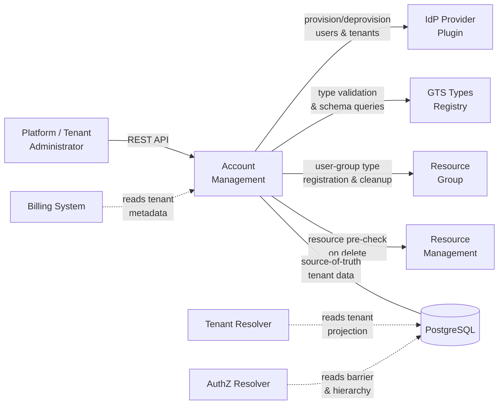
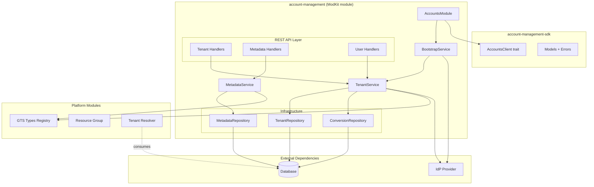
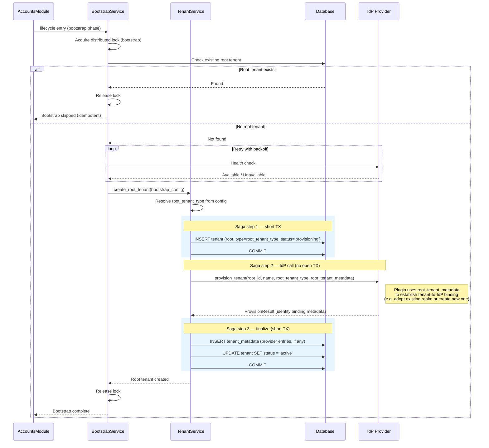
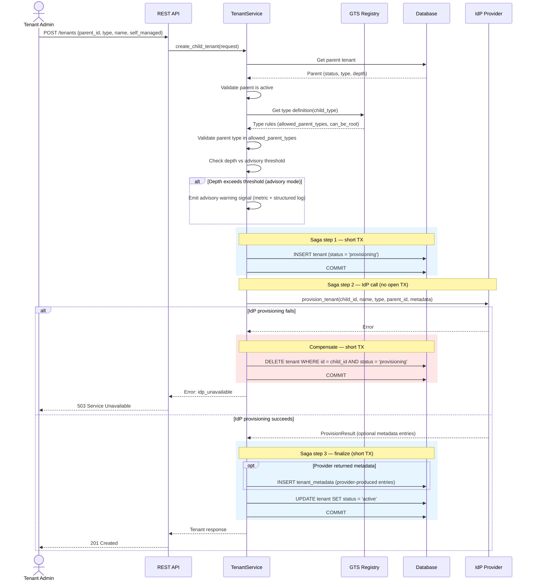
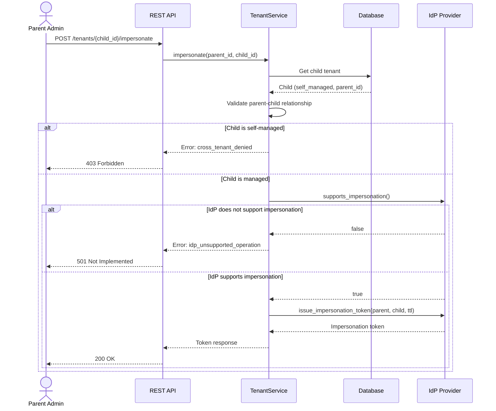
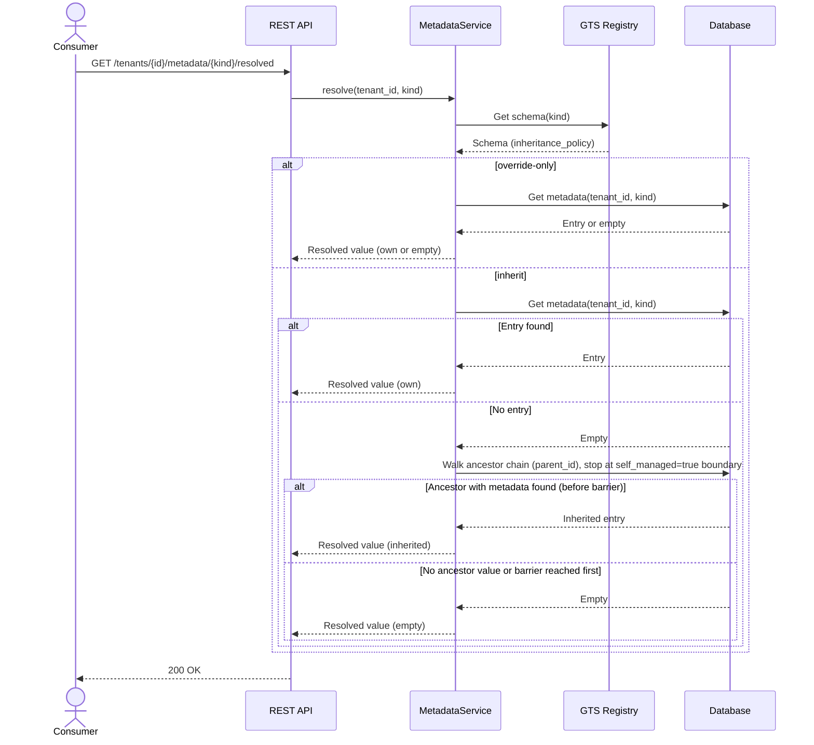
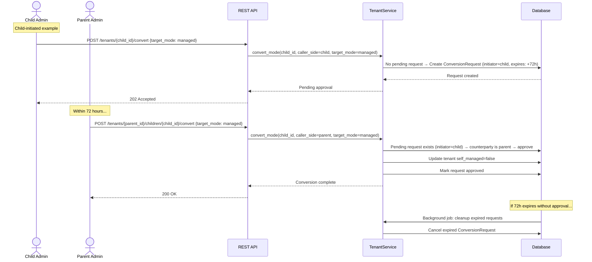

Created:  2026-04-01 by Diffora

# Technical Design — Account Management (AM)

- [ ] `p3` - **ID**: `cpt-cf-accounts-design-am`

<!-- toc -->

- [1. Architecture Overview](#1-architecture-overview)
  - [1.1 Architectural Vision](#11-architectural-vision)
  - [1.2 Architecture Drivers](#12-architecture-drivers)
  - [1.3 Architecture Layers](#13-architecture-layers)
- [2. Principles & Constraints](#2-principles--constraints)
  - [2.1 Design Principles](#21-design-principles)
  - [2.2 Constraints](#22-constraints)
- [3. Technical Architecture](#3-technical-architecture)
  - [3.1 Domain Model](#31-domain-model)
  - [3.2 Component Model](#32-component-model)
  - [3.3 API Contracts](#33-api-contracts)
  - [3.4 Internal Dependencies](#34-internal-dependencies)
  - [3.5 External Dependencies](#35-external-dependencies)
  - [3.6 Interactions & Sequences](#36-interactions--sequences)
  - [3.7 Database schemas & tables](#37-database-schemas--tables)
  - [3.8 Error Codes Reference](#38-error-codes-reference)
- [4. Additional Context](#4-additional-context)
  - [Non-Applicable Design Domains](#non-applicable-design-domains)
  - [Security Architecture](#security-architecture)
  - [Threat Modeling](#threat-modeling)
  - [Reliability Architecture](#reliability-architecture)
  - [Recovery Architecture](#recovery-architecture)
  - [Resilience Patterns](#resilience-patterns)
  - [Observability](#observability)
  - [Data Governance](#data-governance)
  - [Production Scale](#production-scale)
  - [Testing Architecture](#testing-architecture)
  - [Known Limitations & Technical Debt](#known-limitations--technical-debt)
- [5. Traceability](#5-traceability)

<!-- /toc -->

> **Abbreviation**: Account Management = **AM**. Used throughout this document.

## 1. Architecture Overview

### 1.1 Architectural Vision

AM is the foundational multi-tenancy source-of-truth module for the Cyber Fabric platform. It owns the tenant hierarchy, tenant type enforcement, barrier metadata, delegated IdP user operations, and extensible tenant metadata. AM follows the standard ModKit module pattern under `modules/system/account-management/`: a planned SDK crate (`account-management-sdk`) exposes transport-agnostic traits and models, and a planned implementation crate (`account-management`) provides the module lifecycle, REST API, domain logic, and infrastructure adapters.

The architecture separates data ownership from enforcement. AM stores and validates the tenant forest structure, barrier flags, and type constraints. It does not evaluate authorization policies, generate SQL predicates, or validate bearer tokens on the per-request path. Tenant Resolver and AuthZ Resolver consume AM source-of-truth data for runtime enforcement. This separation keeps AM focused on administrative correctness while letting specialized resolvers optimize the hot path independently.

IdP integration uses the CyberFabric gateway + plugin pattern, analogous to AuthN Resolver (see `cpt-cf-accounts-adr-idp-contract-separation`). AM defines an `IdpProviderPluginClient` trait for tenant and user administrative operations (tenant provisioning/deprovisioning, user provision/deprovision, impersonation, tenant-scoped query). The plugin is discovered via GTS types-registry and resolved through `ClientHub`. The platform ships a default provider plugin; vendors substitute their own implementation behind the same trait. The IdP provider plugin is intentionally separate from the AuthN Resolver plugin — the two target different concerns (admin operations vs hot-path token validation) with different performance profiles and protocols. The contract is one-directional: AM calls IdP, IdP does not call AM.

User group management is handled by the [Resource Group](../../resource-group/docs/PRD.md) module. AM registers a dedicated Resource Group type for user groups during module initialization; consumers call `ResourceGroupClient` directly for group lifecycle, membership, and hierarchy operations.

#### System Context

### 1.2 Architecture Drivers

#### Functional Drivers

| Requirement | Design Response |
|-------------|-----------------|
| `cpt-cf-accounts-fr-root-tenant-creation` | Bootstrap runs as the first action inside the module's `lifecycle(entry = ...)` method, creating the initial root tenant with IdP linking before signalling ready. |
| `cpt-cf-accounts-fr-root-tenant-idp-link` | Bootstrap calls `provision_tenant` for the root tenant (same contract as all tenants), forwarding deployer-configured `root_tenant_metadata` so the IdP provider plugin can establish the tenant-to-IdP binding. Any provider-returned `ProvisionResult` metadata is persisted as tenant metadata. AM does not validate binding sufficiency — binding establishment is the provider's responsibility, whether via returned metadata, external configuration, or convention. |
| `cpt-cf-accounts-fr-bootstrap-idempotency` | Bootstrap checks for existing root tenant before creation; no-op when already present. |
| `cpt-cf-accounts-fr-bootstrap-ordering` | Bootstrap retries IdP availability with configurable backoff and timeout before proceeding. |
| `cpt-cf-accounts-fr-create-root-tenant` | `TenantService::create_root_tenant` validates that the GTS type allows root placement (`can_be_root: true`). Platform Administrator authorization is enforced by `PolicyEnforcer` in the REST handler layer; BootstrapService calls the domain method directly during lifecycle startup (no external caller, no AuthZ evaluation). |
| `cpt-cf-accounts-fr-create-child-tenant` | `TenantService::create_child_tenant` validates parent status, GTS type constraints, and depth threshold. |
| `cpt-cf-accounts-fr-hierarchy-depth-limit` | Configurable advisory threshold with optional strict mode; depth computed from parent at creation time. |
| `cpt-cf-accounts-fr-tenant-status-change` | `TenantService::update_status` applies `active` ↔ `suspended` transitions without cascading to children. Transition to `deleted` is rejected — deletion goes through `TenantService::delete_tenant` which enforces child/resource preconditions. |
| `cpt-cf-accounts-fr-tenant-soft-delete` | `TenantService::delete_tenant` validates no non-deleted children and no active resources before soft delete; schedules hard deletion after retention period. |
| `cpt-cf-accounts-fr-children-query` | Paginated direct-children query with status filtering via OData `$filter` on `parent_id` index. |
| `cpt-cf-accounts-fr-root-tenant-listing` | `TenantService` provides `parent_id IS NULL` paginated query with status filtering. Platform Administrator authorization enforced by `PolicyEnforcer`. Uses `idx_tenants_parent_status` index. |
| `cpt-cf-accounts-fr-tenant-read` | `TenantService::get_tenant` returns tenant details by identifier within the caller's authorized scope. |
| `cpt-cf-accounts-fr-tenant-update` | `TenantService::update_tenant` mutates only `name` and `status` (`active` ↔ `suspended`); immutable hierarchy-defining fields are rejected; `status=deleted` is rejected with `422` — use `DELETE` endpoint. |
| `cpt-cf-accounts-fr-tenant-type-enforcement` | `TenantService` queries `TypesRegistryClient` for type constraints and `can_be_root` at creation time. |
| `cpt-cf-accounts-fr-tenant-type-nesting` | Same-type nesting permitted when GTS type definition allows it; acyclicity guaranteed by forest structure. |
| `cpt-cf-accounts-fr-managed-tenant-creation` | Tenant created with `self_managed=false`; no barrier flag set. |
| `cpt-cf-accounts-fr-self-managed-tenant-creation` | Tenant created with `self_managed=true`; barrier flag stored for downstream resolver consumption. |
| `cpt-cf-accounts-fr-managed-to-self-managed` | Unilateral conversion: `TenantService` sets `self_managed=true` immediately, no approval required. |
| `cpt-cf-accounts-fr-self-managed-to-managed` | Dual-consent conversion via `ConversionRequest` entity with 72h expiry and background cleanup. Each side uses its own tenant-scoped endpoint — no barrier bypass required. |
| `cpt-cf-accounts-fr-conversion-requests-query` | `TenantService` provides paginated inbound conversion-request query joining `conversion_requests` with `tenants` on `parent_id`. Operates within parent tenant AuthZ scope; no barrier bypass required. Exposes only conversion-request metadata (child `id` and `name`), not full child tenant data. |
| `cpt-cf-accounts-fr-conversion-cancel` | `TenantService::cancel_conversion` transitions a pending `ConversionRequest` to `cancelled` status. Either side can cancel from their own tenant-scoped endpoint (child: `DELETE /tenants/{id}/convert`; parent: `DELETE /tenants/{parent_id}/children/{child_id}/convert`). Returns `not_found` if no pending request exists. |
| `cpt-cf-accounts-fr-managed-tenant-impersonation` | `IdpProviderPluginClient::issue_impersonation_token` with configurable TTL (default: 1h, max: 4h); feature-gated per provider capability. |
| `cpt-cf-accounts-fr-idp-tenant-provision` | Tenant creation uses a saga pattern: (1) short TX inserts the tenant with `status=provisioning`, (2) `IdpProviderPluginClient::provision_tenant` is called outside any transaction, (3) a second short TX persists provider-returned metadata and transitions the tenant to `active`. If the IdP call fails, a compensating TX deletes the `provisioning` row — no orphan in either system. If the finalization TX fails, the tenant remains in `provisioning` state for background retry or compensation (see Reliability Architecture — Data Consistency). A background reaper cleans stale `provisioning` tenants. |
| `cpt-cf-accounts-fr-idp-tenant-deprovision` | Background hard-deletion job calls `IdpProviderPluginClient::deprovision_tenant` for every hard-deleted tenant. Provider implementations clean up tenant-scoped IdP resources or perform a no-op, potentially guided by tenant type traits such as `idp_provisioning`. Failure retries rather than skips. |
| `cpt-cf-accounts-fr-idp-user-provision` | `IdpProviderPluginClient::create_user` with tenant scope binding and resolved tenant metadata (for IdP context resolution, e.g., effective Keycloak realm). |
| `cpt-cf-accounts-fr-idp-user-deprovision` | `IdpProviderPluginClient::delete_user` with session revocation. |
| `cpt-cf-accounts-fr-idp-user-query` | `IdpProviderPluginClient::list_users` with tenant filter; supports optional user-ID filter for single-user lookups. |
| `cpt-cf-accounts-fr-user-group-rg-type` | `AccountsModule` idempotently registers the user-group Resource Group type during module initialization, with `allowed_memberships` including the platform IdP user resource type (`gts.z.system.idp.user.v1~`). |
| `cpt-cf-accounts-fr-user-group-lifecycle` | Consumers call `ResourceGroupClient` directly for group create/update/delete. AM does not proxy these operations. |
| `cpt-cf-accounts-fr-user-group-membership` | Consumers call `ResourceGroupClient` directly for membership add/remove. Callers verify user existence via AM's user-list endpoint; RG treats `resource_id` as opaque. |
| `cpt-cf-accounts-fr-nested-user-groups` | Nested groups via Resource Group parent-child hierarchy; cycle detection enforced by Resource Group forest invariants. No AM involvement at runtime. |
| `cpt-cf-accounts-fr-tenant-metadata-schema` | `MetadataService` validates metadata kinds against GTS-registered schemas with per-schema inheritance policy. |
| `cpt-cf-accounts-fr-tenant-metadata-crud` | `MetadataService` provides CRUD for metadata entries with GTS schema validation. |
| `cpt-cf-accounts-fr-tenant-metadata-api` | `MetadataService::resolve` walks the hierarchy for `inherit` schemas; returns tenant-level value for `override-only`. |
| `cpt-cf-accounts-fr-deterministic-errors` | Unified error mapper translates domain and infrastructure failures to stable public error categories. |
| `cpt-cf-accounts-fr-observability-metrics` | OpenTelemetry metrics for domain-internal latencies (IdP calls, GTS validation, metadata resolution, bootstrap), background job throughput, error rates, and security counters. Per-endpoint CRUD counts and children-query latency are captured by platform HTTP middleware; capacity gauges (active tenants) are derivable from DB queries. Projection freshness is a Tenant Resolver concern. |

#### NFR Allocation

| NFR ID | NFR Summary | Allocated To | Design Response | Verification Approach |
|--------|-------------|--------------|-----------------|----------------------|
| `cpt-cf-accounts-nfr-context-validation-latency` | End-to-end tenant-context validation p95 ≤ 5ms | Schema design + indexes on `tenants` table (AM contribution); Tenant Resolver caching (resolver contribution) | Composite indexes on `(parent_id, status)`, `(id, status)`, and `(tenant_type_schema_id)`; denormalized `depth` column avoids recursive queries. AM provides the indexed source-of-truth schema; the end-to-end p95 ≤ 5ms target requires Tenant Resolver's caching layer on top. | AM: integration tests verify indexed query baseline with seeded dataset. Platform: pre-GA load test benchmark (end-to-end through Tenant Resolver + caching) against approved deployment profile. |
| `cpt-cf-accounts-nfr-tenant-isolation` | Zero cross-tenant data leaks | SecureConn + PolicyEnforcer on all API endpoints | All database access through `SecureConn` with tenant-scoped queries; `PolicyEnforcer` PEP pattern on every REST handler. | Automated security test suite with cross-tenant access attempts |
| `cpt-cf-accounts-nfr-audit-completeness` | 100% tenant config changes audited | Platform request audit infrastructure | AM delegates audit logging to platform-level request audit infrastructure. Platform access logs capture actor identity, tenant context, and request details for all state-changing operations. Database-level `created_at`/`updated_at` timestamps provide change chronology. | Verify platform audit log entries exist for all state-changing operations in integration tests |
| `cpt-cf-accounts-nfr-barrier-enforcement` | Barrier state sufficient for downstream enforcement; AM-owned barrier-state changes audited | `self_managed` column + tenant hierarchy in `tenants` table | AM exposes `self_managed` flag and parent-child relationships; Tenant Resolver and AuthZ Resolver consume this data for barrier traversal and access decisions. AM commits the flag synchronously within the conversion transaction; enforcement latency depends on how quickly Tenant Resolver's projection reflects the change (sync interval is a Tenant Resolver concern, not an AM guarantee). Platform request audit logging captures all barrier-state-changing operations (mode conversions) per `cpt-cf-accounts-nfr-audit-completeness`; cross-tenant access auditing is a platform AuthZ concern. | Integration tests validating barrier data completeness for resolver consumption; verify platform audit log entries exist for mode conversion operations |
| `cpt-cf-accounts-nfr-tenant-model-versatility` | Both managed and self-managed in same tree | `self_managed` boolean per tenant, independent of siblings | Sibling tenants under the same parent can have different `self_managed` values; mode conversion is a per-tenant operation. | Integration tests with mixed-mode hierarchies |
| `cpt-cf-accounts-nfr-compatibility` | No breaking changes within minor release | Path-based API versioning + stable SDK trait contract | REST API uses `/api/accounts/v1/` prefix; SDK trait changes require new major version with migration path. | Contract tests on SDK trait + API schema regression tests |
| `cpt-cf-accounts-nfr-production-scale` | Approved deployment profile before DESIGN sign-off | Schema design + index strategy | Approved deployment profile: 100K tenants, depth 5 (advisory threshold 10), 300K users (IdP-stored), 30K user groups / 300K memberships (RG-stored), 1K rps peak. All targets within planning envelope. Schema impact assessment confirms existing indexes and B-tree depths are sufficient — no partitioning required (see Section 4, Production Scale). | Capacity test against approved profile (100K tenants, 300K users, 1K rps) |
| `cpt-cf-accounts-nfr-data-lifecycle` | Tenant deprovisioning cascades cleanup | `TenantService::delete_tenant` + background hard-delete job | Soft delete transitions to `deleted` status; background job hard-deletes after retention period; cascade triggers IdP `deprovision_tenant` (with retry on failure), Resource Group cleanup for tenant-scoped user groups (via `ResourceGroupClient`), and metadata entry deletion. | Integration tests verifying cascaded cleanup |
| `cpt-cf-accounts-nfr-authentication-context` | Authenticated requests via platform SecurityContext; MFA for admin ops deferred to platform AuthN policy | `SecurityContext` requirement on all REST handlers via framework middleware | AM does not validate tokens or enforce MFA directly. All REST endpoints require a valid `SecurityContext` provided by the framework AuthN pipeline. MFA enforcement for administrative operations (tenant creation, mode conversion, impersonation) is a platform AuthN policy concern — AM relies on the framework to reject requests that do not meet the configured authentication strength. | API tests: every endpoint returns 401 without valid `SecurityContext`; E2E: admin operations succeed only with authenticated requests |
| `cpt-cf-accounts-nfr-data-quality` | Transactional commit visibility for Tenant Resolver sync; hierarchy integrity checks | Transactional DB writes + diagnostic integrity query | AM commits hierarchy changes transactionally, making them immediately visible in the `tenants` table for Tenant Resolver consumption. Schema stability per `cpt-cf-accounts-nfr-compatibility` ensures the database-level data contract remains intact. AM provides a hierarchy integrity check (orphaned children, broken parent references, depth mismatches) as a diagnostic capability. The end-to-end 30s freshness SLO is a platform-level target requiring Tenant Resolver's sync mechanism; AM's contribution is transactional commit visibility. | Integration: hierarchy integrity check detects seeded anomalies (orphaned child, depth mismatch); Integration: committed writes are immediately visible via direct table query |

#### Key ADRs

The following architecture decisions are adopted in this DESIGN:

| Decision Area | Adopted Approach | ADR |
|---------------|-----------------|-----|
| IdP contract design | Separate IdP provider plugin (`IdpProviderPluginClient`) from AuthN Resolver plugin, both following CyberFabric gateway + plugin pattern with independent GTS schemas. | `cpt-cf-accounts-adr-idp-contract-separation` — [ADR-0001](ADR/0001-cpt-cf-accounts-adr-idp-contract-separation.md) |
| Metadata inheritance | Walk-up resolution at read time via `parent_id` ancestor chain. The walk stops at self-managed barriers and otherwise continues to the root; no write amplification, always consistent. | `cpt-cf-accounts-adr-barrier-aware-metadata-inheritance` — [ADR-0004](ADR/0004-cpt-cf-accounts-adr-barrier-aware-metadata-inheritance.md) (supersedes `cpt-cf-accounts-adr-metadata-inheritance` — [ADR-0002](ADR/0002-cpt-cf-accounts-adr-metadata-inheritance.md)) |
| Conversion approval | Stateful `ConversionRequest` entity with 72h TTL, partial unique index for at-most-one, and background cleanup job. Dual-scope `/convert` endpoints (child-scoped and parent-scoped) let each side initiate or approve from its own AuthZ scope; no separate `/convert/approve` route and no barrier bypass required. | `cpt-cf-accounts-adr-dual-scope-conversion-endpoints` — [ADR-0005](ADR/0005-cpt-cf-accounts-adr-dual-scope-conversion-endpoints.md) (supersedes `cpt-cf-accounts-adr-conversion-approval` — [ADR-0003](ADR/0003-cpt-cf-accounts-adr-conversion-approval.md)) |
| User identity source of truth | IdP is the single source of truth for user identity data (credentials, profile, authentication state, user existence). AM does not maintain a local user table, projection, or cache. | `cpt-cf-accounts-adr-idp-user-identity-source-of-truth` — [ADR-0007](ADR/0007-cpt-cf-accounts-adr-idp-user-identity-source-of-truth.md) |
| User-tenant binding | IdP stores the user-tenant binding as a tenant identity attribute on the user record. AM coordinates binding via the IdP contract but does not independently store or cache the relationship. | `cpt-cf-accounts-adr-idp-user-tenant-binding` — [ADR-0008](ADR/0008-cpt-cf-accounts-adr-idp-user-tenant-binding.md) |

Rejected prospective direction: `cpt-cf-accounts-adr-resource-group-tenant-hierarchy-source` — [ADR-0006](ADR/0006-cpt-cf-accounts-adr-resource-group-tenant-hierarchy-source.md) considered moving canonical tenant hierarchy storage from the AM `tenants` table to Resource Group, but rejected it because it splits tenant structure and tenant lifecycle ownership across modules. This DESIGN intentionally retains the dedicated `tenants` table as the AM source of truth.

### 1.3 Architecture Layers

- [ ] `p3` - **ID**: `cpt-cf-accounts-tech-modkit-stack`

| Layer | Responsibility | Technology |
|-------|---------------|------------|
| REST API | HTTP endpoints, request/response DTOs, OpenAPI docs | OperationBuilder + Axum handlers |
| SDK | Public client trait, transport-agnostic models, error types | Rust traits + ClientHub registration |
| Domain | Business logic, invariants, tenant lifecycle, metadata resolution | Rust domain services |
| Infrastructure | Database access, IdP adapter, migrations | SeaORM via SecureConn, IdP contract implementations |

## 2. Principles & Constraints

### 2.1 Design Principles

#### Source-of-Truth, Not Enforcer

- [ ] `p2` - **ID**: `cpt-cf-accounts-principle-source-of-truth`

AM owns the canonical tenant hierarchy, barrier state, type constraints, and extensible metadata. It validates structural invariants (forest shape, type compatibility, depth thresholds) on writes. AM does not evaluate authorization decisions, interpret policies, or enforce per-request access control. Tenant Resolver and AuthZ Resolver are the enforcement points that consume AM data.

**ADRs**: None yet — decision implicit in platform architecture separation.

#### IdP-Agnostic

- [ ] `p2` - **ID**: `cpt-cf-accounts-principle-idp-agnostic`

All user lifecycle operations go through the `IdpProviderPluginClient` trait. AM never hard-codes IdP-specific logic, never stores user credentials, and never caches user-tenant membership locally. If the IdP is unavailable, user operations fail with `idp_unavailable` — AM does not fall back to stale data.

**ADRs**: `cpt-cf-accounts-adr-idp-contract-separation` — accepted in [ADR-0001](ADR/0001-cpt-cf-accounts-adr-idp-contract-separation.md); `cpt-cf-accounts-adr-idp-user-identity-source-of-truth` — accepted in [ADR-0007](ADR/0007-cpt-cf-accounts-adr-idp-user-identity-source-of-truth.md); `cpt-cf-accounts-adr-idp-user-tenant-binding` — accepted in [ADR-0008](ADR/0008-cpt-cf-accounts-adr-idp-user-tenant-binding.md)

#### Forest Invariant Preservation

- [ ] `p2` - **ID**: `cpt-cf-accounts-principle-forest-invariant`

Every tenant write validates that the resulting hierarchy remains a valid forest: each tenant has at most one parent, no cycles exist, type constraints are satisfied, and root tenants have `parent_id = NULL`. The forest structure is enforced at the domain layer before persistence, not by database constraints alone.

**ADRs**: None yet — invariant derived from platform tenant model specification.

#### Barrier as Data

- [ ] `p2` - **ID**: `cpt-cf-accounts-principle-barrier-as-data`

AM does not enforce access-control barriers. It stores the `self_managed` flag, returns it in API responses, and includes it in the source-of-truth dataset consumed by Tenant Resolver. AM domain logic does not filter or restrict API results based on barrier values — barrier enforcement is applied at the platform AuthZ layer: all AM REST API endpoints pass through `PolicyEnforcer` → AuthZ Resolver → Tenant Resolver, which excludes self-managed tenants and their subtrees from the caller's access scope before AM domain logic executes. AM's domain services do read hierarchy data that may include barrier-hidden tenants for two internal purposes: (1) **metadata inheritance boundary** — the ancestor walk stops at self-managed boundaries so that a self-managed tenant never inherits metadata from ancestors above its barrier (see `cpt-cf-accounts-fr-tenant-metadata-api`); (2) **structural invariant validation** — hierarchy-owner operations (parent-child type validation during creation, child-count pre-checks during deletion, child-state validation for the parent-scoped conversion endpoint) require full hierarchy visibility regardless of barrier state. Neither purpose constitutes access-control filtering — the results are used for internal precondition checks and are not exposed to API callers. These reads are performed via unscoped hierarchy lookups on the `tenants` table (see Security Architecture, Data Protection), distinct from the platform's `BarrierMode::Ignore` concept which AM does not use. When a tenant converts to self-managed, AM commits `self_managed=true` synchronously within the conversion transaction. Enforcement takes effect once Tenant Resolver's denormalized projection reflects the updated flag; the propagation interval is owned by Tenant Resolver, not AM.

**ADRs**: None yet — separation of concerns derived from platform authorization architecture.

#### Delegation to Resource Group

- [ ] `p2` - **ID**: `cpt-cf-accounts-principle-delegation-to-rg`

User group hierarchy, membership storage, cycle detection, and tenant-scoped isolation are handled by the Resource Group module. AM registers the user-group RG type at module initialization and triggers RG cleanup during tenant hard-deletion. Consumers call `ResourceGroupClient` directly for all group and membership operations — AM does not proxy or coordinate these calls. AM's user-list endpoint (`GET /tenants/{id}/users`) provides the valid user set; callers combine it with RG's membership API.

**ADRs**: None yet — direct delegation pattern consistent with Resource Group's designed consumer model.

**Principle conflict resolution**: No conflicts exist among the current five principles. If future design decisions create tension between principles, conflicts will be resolved through the ADR process. Forest Invariant Preservation and Source-of-Truth Not Enforcer take precedence as the foundational architectural commitments.

### 2.2 Constraints

#### No Direct User Data Storage

- [ ] `p2` - **ID**: `cpt-cf-accounts-constraint-no-user-storage`

AM does not maintain a local user table, user projection, or cached user-tenant membership. User existence and tenant binding are verified against the IdP at operation time. User identifiers appear in AM only as opaque references in audit logs and as arguments passed to Resource Group for group membership. If the IdP is unavailable, user operations fail rather than degrade to cached state.

**ADRs**: `cpt-cf-accounts-adr-idp-user-identity-source-of-truth` — accepted in [ADR-0007](ADR/0007-cpt-cf-accounts-adr-idp-user-identity-source-of-truth.md); `cpt-cf-accounts-adr-idp-user-tenant-binding` — accepted in [ADR-0008](ADR/0008-cpt-cf-accounts-adr-idp-user-tenant-binding.md)

#### SecurityContext Propagation

- [ ] `p2` - **ID**: `cpt-cf-accounts-constraint-security-context`

All AM API endpoints require a valid `SecurityContext` propagated by the Cyber Fabric framework. `PolicyEnforcer` PEP pattern is applied on every REST handler. AM does not construct, validate, or modify `SecurityContext` — it consumes the context provided by the framework.

**ADRs**: None yet — framework convention.

#### GTS Availability for Type Resolution

- [ ] `p2` - **ID**: `cpt-cf-accounts-constraint-gts-availability`

Tenant creation and type validation require the GTS Types Registry to be available. If GTS is unreachable, tenant creation operations that require type validation fail with a deterministic error. AM does not cache type definitions locally — type constraints are evaluated against GTS at write time to ensure consistency with runtime type changes.

**ADRs**: None yet — runtime validation trade-off.

#### No AuthZ Evaluation

- [ ] `p2` - **ID**: `cpt-cf-accounts-constraint-no-authz-eval`

AM does not evaluate allow/deny decisions, interpret authorization policies, validate bearer tokens, or generate SQL predicates for tenant scoping. These responsibilities belong to AuthZ Resolver, Tenant Resolver, and the Cyber Fabric framework respectively.

**ADRs**: None yet — platform architecture boundary.

#### Platform Versioning Policy

- [ ] `p2` - **ID**: `cpt-cf-accounts-constraint-versioning-policy`

Published REST APIs follow path-based versioning (`/api/accounts/v1/`). The SDK trait (`AccountsClient`) and IdP contract (`IdpProviderPluginClient`) are stable interfaces — breaking changes require a new major version with a documented migration path for consumers. Within a version, only additive changes are permitted (new optional fields, new endpoints). Deprecated endpoints receive a minimum one-major-version notice period before removal. API lifecycle: v1 remains supported until v2 reaches GA; no concurrent support for more than two major versions.

**ADRs**: None yet — platform policy.

#### Data Handling and Regulatory Compliance

- [ ] `p2` - **ID**: `cpt-cf-accounts-constraint-data-handling`

AM acts as a data processor for identity-linked payloads. Data protection regulations (GDPR processor obligations) are enforced at the platform level. AM minimizes persisted user attributes (no local user table), treats IdP identity payloads as transient data, and delegates data residency to platform infrastructure per PRD Section 6.9. Tenant hierarchy metadata is classified as commercially sensitive; access is governed by `SecureConn` + `PolicyEnforcer` scoping.

**ADRs**: None yet — compliance boundary defined in PRD NFR exclusions.

#### Resource Constraints

Resource constraints (team size, timeline) are not applicable at module level — tracked at project level. Regulatory constraints (GDPR processor obligations) are enforced at the platform level per `cpt-cf-accounts-constraint-data-handling`. Data residency is delegated to platform infrastructure per PRD Section 6.9.

#### Vendor and Licensing

- [ ] `p2` - **ID**: `cpt-cf-accounts-constraint-vendor-licensing`

AM uses only platform-approved open-source dependencies (SeaORM, Axum, OpenTelemetry via ModKit). Vendor lock-in is limited to the IdP provider plugin contract, which is intentionally pluggable — vendors substitute their own implementation. No proprietary or copyleft-licensed dependencies are introduced at the module level.

**ADRs**: None yet — platform dependency policy.

#### Legacy System Integration

- [ ] `p2` - **ID**: `cpt-cf-accounts-constraint-legacy-integration`

Legacy system integration is handled through the pluggable IdP provider contract, which allows AM to integrate with existing organizational directories and identity providers without module-level changes. No additional legacy integration constraints exist for v1.

**ADRs**: None yet — covered by IdP-Agnostic principle.

## 3. Technical Architecture

### 3.1 Domain Model

**Technology**: Rust structs (SeaORM entities for persistence, SDK models for transport)

**Planned location**: `modules/system/account-management/account-management-sdk/src/models.rs` (SDK models), `modules/system/account-management/account-management/src/infra/storage/entity.rs` (persistence entities)

**Core Entities**:

| Entity | Description | Schema |
|--------|-------------|--------|
| Tenant | Core tenant node in the hierarchy forest. Holds identity, parent reference, status, mode, type, and depth. | `account-management-sdk` models |
| TenantMetadata | Extensible metadata entry scoped to a tenant, validated against a GTS-registered schema. | `account-management-sdk` models |
| ConversionRequest | Tracks a pending self-managed-to-managed mode conversion requiring dual approval with expiry. | `account-management-sdk` models |

**Relationships**:
- Tenant → Tenant: Self-referential parent-child (via `parent_id`). A tenant has zero or one parent and zero or more children. Root tenants have `parent_id = NULL`.
- Tenant → TenantMetadata: One-to-many. A tenant can have multiple metadata entries, at most one per schema kind.
- Tenant → ConversionRequest: One-to-many (but at most one active request at a time). A conversion request references the target tenant and the initiating tenant side (parent or child).
- Tenant → GTS Type: Many-to-one (via `tenant_type_schema_id`). Each tenant references a GTS-registered type that defines parent-child constraints.
- Tenant → IdP: Logical relationship via opaque tenant identifier used for IdP linking. No local foreign key — IdP is external.
- Tenant → Resource Group (User Groups): Logical relationship. User groups are Resource Group entities scoped to a tenant. AM registers the RG type at init; consumers call `ResourceGroupClient` directly. `TenantService` triggers RG group cleanup during tenant hard-deletion.

#### Tenant Types — GTS Schema with Traits

Tenant types are **not a compile-time enum**. They are registered at runtime through the [GTS (Global Type System)](https://github.com/GlobalTypeSystem/gts-spec) types registry, enabling deployments to define their own business hierarchy topology without code changes. The type topology is deployment-specific (see PRD §5.3 for examples: flat, cloud hosting, education, enterprise).

**Base Type Schema:** `gts.x.accounts.tenants.tenant_type.v1~` — [tenant_type.v1.schema.json](../schemas/tenant-types/tenant_type.v1.schema.json)

The base type defines behavioral traits via standard [GTS Schema Traits](https://github.com/GlobalTypeSystem/gts-spec?tab=readme-ov-file#97---schema-traits-x-gts-traits-schema--x-gts-traits) (`x-gts-traits-schema`). Derived tenant type schemas resolve trait values via `x-gts-traits`. Traits are not part of the tenant instance data model — they configure system behavior for processing tenants of each type.

**Base type traits** (defined in `x-gts-traits-schema`):

| Trait | Type | Default | Description |
|-------|------|---------|-------------|
| `can_be_root` | boolean | `false` | Whether tenants of this type can be root tenants (`parent_id = null`) |
| `allowed_parent_types` | string[] | `[]` | GTS instance identifiers of tenant types allowed as parent. Empty array means no nesting allowed. |
| `idp_provisioning` | boolean | `false` | Whether tenants of this type typically require dedicated IdP-side resources. AM still invokes `provision_tenant` / `deprovision_tenant`; provider implementations may use this trait to decide whether to create resources or complete as a no-op. |

Derived type schemas resolve their behavioral traits via `x-gts-traits` (per [GTS spec §9.7](https://github.com/GlobalTypeSystem/gts-spec?tab=readme-ov-file#97---schema-traits-x-gts-traits-schema--x-gts-traits)). Properties not specified fall back to defaults from the base type's `x-gts-traits-schema`.

**Example — Cloud Hosting Deployment:**

| GTS Schema ID (chained, stored) | Description | `x-gts-traits` |
|---------------------------------|-------------|----------------|
| `gts.x.accounts.tenants.tenant_type.v1~x.accounts.tenants.provider.v1~` | Platform operator; root tenant | `can_be_root: true`, `idp_provisioning: true` |
| `gts.x.accounts.tenants.tenant_type.v1~x.accounts.tenants.reseller.v1~` | Reseller; nestable under provider or other resellers | `allowed_parent_types: [x.accounts.tenants.provider.v1~, x.accounts.tenants.reseller.v1~]`, `idp_provisioning: true` |
| `gts.x.accounts.tenants.tenant_type.v1~x.accounts.tenants.customer.v1~` | End customer; leaf tenant | `allowed_parent_types: [x.accounts.tenants.provider.v1~, x.accounts.tenants.reseller.v1~]` |

**Runtime Registration:** New tenant types are registered via the GTS REST API (`POST /schemas`) or programmatically via `GtsStore.register_schema()`. AM validates the chained schema identifier against the GTS registry at tenant creation time and rejects unregistered types with `invalid_tenant_type` (422).

**Input and storage format:** The API accepts the **full chained `GtsSchemaId`** (e.g., `gts.x.accounts.tenants.tenant_type.v1~x.accounts.tenants.reseller.v1~`). Short-name aliases are not supported — GTS identifiers can contain multiple chained segments (up to 1024 characters per `GTS_MAX_LENGTH`), making short-name derivation ambiguous. AM validates the chained schema identifier against the GTS registry and **stores it as-is** in the `tenant_type_schema_id` column. All API responses and internal references use the full chained `GtsSchemaId`. The `allowed_parent_types` trait values in `x-gts-traits` use GTS instance identifiers (per GTS spec); AM resolves them to chained schema IDs for comparison against stored values.

**Trait-driven validation at tenant creation:**

1. Validate `tenant_type` (full chained `GtsSchemaId`) against the GTS registry — reject unregistered identifiers with `invalid_tenant_type` (422)
2. Build effective traits by merging `x-gts-traits` values along the schema chain with defaults from `x-gts-traits-schema`
3. If `can_be_root = true`, allow `parent_id = null`; if `can_be_root = false`, require `parent_id != null`
4. If `parent_id != null`, validate the requested parent-child type relationship against the GTS rules — reject with `type_not_allowed` (409) if not permitted
5. Call `IdpProviderPluginClient::provision_tenant`; provider implementations may create tenant-scoped resources or complete as a no-op based on deployment-specific behavior and tenant traits such as `idp_provisioning`

### 3.2 Component Model

#### AccountsModule

- [ ] `p2` - **ID**: `cpt-cf-accounts-component-module`

##### Why this component exists

Entry point for the ModKit lifecycle. Initializes all internal services, registers routes, runs bootstrap, and exposes `AccountsClient` via ClientHub.

##### Responsibility scope

Module lifecycle (`init()` for wiring; `lifecycle(entry = ...)` for startup bootstrap and background jobs; `CancellationToken` for graceful shutdown), REST route registration via OperationBuilder, ClientHub registration of `AccountsClient` implementation, database migration registration, bootstrap orchestration on first start.

##### Responsibility boundaries

Does not contain business logic. Does not directly access the database. Delegates all domain operations to `TenantService` and `MetadataService`.

##### Related components (by ID)

- `cpt-cf-accounts-component-tenant-service` — owns; creates and wires during initialization
- `cpt-cf-accounts-component-metadata-service` — owns; creates and wires during initialization
- `cpt-cf-accounts-component-bootstrap-service` — owns; invokes at the start of the `lifecycle(entry = ...)` method before signalling ready

#### TenantService

- [ ] `p2` - **ID**: `cpt-cf-accounts-component-tenant-service`

##### Why this component exists

Central domain service for all tenant lifecycle operations. Encapsulates forest invariant validation, type enforcement, status management, mode conversion, IdP tenant provisioning, and IdP user operations.

##### Responsibility scope

Tenant CRUD (create root, create child, get, update, soft delete). Tenant creation uses a saga pattern to avoid holding DB transactions open during external IdP calls: (1) a short transaction inserts the tenant with `status=provisioning`; (2) `IdpProviderPluginClient::provision_tenant` is called outside any transaction; (3) a second short transaction persists any provider-returned metadata entries and transitions the tenant to `active`. If the IdP call fails, a compensating transaction deletes the `provisioning` row — the caller receives `idp_unavailable` and neither system retains an orphan. If the finalization transaction fails, the tenant remains in `provisioning` state; a background provisioning reaper either retries finalization or compensates (calls `deprovision_tenant` + deletes the row). Tenants in `provisioning` status are excluded from all API queries and rejected for any operations — the status is purely internal. Calls `IdpProviderPluginClient::deprovision_tenant` during hard deletion for every tenant; provider implementations clean up resources or complete as a no-op. Failure retries rather than skips. Hierarchy depth validation with advisory/strict threshold. Status transitions (`active` ↔ `suspended`) without cascading; transition to `deleted` is rejected on PATCH — deletion requires the `DELETE` endpoint which enforces child/resource preconditions. Mode conversion (managed ↔ self-managed) including dual-consent flow with per-scope endpoints: both child-scoped (`/tenants/{id}/convert`) and parent-scoped (`/tenants/{parent_id}/children/{child_id}/convert`) route to the same domain method, which resolves the caller's side from the endpoint and determines initiation vs approval from `ConversionRequest` state. Conversion request cancellation (`cancel_conversion`) transitions a pending request to `cancelled` status; either the initiator (withdraw) or counterparty (reject) can cancel from their own tenant scope. IdP user operations (provision, deprovision, query, impersonation) via `IdpProviderPluginClient`. Children query with pagination and status filtering. Root tenant listing (Platform Administrator only, `parent_id IS NULL` query). Inbound conversion-request listing for parent tenants (surfaces pending requests from barrier-isolated children without bypassing the barrier). Hard deletion scheduling after retention period; hard-deletion job processes tenants in leaf-first order (`depth DESC`) to satisfy the `parent_id` FK without cascading deletes. Provisioning reaper job cleans stale `provisioning` tenants (older than configurable timeout, default: 5 minutes) by calling `deprovision_tenant` (idempotent) and deleting the row. Deterministic error mapping for all failure paths. Platform request audit logging captures all state-changing operations.

##### Responsibility boundaries

Does not evaluate authorization policies — relies on `PolicyEnforcer` PEP in the REST handler layer. Does not implement barrier filtering in domain logic — barrier enforcement is handled by `PolicyEnforcer` → AuthZ Resolver → Tenant Resolver before domain logic executes. Does not store user data locally — all user operations pass through the IdP contract.

##### Related components (by ID)

- `cpt-cf-accounts-component-module` — called by; registered during module initialization
- `cpt-cf-accounts-component-metadata-service` — related; metadata entries cascade-deleted via DB `ON DELETE CASCADE` when tenant row is removed; MetadataService used for tenant metadata resolution in user operations

##### Diagnostic Capabilities

**Hierarchy integrity check mechanism**: Exposed as an internal SDK method `TenantService::check_hierarchy_integrity()`. Implementation uses a recursive CTE to detect orphaned children (nodes whose `parent_id` references a non-existent tenant), broken parent references, and depth mismatches (where the stored `depth` column disagrees with the computed depth from the root). Results are surfaced as structured diagnostic output and as the `am_hierarchy_integrity_violations` gauge metric.

#### MetadataService

- [ ] `p2` - **ID**: `cpt-cf-accounts-component-metadata-service`

##### Why this component exists

Manages extensible tenant metadata with GTS-schema validation and per-schema inheritance resolution.

##### Responsibility scope

Metadata CRUD (create, read, update, delete) for any GTS-registered metadata kind. Schema validation against GTS at write time. Inheritance resolution: for `inherit` schemas, walks the tenant hierarchy upward to find the nearest ancestor value; for `override-only` schemas, returns the tenant's own value or empty. Cascade deletion of metadata entries when a tenant is deprovisioned.

##### Responsibility boundaries

Does not define metadata schemas — schemas are registered in GTS. Does not interpret metadata content — treats values as opaque validated payloads. Reads the `self_managed` flag during inheritance resolution to stop the ancestor walk at self-managed boundaries — a self-managed tenant's resolved value never includes ancestors above its barrier.

##### Related components (by ID)

- `cpt-cf-accounts-component-tenant-service` — related; metadata entries cascade-deleted via DB `ON DELETE CASCADE` when tenant row is removed; MetadataService called by TenantService for tenant metadata resolution in user operations
- `cpt-cf-accounts-component-module` — called by; for route registration

#### BootstrapService

- [ ] `p2` - **ID**: `cpt-cf-accounts-component-bootstrap-service`

##### Why this component exists

Handles one-time platform initialization: creating the initial root tenant and linking it to the IdP.

##### Responsibility scope

Acquires a distributed lock to prevent concurrent bootstrap from parallel service starts. Checks whether the initial root tenant already exists (idempotency). Waits for IdP availability with configurable retry/backoff and timeout. Creates the initial root tenant using the configured `root_tenant_type` (must have `can_be_root: true` in GTS traits) with `active` status. Calls `provision_tenant` with deployer-configured `root_tenant_metadata` (same contract as all tenants) so the IdP provider plugin can establish the tenant-to-IdP binding. Any provider-returned `ProvisionResult` metadata is persisted as tenant metadata; if the provider returns no metadata, bootstrap proceeds normally. Bootstrap completion is captured by platform request audit logging. Releases the lock.

##### Responsibility boundaries

Does not create post-bootstrap root tenants — those go through `TenantService::create_root_tenant`. Does not interpret the `root_tenant_metadata` content — the bootstrap config is a pass-through for the IdP provider plugin. Does not provision the Platform Administrator user — that identity is pre-provisioned in the IdP during infrastructure setup. Runs only at the start of `AccountsModule`'s `lifecycle(entry = ...)` method, before the ready signal.

##### Related components (by ID)

- `cpt-cf-accounts-component-tenant-service` — calls; for root tenant creation
- `cpt-cf-accounts-component-module` — called by; at the start of the lifecycle entry method

### 3.3 API Contracts

#### Tenant Management REST API

- [ ] `p1` - **ID**: `cpt-cf-accounts-interface-tenant-mgmt-rest`

- **Interfaces**: `cpt-cf-accounts-interface-tenant-mgmt-api`
- **Contracts**: `cpt-cf-accounts-contract-tenant-resolver`, `cpt-cf-accounts-contract-authz-resolver`
- **Technology**: REST / OpenAPI
- **Planned location**: `modules/system/account-management/account-management/src/api/rest/`

**Planned**: Machine-readable OpenAPI specification at `modules/system/account-management/schemas/openapi/accounts-v1.yaml`, to be generated from OperationBuilder annotations at build time.

For the consolidated AuthN/AuthZ mapping of all endpoints to PolicyEnforcer actions, see the Resource Types and Actions table in Security Architecture (Section 4).

**Endpoints Overview**:

| Method | Path | Description | Stability |
|--------|------|-------------|-----------|
| `POST` | `/api/accounts/v1/tenants` | Create tenant (root or child based on `parent_id`) | stable |
| `GET` | `/api/accounts/v1/tenants/{id}` | Get tenant by ID | stable |
| `PATCH` | `/api/accounts/v1/tenants/{id}` | Update tenant (name, status) | stable |
| `DELETE` | `/api/accounts/v1/tenants/{id}` | Soft-delete tenant | stable |
| `GET` | `/api/accounts/v1/tenants/{id}/children` | List direct children (paginated, filterable) | stable |
| `GET` | `/api/accounts/v1/tenants?parent_id=null` | List root tenants (Platform Administrator only) | stable |
| `GET` | `/api/accounts/v1/tenants/{id}/conversion-requests` | List inbound conversion requests for parent tenant | stable |
| `POST` | `/api/accounts/v1/tenants/{id}/convert` | Initiate or approve mode conversion (child-scoped) | stable |
| `POST` | `/api/accounts/v1/tenants/{parent_id}/children/{child_id}/convert` | Initiate or approve mode conversion (parent-scoped) | stable |
| `DELETE` | `/api/accounts/v1/tenants/{id}/convert` | Cancel pending conversion request (child-scoped) | stable |
| `DELETE` | `/api/accounts/v1/tenants/{parent_id}/children/{child_id}/convert` | Cancel pending conversion request (parent-scoped) | stable |
| `POST` | `/api/accounts/v1/tenants/{id}/impersonate` | Obtain impersonation token for managed child | stable |

#### `POST /api/accounts/v1/tenants` — Creation Rules

**Request payload:**

| Field | Required | Default | Description |
|-------|----------|---------|-------------|
| `name` | Yes | — | Human-readable tenant name |
| `parent_id` | No | `null` | Parent tenant UUID. `null` creates a root tenant (Platform Administrator only). |
| `tenant_type` | Yes | — | Full chained `GtsSchemaId` for the tenant type (e.g., `gts.x.accounts.tenants.tenant_type.v1~x.accounts.tenants.reseller.v1~`). Validated against GTS registry and parent type constraints. |
| `self_managed` | No | `false` | If `true`, creates a visibility barrier for the parent. |
| `metadata` | No | `null` | Provider-specific metadata parameters passed to `IdpProviderPluginClient::provision_tenant`. |

**Preconditions:**

| Condition | Error | Description |
|-----------|-------|-------------|
| Valid tenant type | `422` | `tenant_type` must be registered in GTS. Error: `invalid_tenant_type` |
| Parent exists | `404` | Parent tenant with the given ID was not found |
| Parent is `active` | `422` | Parent tenant is suspended or deleted. Error: `validation` |
| Parent type allows child type | `409` | Child `tenant_type` must be permitted under the selected parent type. Error: `type_not_allowed` |
| Depth within limits | `409` | In strict mode, `parent.depth + 1` must not exceed the configured hard limit. Error: `tenant_depth_exceeded` |
| Root creation authorized | `403` | Only Platform Administrator can create root tenants (`parent_id = null`). Error: `cross_tenant_denied` |
| Actor has create permission | `403` | Requires tenant-create permission scoped to the parent tenant |

**Side effects:**

| Effect | Timing | Description |
|--------|--------|-------------|
| IdP tenant provisioning | Saga: after initial insert, before finalization | Tenant creation follows a three-step saga: (1) short TX inserts tenant with `status=provisioning`; (2) `IdpProviderPluginClient::provision_tenant` called outside any transaction; (3) short TX persists provider-returned metadata and sets `status=active`. If the IdP call fails, a compensating TX deletes the `provisioning` row — no orphan in either system. If the finalization TX fails, the tenant remains in `provisioning` for background retry or compensation. See Reliability Architecture. |
| Platform audit log | Automatic | Captured by platform request audit infrastructure. |
| Depth advisory warning signal | Conditional | When the advisory threshold is exceeded (non-strict mode), AM increments `am_depth_threshold_exceeded_total` and writes a structured warning log entry with tenant ID, parent ID, requested depth, and configured threshold. This is not a CloudEvent. |

#### `GET /api/accounts/v1/tenants/{id}` — Read Rules

**Preconditions:**

| Condition | Error | Description |
|-----------|-------|-------------|
| Tenant exists | `404` | Tenant with the given ID was not found |
| Actor has read permission | `403` | Requires tenant-read permission scoped to the tenant |

#### `PATCH /api/accounts/v1/tenants/{id}` — Update Rules

**Mutable fields** (partial update — only supplied fields are changed):

| Field | Mutable | Notes |
|-------|---------|-------|
| `name` | Yes | Display label; no uniqueness constraint enforced |
| `status` | Yes | Only `active` ↔ `suspended` transitions allowed. `deleted` is rejected — use `DELETE /tenants/{id}`. |

**Immutable fields** (rejected if included in the request body):

| Field | Reason |
|-------|--------|
| `id` | System-generated identifier |
| `tenant_type` | Fundamental to hierarchy position; set at creation. GTS type resolved at creation time. |
| `parent_id` | Hierarchy changes are not supported in v1 |
| `self_managed` | Changed via `/convert` endpoint — requires approval workflow |
| `depth` | Derived from hierarchy position |
| `created_at` | Audit field; set once at creation |

**Preconditions:**

| Condition | Error | Description |
|-----------|-------|-------------|
| Tenant exists | `404` | Tenant with the given ID was not found |
| Tenant is not `deleted` | `409` | Deleted tenants are immutable; no updates allowed |
| Valid field values | `422` | Validation failure (e.g., empty `name`) |
| Actor has update permission | `403` | Requires tenant-update permission scoped to the tenant |

#### Status Transition Rules

**Allowed transitions:**

| From | To | Allowed | Notes |
|------|----|---------|-------|
| `provisioning` | `active` | Yes (internal) | Set by saga step 3 after successful IdP provisioning. Not exposed via API. |
| `provisioning` | _(deleted)_ | Yes (internal) | Compensating action on IdP failure or background reaper cleanup. Not exposed via API. |
| `active` | `suspended` | Yes | Child tenants remain `active` — suspension does NOT cascade |
| `suspended` | `active` | Yes | Reactivates tenant |
| any | `deleted` | **No** | Rejected on PATCH with `422`. Use `DELETE /tenants/{id}` which enforces child/resource preconditions. |
| `deleted` | any | **No** | Terminal state; transition rejected with `409` |

> **Note**: `provisioning` is a transient internal status used exclusively by the tenant creation saga. Tenants in `provisioning` status are invisible to all API queries (`WHERE status IN ('active', 'suspended', 'deleted')`) and rejected for any operations with `404`. The status is never returned in API responses.

#### `DELETE /api/accounts/v1/tenants/{id}` — Deletion Rules

Soft delete: tenant transitions to `deleted` status with `deleted_at` set. Hard deletion occurs after the configurable retention period (default: 90 days) via background job.

**Preconditions:**

| Condition | Error | Description |
|-----------|-------|-------------|
| Tenant exists | `404` | Tenant with the given ID was not found |
| No non-deleted children | `409` | All child tenants must be in `deleted` status before the parent can be soft-deleted. Error: `tenant_has_children` |
| No active resources | `409` | Tenant must have no active resources (validated via RMS query). Error: `tenant_has_resources` |
| Already deleted | — | Returns success (idempotent) |
| Actor has delete permission | `403` | Requires tenant-delete permission scoped to the tenant |

**Side effects:**

| Effect | Timing | Description |
|--------|--------|-------------|
| Platform audit log | Automatic | Captured by platform request audit infrastructure. |
| Hard deletion | After retention period | Background job processes expired tenants in **leaf-first order** (`ORDER BY depth DESC`) to satisfy the `parent_id` FK constraint. For each tenant: calls `IdpProviderPluginClient::deprovision_tenant`, triggers RG group cleanup via `ResourceGroupClient`, then hard-deletes the tenant row (metadata entries are removed automatically by `ON DELETE CASCADE`). If any step fails, that tenant is skipped and retried in the next cycle — it does not block processing of other tenants in the batch. |

#### `GET /api/accounts/v1/tenants?parent_id=null` — Root Tenant Listing

- [ ] `p1` - **ID**: `cpt-cf-accounts-interface-list-root-tenants`

Lists all root tenants in the forest. Restricted to **Platform Administrator** only.

**Query parameters:**

| Parameter | Required | Default | Description |
|-----------|----------|---------|-------------|
| `parent_id` | Yes | — | Must be `null` to select root tenants (`WHERE parent_id IS NULL`). |
| `status` | No | All non-deleted | Optional OData `$filter` on status (e.g., `active`, `suspended`). Soft-deleted tenants are excluded by default unless `status eq 'deleted'` is specified. |
| `$top` | No | 50 | Page size (max 200). |
| `$skip` | No | 0 | Offset for offset-based pagination. |

**Preconditions:**

| Condition | Error | Description |
|-----------|-------|-------------|
| Caller is Platform Administrator | `403` | Error: `cross_tenant_denied`. Only Platform Administrators may list root tenants. |
| `parent_id=null` is present | `422` | Error: `validation`. The `parent_id` filter is required to prevent unbounded forest-wide queries. |

**Response:** Paginated array of tenant summary objects (same shape as the children query response: `id`, `name`, `tenant_type`, `status`, `self_managed`, `depth`, `created_at`, `updated_at`).

**Query plan:** Uses the existing `idx_tenants_parent_status` index (`parent_id, status`) with `parent_id IS NULL` predicate. At the approved scale (≤ hundreds of root tenants), this is a simple indexed scan.

#### `GET /api/accounts/v1/tenants/{id}/conversion-requests` — Inbound Conversion Requests

- [ ] `p3` - **ID**: `cpt-cf-accounts-interface-list-conversion-requests`

Lists conversion requests targeting direct children of the specified parent tenant. This is the discovery mechanism that enables parent admins to learn about pending self-managed-to-managed conversion requests from children that are otherwise invisible due to the barrier. The endpoint operates entirely within the parent tenant's AuthZ scope — no barrier bypass is required.

**Path parameters:**

| Parameter | Description |
|-----------|-------------|
| `{id}` | Parent tenant UUID |

**Query parameters:**

| Parameter | Required | Default | Description |
|-----------|----------|---------|-------------|
| `status` | No | `pending` | Filter by conversion request status: `pending`, `approved`, `expired`, `cancelled`. Defaults to `pending` to surface actionable requests. |
| `$top` | No | 50 | Page size (max 200). |
| `$skip` | No | 0 | Offset for pagination. |

**Preconditions:**

| Condition | Error | Description |
|-----------|-------|-------------|
| Parent tenant exists | `404` | Error: `not_found` |
| Actor has `convert_mode_parent` permission | `403` | Requires tenant-admin permission scoped to the parent tenant |

**Response fields (per request):**

| Field | Type | Description |
|-------|------|-------------|
| `id` | UUID | Conversion request identifier |
| `tenant_id` | UUID | Child tenant that is the subject of the conversion |
| `tenant_name` | String | Child tenant's display name (minimal barrier carve-out for discoverability) |
| `initiator_tenant_id` | UUID | Tenant whose admin initiated the request |
| `initiator_side` | String | `child` or `parent` — derived at query time by comparing `initiator_tenant_id` against `tenant_id` (if equal → `child`) vs the parent of the tenant (if equal → `parent`) |
| `status` | String | `pending`, `approved`, `expired`, `cancelled` |
| `created_at` | DateTime | When the request was created |
| `expires_at` | DateTime | When the request expires (72h from creation) |

**Query plan:** Joins `conversion_requests` with `tenants` on `conversion_requests.tenant_id = tenants.id` filtered by `tenants.parent_id = {id}`. The `tenant_name` field is the only child tenant data exposed — full tenant details, hierarchy, metadata, and resources remain behind the barrier.

**Security note:** This endpoint intentionally exposes the child tenant's `id` and `name` through the barrier. This is acceptable because: (1) the parent already knows the child exists (it created the child before the child became self-managed), (2) the information is limited to identifiers needed for the approval workflow, and (3) the `convert_mode_parent` permission gates access.

#### `POST /api/accounts/v1/tenants/{id}/convert` — Mode Conversion Rules (Child-Scoped)

Controls the `self_managed` flag. Called by the **child tenant admin** within their own tenant scope.

**Request payload:**

| Field | Required | Description |
|-------|----------|-------------|
| `target_mode` | Yes | Desired resulting mode: `managed` or `self_managed`. `managed` on a self-managed tenant starts (or approves) the dual-consent flow; `self_managed` on a managed tenant applies immediately. |

**Allowed transitions:**

| Transition | Who can initiate | Consent required |
|-----------|-----------------|-------------------|
| Managed → Self-managed | Child tenant admin | Unilateral — applies immediately |
| Self-managed → Managed | Either parent or child tenant admin | The counterparty must approve within 72h |

**Self-managed → Managed: Two-step dual-consent flow**

Each side calls its own endpoint. The system determines whether the call is initiation or approval based on the `ConversionRequest` state.

| Step | Actor | Endpoint | Behavior |
|------|-------|----------|----------|
| 1 | Initiator (child or parent admin) | Child: `POST /tenants/{id}/convert`; Parent: `POST /tenants/{parent_id}/children/{child_id}/convert` | No pending request → `ConversionRequest` created with initiator side recorded and 72h expiry |
| 2 | Counterparty | Their own endpoint (see above) | Pending request exists, initiated by the other side → conversion completes: `self_managed` set to `false`, request marked approved |

**Preconditions (child-scoped endpoint):**

| Condition | Error | Description |
|-----------|-------|-------------|
| Tenant exists | `404` | Tenant with the given ID was not found |
| Tenant is `active` | `422` | Mode changes only allowed on active tenants. Error: `validation` |
| No conflicting pending request initiated by same side | `409` | Error: `mode_change_pending` |
| Actor has admin permission | `403` | Requires tenant-admin permission scoped to the child tenant |

#### `POST /api/accounts/v1/tenants/{parent_id}/children/{child_id}/convert` — Mode Conversion Rules (Parent-Scoped)

Parent-side entry point for initiating or approving a self-managed → managed conversion. Called by the **parent tenant admin** within the parent tenant scope. No `BarrierMode::Ignore` bypass is required in the AuthZ pipeline — `PolicyEnforcer` evaluates the parent admin's permissions within the parent scope (`OWNER_TENANT_ID = parent_id`). After AuthZ passes, the domain service validates child state (exists, is a direct child, is self-managed, is active) via an unscoped hierarchy lookup on the `tenants` table — see Security Architecture, Data Protection.

**Request payload:**

| Field | Required | Description |
|-------|----------|-------------|
| `target_mode` | Yes | Must be `managed`. Parent cannot convert a child to self-managed (that is the child's unilateral right). |

**Preconditions (parent-scoped endpoint):**

| Condition | Error | Description |
|-----------|-------|-------------|
| Parent tenant exists | `404` | Parent tenant with the given ID was not found |
| Child tenant exists and is a direct child of parent | `404` | Error: `not_a_child` (child is not a direct child of the specified parent) |
| Child tenant is self-managed | `409` | Conversion only applies to self-managed children |
| Child tenant is `active` | `422` | Mode changes only allowed on active tenants. Error: `validation` |
| No conflicting pending request initiated by same side | `409` | Error: `mode_change_pending` |
| Actor has admin permission | `403` | Requires tenant-admin permission scoped to the parent tenant |

#### `DELETE /api/accounts/v1/tenants/{id}/convert` — Conversion Cancellation (Child-Scoped)

Cancels a pending conversion request for the tenant. Called by the **child tenant admin** within their own tenant scope. The initiator cancels to withdraw; the counterparty cancels to reject.

**Preconditions:**

| Condition | Error | Description |
|-----------|-------|-------------|
| Tenant exists | `404` | Tenant with the given ID was not found |
| Pending conversion request exists | `404` | No pending conversion request for this tenant. Error: `not_found` |
| Actor has admin permission | `403` | Requires tenant-admin permission scoped to the child tenant |

**Side effects:**

| Effect | Description |
|--------|-------------|
| Request status → `cancelled` | The pending `ConversionRequest` transitions to `cancelled` status |
| Platform audit log | Captured by platform request audit infrastructure. |

**Response:** `200 OK` with the cancelled conversion request summary.

#### `DELETE /api/accounts/v1/tenants/{parent_id}/children/{child_id}/convert` — Conversion Cancellation (Parent-Scoped)

Cancels a pending conversion request for the child tenant. Called by the **parent tenant admin** within the parent tenant scope. AuthZ evaluation uses `OWNER_TENANT_ID = parent_id`; child-state validation uses an unscoped hierarchy lookup (same pattern as the parent-scoped initiation endpoint).

**Preconditions:**

| Condition | Error | Description |
|-----------|-------|-------------|
| Parent tenant exists | `404` | Parent tenant with the given ID was not found |
| Child tenant exists and is a direct child of parent | `404` | Error: `not_a_child` |
| Pending conversion request exists | `404` | No pending conversion request for this tenant. Error: `not_found` |
| Actor has admin permission | `403` | Requires tenant-admin permission scoped to the parent tenant |

**Side effects:**

| Effect | Description |
|--------|-------------|
| Request status → `cancelled` | The pending `ConversionRequest` transitions to `cancelled` status |
| Platform audit log | Captured by platform request audit infrastructure. |

**Response:** `200 OK` with the cancelled conversion request summary.

#### `POST /api/accounts/v1/tenants/{id}/impersonate` — Impersonation Rules

**Request:**

| Field | Required | Description |
|-------|----------|-------------|
| `reason` | No | Human-readable reason for impersonation (captured in platform audit log) |

**Preconditions:**

| Condition | Error | Description |
|-----------|-------|-------------|
| Target tenant exists and is `active` | `404` | Cannot impersonate deleted or suspended tenants |
| Target is managed (no barrier) | `403` | Self-managed tenants cannot be impersonated. Error: `cross_tenant_denied` |
| Caller is parent of target | `403` | Impersonation requires parent-child managed relationship |
| IdP supports impersonation | `501` | IdP implementation must support impersonation tokens. Error: `idp_unsupported_operation` |
| Actor has impersonate permission | `403` | Requires tenant-impersonate permission scoped to the target tenant |

**Response:**

| Field | Type | Description |
|-------|------|-------------|
| `access_token` | string | Time-bounded impersonation token from IdP |
| `expires_at` | timestamp | Token expiration (configurable TTL, default: 1h, max: 4h) |
| `subject_tenant_id` | UUID | Caller's original tenant (Subject Tenant in SecurityContext) |
| `context_tenant_id` | UUID | Target tenant being impersonated (Context Tenant) |
| `token_type` | string | `Bearer` |

**Side effects:**

| Effect | Description |
|--------|-------------|
| Platform audit log | Captured by platform request audit infrastructure. |

#### User Operations REST API

- [ ] `p2` - **ID**: `cpt-cf-accounts-interface-user-ops-rest`

- **Interfaces**: `cpt-cf-accounts-interface-user-ops-api`

- **Technology**: REST / OpenAPI
- **Planned location**: `modules/system/account-management/account-management/src/api/rest/`

**Endpoints Overview**:

| Method | Path | Description | Stability |
|--------|------|-------------|-----------|
| `POST` | `/api/accounts/v1/tenants/{id}/users` | Provision user in tenant (via IdP contract) | stable |
| `DELETE` | `/api/accounts/v1/tenants/{id}/users/{user_id}` | Deprovision user (via IdP contract) | stable |
| `GET` | `/api/accounts/v1/tenants/{id}/users` | List users in tenant (via IdP contract) | stable |

#### User Operations Design Notes

- **Invite model only**: No self-registration. Users are provisioned via API within an existing tenant security context.
- **No local user table**: IdP is the single source of truth for user identity. AM does not maintain a local user projection — all queries hit the IdP contract at runtime. If IdP is unavailable, user operations fail with `idp_unavailable`.
- **Resolved metadata**: Before calling the IdP contract, AM resolves the target tenant's metadata (using `MetadataService::resolve` with inheritance) and passes the resolved values to the provider plugin. This allows the provider to determine the effective IdP context (e.g., which Keycloak realm) without calling back into AM.

#### `POST /api/accounts/v1/tenants/{id}/users` — Provision User

AM validates the tenant, resolves its metadata (with inheritance), then calls `IdpProviderPluginClient::create_user`. The provider binds the user to the specified tenant (sets the tenant identity attribute on the user record) and uses the resolved metadata to determine the effective IdP context.

**Request payload:**

| Field | Required | Description |
|-------|----------|-------------|
| `username` | Yes | Unique user identifier within the tenant scope. Format is provider-defined (e.g., email address, login name). |
| `attributes` | No | Provider-defined user attributes passed through to `IdpProviderPluginClient::create_user`. AM does not validate attribute content — validation is the provider's responsibility. |

**Preconditions:**

| Condition | Error | Description |
|-----------|-------|-------------|
| Tenant exists | `404` | Tenant with the given ID was not found |
| Tenant is `active` | `422` | User provisioning requires an active tenant. Error: `validation` |
| IdP available | `503` | IdP contract call failed or timed out. Error: `idp_unavailable` |
| Actor has `provision_user` permission | `403` | Requires user-management permission scoped to the tenant |

**Response** (`201 Created`):

| Field | Type | Description |
|-------|------|-------------|
| `user_id` | String | Opaque IdP-issued user identifier |
| `username` | String | The username as stored by the IdP |
| `tenant_id` | UUID | Tenant the user is bound to |

**Side effects:**

| Effect | Description |
|--------|-------------|
| IdP user creation | `IdpProviderPluginClient::create_user` called with tenant ID, tenant scope, resolved metadata, and user attributes |
| Platform audit log | Captured by platform request audit infrastructure. |

#### `DELETE /api/accounts/v1/tenants/{id}/users/{user_id}` — Deprovision User

AM resolves the tenant's metadata, then calls `IdpProviderPluginClient::delete_user`. Active sessions for the user are revoked by the IdP. Group memberships in Resource Group become orphaned (cleanup is a future lifecycle concern).

**Preconditions:**

| Condition | Error | Description |
|-----------|-------|-------------|
| Tenant exists | `404` | Tenant with the given ID was not found |
| Tenant is `active` | `422` | User deprovisioning requires an active tenant. Error: `validation` |
| User exists in IdP | `404` | User with the given ID was not found in the IdP. Error: `not_found` |
| IdP available | `503` | IdP contract call failed or timed out. Error: `idp_unavailable` |
| Actor has `deprovision_user` permission | `403` | Requires user-management permission scoped to the tenant |

**Response:** `200 OK` (empty body). Idempotent — repeated calls for the same user return success.

**Side effects:**

| Effect | Description |
|--------|-------------|
| IdP user removal | `IdpProviderPluginClient::delete_user` called with resolved metadata; active sessions revoked |
| Platform audit log | Captured by platform request audit infrastructure. |

#### `GET /api/accounts/v1/tenants/{id}/users` — List Users

Delegates to `IdpProviderPluginClient::list_users` with tenant filter and resolved metadata. Supports pagination and optional single-user lookup.

**Query parameters:**

| Parameter | Required | Default | Description |
|-----------|----------|---------|-------------|
| `user_id` | No | — | Optional opaque IdP-issued user identifier. When provided, narrows results to a single user (point-existence check). |
| `$top` | No | 50 | Page size (max 200). Ignored when `user_id` is provided. |
| `$skip` | No | 0 | Offset for pagination. Ignored when `user_id` is provided. |

**Preconditions:**

| Condition | Error | Description |
|-----------|-------|-------------|
| Tenant exists | `404` | Tenant with the given ID was not found |
| IdP available | `503` | IdP contract call failed or timed out. Error: `idp_unavailable` |
| Actor has `list_users` permission | `403` | Requires user-management permission scoped to the tenant |

**Response** (`200 OK`):

| Field | Type | Description |
|-------|------|-------------|
| `items` | Array | List of user objects |
| `items[].user_id` | String | Opaque IdP-issued user identifier |
| `items[].username` | String | User's username as stored by the IdP |
| `items[].attributes` | Object | Provider-defined user attributes (profile data, status, etc.) |
| `total_count` | Integer | Total number of users matching the filter (for pagination) |

> **Note**: The `items[].attributes` shape is provider-defined and varies by IdP implementation. AM passes the provider's response through without transformation. Consumers should consult the active IdP provider's documentation for available attribute fields.

#### Tenant Metadata REST API

- [ ] `p2` - **ID**: `cpt-cf-accounts-interface-metadata-rest`

- **Interfaces**: `cpt-cf-accounts-interface-tenant-metadata-api`

- **Technology**: REST / OpenAPI
- **Planned location**: `modules/system/account-management/account-management/src/api/rest/`

**Endpoints Overview**:

| Method | Path | Description | Stability |
|--------|------|-------------|-----------|
| `PUT` | `/api/accounts/v1/tenants/{id}/metadata/{kind}` | Create or update metadata entry for a kind | stable |
| `GET` | `/api/accounts/v1/tenants/{id}/metadata/{kind}` | Get raw metadata entry for a kind | stable |
| `DELETE` | `/api/accounts/v1/tenants/{id}/metadata/{kind}` | Delete metadata entry for a kind | stable |
| `GET` | `/api/accounts/v1/tenants/{id}/metadata/{kind}/resolved` | Get resolved (inherited) metadata value | stable |

#### Metadata Behavioral Notes

- **Schema validation**: All writes are validated against the GTS-registered schema for the metadata kind. Unregistered kinds are rejected with `not_found`.
- **Inheritance**: When the metadata schema's inheritance policy is `inherit`, the `/resolved` endpoint walks the ancestor chain (via `parent_id`) to find the nearest value. The walk stops at self-managed boundaries — a self-managed tenant never inherits metadata from ancestors above its barrier (resolves to `empty` if no own value exists). For `override-only` schemas, only the tenant's own value is returned. This keeps metadata resolution an AM-internal `parent_id`-FK computation with no `BarrierMode::Ignore` bypass required.
- **PUT semantics**: Metadata uses `PUT` (full replace for a given kind). The entire value must be supplied; the previous value is overwritten.
- **Cascade deletion**: When a tenant is deprovisioned, all its metadata entries are deleted via `ON DELETE CASCADE`.

**Common preconditions for metadata operations:**

| Condition | Error | Description |
|-----------|-------|-------------|
| Tenant exists | `404` | Tenant with the given ID was not found |
| Metadata kind registered in GTS | `404` | The schema kind must be registered. Error: `not_found` |
| Schema validation passes (writes) | `422` | Payload must conform to the GTS schema. Error: `validation` |
| Tenant is `active` (writes) | `422` | Cannot write metadata to suspended or deleted tenants. Error: `validation` |
| Actor has metadata permission | `403` | Requires metadata-management permission scoped to the tenant |

#### AccountsClient SDK Trait

- [ ] `p2` - **ID**: `cpt-cf-accounts-interface-sdk-client`

- **Technology**: Rust trait + ClientHub
- **Planned location**: `modules/system/account-management/account-management-sdk/src/api.rs`

Transport-agnostic client trait registered in ClientHub for inter-module communication. Exposes tenant CRUD, children query, root tenant listing, mode conversion, conversion request listing, impersonation, user operations, and metadata resolution. Consumers resolve via `hub.get::<dyn AccountsClient>()`.

#### IdP Provider Plugin

- [ ] `p1` - **ID**: `cpt-cf-accounts-interface-idp-plugin`

- **Contracts**: `cpt-cf-accounts-contract-idp-provider`
- **Technology**: CyberFabric plugin (Rust trait + GTS discovery + ClientHub registration), analogous to `AuthNResolverPluginClient`
- **Planned location**: `modules/system/account-management/account-management-sdk/src/idp.rs`
- **ADR**: `cpt-cf-accounts-adr-idp-contract-separation`

Plugin trait `IdpProviderPluginClient` — discovered via GTS types-registry, registered in `ClientHub` with the plugin's GTS instance ID as scope. Operations:

- `provision_tenant` — set up IdP-side resources for a new tenant (for example, create a Keycloak realm). AM calls this operation for every tenant creation, passing tenant ID, name, type, parent ID, and request metadata. For the bootstrap root tenant, the metadata originates from the deployer-configured `root_tenant_metadata` in bootstrap config; for API-created tenants, it comes from the `metadata` field in the `POST /tenants` request body. The metadata is opaque to AM — it guides the provider plugin's behavior (e.g., `{ "adopt_realm": "master" }` to adopt an existing Keycloak realm, or other provider-specific instructions for fresh resource creation). Providers may create resources, adopt existing ones, or complete as a no-op, potentially guided by the metadata content and/or tenant type traits such as `idp_provisioning`. Returns an optional `ProvisionResult` containing provider-produced metadata entries (for example, `{ "keycloak-realm": { "realm_name": "master" } }` for bootstrap, or `{ "keycloak-realm": { "realm_name": "tenant-abc" } }` for a new tenant). AM persists returned entries as tenant metadata (keyed by metadata kind, validated against GTS schemas) in the saga finalization step. **Prerequisite**: all metadata schemas the provider may return must be pre-registered in GTS; unregistered kinds cause the saga finalization to fail, leaving the tenant in `provisioning` status for background reaper compensation. This enables the provider to feed back computed values (effective realm, external IDs, identity binding confirmation) that become part of the tenant's inherited metadata tree.
- `deprovision_tenant` — tear down IdP-side resources during tenant hard deletion (for example, remove a Keycloak realm). AM calls this operation for every hard-deleted tenant; providers may clean up resources or complete as a no-op, potentially guided by tenant type traits such as `idp_provisioning`.
- `create_user` — provision a user in a tenant. Receives tenant ID for binding, tenant scope, and **resolved tenant metadata** (see below) so the provider can determine the effective IdP context (e.g., which Keycloak realm to create the user in). The provider **MUST** set the tenant identity attribute on the user record per `cpt-cf-accounts-fr-idp-user-provision`.
- `delete_user` — deprovision a user with session revocation.
- `list_users` — list users belonging to a tenant scope. Receives resolved tenant metadata for IdP context resolution. Supports an optional user-ID filter to narrow results to a single user by their opaque IdP-issued identifier. Pagination applies when no user-ID filter is provided.

- `issue_impersonation_token` — obtain a time-bounded impersonation token.
- `supports_impersonation` — capability check for impersonation support.

The contract is one-directional: AM calls IdP. Provider plugin implementations are deployment-specific, vendor-replaceable, and wired at startup via GTS plugin discovery.

**Resolved metadata in user operations**: Before calling `create_user`, `delete_user`, or `list_users`, AM resolves the target tenant's metadata (using `MetadataService::resolve` with inheritance) and passes the resolved values to the provider plugin. This allows the provider to determine the effective IdP context without calling back into AM. For example, a Keycloak provider uses the resolved `keycloak-realm` metadata to determine which realm the user belongs to — if the tenant has its own realm (written by `provision_tenant`), that realm is used; otherwise, the inherited parent realm applies.

### 3.4 Internal Dependencies

| Dependency Module | Interface Used | Purpose |
|-------------------|----------------|---------|
| [Resource Group](../../resource-group/docs/PRD.md) | `ResourceGroupClient` (SDK trait via ClientHub) | AM registers a user-group RG type at module initialization and triggers tenant-scoped group cleanup during hard-deletion. Consumers call `ResourceGroupClient` directly for all group lifecycle, membership, and hierarchy operations. |
| GTS Types Registry | `TypesRegistryClient` (SDK trait via ClientHub) | Runtime tenant type definitions, parent-child constraint validation, metadata schema registration and validation. |
| Resource Management System (RMS) | RMS SDK trait via ClientHub | Tenant deletion pre-check: `TenantService::delete_tenant` queries RMS to verify no active resources exist before soft-deleting a tenant. If RMS is unavailable, deletion fails with `service_unavailable` rather than proceeding without the check. |

**Dependency Rules** (per project conventions):
- No circular dependencies
- Always use SDK modules for inter-module communication
- No cross-category sideways deps except through contracts
- `SecurityContext` must be propagated across all in-process calls

### 3.5 External Dependencies

#### IdP Provider

- **Contract**: `cpt-cf-accounts-contract-idp-provider`

| Aspect | Detail |
|--------|--------|
| **Type** | External service (pluggable via trait) |
| **Direction** | Outbound (AM → IdP) |
| **Protocol / Driver** | Pluggable: in-process trait or adapter to remote IdP (REST/SCIM/admin API) |
| **Data Format** | Provider-specific; abstracted behind `IdpProviderPluginClient` trait |
| **Compatibility** | Provider implementations are vendor-replaceable. AM tolerates IdP unavailability during bootstrap with retry/backoff. |
| **SLA** | Provider-specific; not prescribed by AM. |
| **Resilience** | Per-call timeouts and retry budgets. At the approved administrative traffic profile (~1K rps peak), circuit breakers and module-level rate limiting are not warranted. |

IdP provider plugin credentials are managed by the plugin implementation and the platform secret management infrastructure; AM does not handle, store, or configure provider credentials.

#### Database

| Aspect | Detail |
|--------|--------|
| **Type** | Database |
| **Direction** | Bidirectional |
| **Protocol / Driver** | SeaORM via SecureConn (tenant-scoped database access) |
| **Data Format** | Relational (see Section 3.7) |
| **Compatibility** | Schema migrations managed via ModKit migration framework. Tenant Resolver consumes source-of-truth tables via database-level data contract. |

### 3.6 Interactions & Sequences

#### Platform Bootstrap

**ID**: `cpt-cf-accounts-seq-bootstrap`

**Use cases**: `cpt-cf-accounts-usecase-root-bootstrap`, `cpt-cf-accounts-usecase-bootstrap-idempotent`, `cpt-cf-accounts-usecase-bootstrap-waits-idp`

**Actors**: `cpt-cf-accounts-actor-platform-admin`, `cpt-cf-accounts-actor-idp`

**Bootstrap configuration:**

| Parameter | Type | Required | Description |
|-----------|------|----------|-------------|
| `root_tenant_type` | string (chained `GtsSchemaId`) | Yes | Full chained GTS schema identifier for the initial root tenant type. Must have `can_be_root: true` in its GTS traits. Deployment-specific — e.g., `gts.x.accounts.tenants.tenant_type.v1~x.accounts.tenants.provider.v1~` for cloud hosting, `gts.x.accounts.tenants.tenant_type.v1~x.accounts.tenants.root.v1~` for flat deployments. |
| `root_tenant_name` | string | Yes | Human-readable name for the initial root tenant. |
| `root_tenant_metadata` | object | No (default: `null`) | Provider-specific metadata forwarded as-is to `provision_tenant` during bootstrap. Guides the IdP provider plugin's behavior — e.g., a Keycloak provider may expect `{ "adopt_realm": "master" }` to adopt an existing realm, while omitting it or providing different metadata may trigger fresh resource creation. The choice is entirely provider-specific. AM does not interpret this value; the content contract is between the deployer and the provider plugin. When omitted, `provision_tenant` receives `null` metadata and the provider proceeds with its default behavior. |
| _(deployment prerequisite)_ | — | — | All metadata schemas that the IdP provider may return in `ProvisionResult` entries must be pre-registered in GTS before bootstrap runs. AM validates all persisted metadata against GTS schemas; unregistered kinds are rejected with `not_found`, causing the saga finalization step to fail and the provisioning reaper to compensate. (`root_tenant_metadata` itself is opaque to AM — it is forwarded as-is to the provider plugin and is not validated against GTS schemas. The prerequisite applies only to provider-produced output that AM persists.) |
| `idp_retry_backoff_initial` | duration | No (default: 2s) | Initial backoff for IdP availability retry. |
| `idp_retry_backoff_max` | duration | No (default: 30s) | Maximum backoff for IdP availability retry. |
| `idp_retry_timeout` | duration | No (default: 5min) | Total timeout for IdP availability wait. Bootstrap fails if exceeded. |

**Description**: On first platform start, AM acquires a distributed lock to prevent concurrent bootstrap from parallel service starts, then creates the initial root tenant using the configured `root_tenant_type` (validated against GTS — must have `can_be_root: true`). Tenant creation follows the same saga pattern as API-created tenants: (1) a short transaction inserts the tenant with `status=provisioning`; (2) `provision_tenant` is called outside any transaction with the deployer-configured `root_tenant_metadata`; (3) a second short transaction persists any provider-returned metadata and transitions the tenant to `active`. The metadata is opaque to AM — it flows through to the IdP provider plugin, which uses it to determine deployment-specific behavior (e.g., a Keycloak provider receiving `{ "adopt_realm": "master" }` may adopt an existing realm, while other metadata may trigger fresh resource creation). If the provider returns no metadata (binding established through external configuration or convention), bootstrap proceeds normally. On subsequent starts, bootstrap detects the existing root (in `active` status) and is a no-op. A root tenant stuck in `provisioning` status from a prior failed bootstrap attempt is treated as non-existent — bootstrap retries creation. If IdP is unavailable, bootstrap retries with backoff until timeout. The lock ensures that even with multiple replicas starting simultaneously, only one performs the bootstrap sequence. The lock implementation is infrastructure-specific (e.g., database advisory lock, distributed lock service) and not prescribed by this design.

#### Create Child Tenant with Type Validation

**ID**: `cpt-cf-accounts-seq-create-child`

**Use cases**: `cpt-cf-accounts-usecase-create-child-tenant`, `cpt-cf-accounts-usecase-reject-type-not-allowed`, `cpt-cf-accounts-usecase-warn-depth-exceeded`

**Actors**: `cpt-cf-accounts-actor-tenant-admin`, `cpt-cf-accounts-actor-gts-registry`

**Description**: Tenant creation validates parent status, type constraints via GTS, and hierarchy depth. The creation itself follows a three-step saga to avoid holding a DB transaction open during the external IdP call: (1) a short transaction inserts the tenant row with `status=provisioning`; (2) `IdpProviderPluginClient::provision_tenant` is called outside any transaction to set up IdP-side resources (e.g., a Keycloak realm); (3) a second short transaction persists any provider-returned metadata entries (e.g., effective realm name) and transitions the tenant to `active`. If the IdP call fails at step 2, a compensating transaction deletes the `provisioning` row — neither system retains an orphan, and the caller receives `idp_unavailable`. If the finalization transaction at step 3 fails, the tenant remains in `provisioning` status; a background provisioning reaper either retries finalization or compensates by calling `deprovision_tenant` (idempotent) and deleting the row (see Reliability Architecture). If the advisory threshold is exceeded, AM emits the v1 advisory warning signal (metric increment plus structured warning log entry) and creation proceeds. In strict mode, creation is rejected when the hard limit is exceeded.

#### Impersonate Managed Child

**ID**: `cpt-cf-accounts-seq-impersonate`

**Use cases**: `cpt-cf-accounts-usecase-impersonate-managed-child`, `cpt-cf-accounts-usecase-reject-impersonate-self-managed`, `cpt-cf-accounts-usecase-reject-impersonate-unsupported`

**Actors**: `cpt-cf-accounts-actor-tenant-admin`, `cpt-cf-accounts-actor-idp`

**Description**: Parent admin requests impersonation of a managed child. The flow validates the managed relationship, checks IdP impersonation capability, and obtains a time-bounded token. Platform request audit logging captures both Subject Tenant and Context Tenant identities.

#### Resolve Inherited Metadata

**ID**: `cpt-cf-accounts-seq-resolve-metadata`

**Use cases**: `cpt-cf-accounts-usecase-resolve-inherited-metadata`, `cpt-cf-accounts-usecase-write-override-only-metadata`

**Actors**: `cpt-cf-accounts-actor-tenant-admin`

**Description**: Metadata resolution applies per-schema inheritance policy. For `override-only` schemas, returns the tenant's own value. For `inherit` schemas, walks up the hierarchy to find the nearest ancestor value if the tenant has no entry of its own.

**Query strategy**: The ancestor walk uses a recursive CTE bounded by the advisory depth threshold, retrieving the full ancestor chain in a single database round-trip. At the approved hierarchy depth (5, advisory 10), this produces a single query with predictable performance.

#### Self-Managed to Managed Conversion (Dual Consent)

**ID**: `cpt-cf-accounts-seq-convert-to-managed`

**Use cases**: `cpt-cf-accounts-usecase-convert-to-managed`, `cpt-cf-accounts-usecase-conversion-expires`, `cpt-cf-accounts-usecase-cancel-conversion`

**Actors**: `cpt-cf-accounts-actor-tenant-admin`

**Description**: Converting a self-managed tenant to managed requires both parent and child admin consent. Each side uses their own tenant-scoped endpoint — the child admin calls `POST /tenants/{child_id}/convert`, the parent admin calls `POST /tenants/{parent_id}/children/{child_id}/convert`. No barrier bypass is needed because each party operates within their own AuthZ scope. The system determines whether a call is initiation or approval by checking the `ConversionRequest` state: if no pending request exists, a new one is created with the caller's side recorded; if a pending request exists and was initiated by the other side, the conversion completes. If the counterparty does not approve within 72 hours, background cleanup cancels the expired request.

### 3.7 Database schemas & tables

- [ ] `p3` - **ID**: `cpt-cf-accounts-db-schema`

#### Table: tenants

**ID**: `cpt-cf-accounts-dbtable-tenants`

**Schema**:

| Column | Type | Description |
|--------|------|-------------|
| id | UUID | Tenant unique identifier |
| parent_id | UUID (nullable) | Parent tenant reference; NULL for root tenants |
| name | VARCHAR(255) | Human-readable tenant name |
| status | VARCHAR(20) | Lifecycle status: `provisioning` (transient, internal), `active`, `suspended`, `deleted` |
| self_managed | BOOLEAN | Barrier flag: v1 binary contract; `true` = visibility barrier for parent. Additional barrier types are out of scope for v1 and would require coordinated contract changes across AM, Tenant Resolver, and AuthZ Resolver. |
| tenant_type_schema_id | TEXT | Full chained `GtsSchemaId` for this tenant's type (max 1024 chars, validated at application layer per `GTS_MAX_LENGTH`) |
| depth | INTEGER | Hierarchy depth (0 for root, computed at creation) |
| created_at | TIMESTAMPTZ | Creation timestamp |
| updated_at | TIMESTAMPTZ | Last update timestamp |
| deleted_at | TIMESTAMPTZ (nullable) | Soft-delete timestamp; non-null when status = deleted |

**PK**: `id`

**Constraints**: `status IN ('provisioning', 'active', 'suspended', 'deleted')`, `depth >= 0`, `parent_id REFERENCES tenants(id)`, `CHECK (parent_id IS NULL) = (depth = 0)`

**Indexes**:
- `idx_tenants_parent_status` on `(parent_id, status)` — children query with status filtering
- `idx_tenants_status` on `(status)` — active tenant counts
- `idx_tenants_type` on `(tenant_type_schema_id)` — type-based queries
- `idx_tenants_deleted_at` on `(deleted_at)` WHERE `deleted_at IS NOT NULL` — hard deletion job

**Additional info**: The `depth` column is denormalized and computed at creation from `parent.depth + 1`. This avoids recursive queries for depth validation and supports the advisory threshold check without hierarchy traversal. Tenant Resolver syncs from this table for its denormalized projection.

**Example**:

| id | parent_id | name | status | self_managed | tenant_type_schema_id | depth |
|----|-----------|------|--------|-------------|----------------------|-------|
| 550e8400-... | NULL | Acme Corp | active | false | gts.x.accounts.tenants.tenant_type.v1~x.accounts.tenants.provider.v1~ | 0 |
| 6ba7b810-... | 550e8400-... | East Division | active | false | gts.x.accounts.tenants.tenant_type.v1~x.accounts.tenants.reseller.v1~ | 1 |
| 7c9e6679-... | 550e8400-... | Autonomous Sub | active | true | gts.x.accounts.tenants.tenant_type.v1~x.accounts.tenants.customer.v1~ | 1 |

#### Table: tenant_metadata

**ID**: `cpt-cf-accounts-dbtable-tenant-metadata`

**Schema**:

| Column | Type | Description |
|--------|------|-------------|
| id | UUID | Metadata entry unique identifier |
| tenant_id | UUID | Owning tenant reference |
| schema_id | TEXT | GTS schema identifier for the metadata kind (max 1024 chars, validated at application layer per `GTS_MAX_LENGTH`) |
| value | JSONB | Metadata payload validated against GTS schema |
| created_at | TIMESTAMPTZ | Creation timestamp |
| updated_at | TIMESTAMPTZ | Last update timestamp |

**PK**: `id`

**Constraints**: `UNIQUE (tenant_id, schema_id)` — at most one entry per tenant per kind, `tenant_id REFERENCES tenants(id) ON DELETE CASCADE`

**Indexes**:
- `idx_tenant_metadata_tenant_schema` on `(tenant_id, schema_id)` UNIQUE — lookup by tenant and kind
- `idx_tenant_metadata_schema` on `(schema_id)` — schema-wide queries

**Example**:

| id | tenant_id | schema_id | value |
|----|-----------|-----------|-------|
| a1b2c3d4-... | 550e8400-... | gts.z.cf.metadata.branding.v1~ | {"logo_url": "https://...", "primary_color": "#0066cc"} |

#### Table: conversion_requests

**ID**: `cpt-cf-accounts-dbtable-conversion-requests`

**Schema**:

| Column | Type | Description |
|--------|------|-------------|
| id | UUID | Request unique identifier |
| tenant_id | UUID | Target tenant being converted |
| initiator_tenant_id | UUID | Tenant whose admin initiated the conversion (may be the target tenant itself or its parent) |
| requested_by | VARCHAR(255) | Opaque identity of the initiating admin |
| approved_by | VARCHAR(255) (nullable) | Opaque identity of the approving admin |
| status | VARCHAR(20) | Request status: `pending`, `approved`, `expired`, `cancelled` |
| expires_at | TIMESTAMPTZ | Approval deadline (default: creation + 72h) |
| created_at | TIMESTAMPTZ | Creation timestamp |
| updated_at | TIMESTAMPTZ | Last update timestamp |

**PK**: `id`

**Constraints**: `status IN ('pending', 'approved', 'expired', 'cancelled')`, `tenant_id REFERENCES tenants(id)`, `initiator_tenant_id REFERENCES tenants(id)`, `UNIQUE (tenant_id) WHERE status = 'pending'` — at most one active conversion per tenant

**Indexes**:
- `idx_conversion_tenant_status` on `(tenant_id, status)` — active request lookup
- `idx_conversion_expires` on `(expires_at)` WHERE `status = 'pending'` — background cleanup job

**Example**:

| id | tenant_id | initiator_tenant_id | status | expires_at |
|----|-----------|-------------------|--------|------------|
| d4e5f6a7-... | 7c9e6679-... | 550e8400-... | pending | 2026-04-04T12:00:00Z |

### 3.8 Error Codes Reference

All errors follow the platform RFC 9457 Problem Details format.

| Error Code | HTTP Status | Category | Description |
|------------|-------------|----------|-------------|
| `invalid_tenant_type` | 422 | `validation` | Tenant type not registered in GTS registry |
| `type_not_allowed` | 409 | `conflict` | Child tenant type is not allowed under the selected parent type |
| `tenant_depth_exceeded` | 409 | `conflict` | Hierarchy depth exceeds the configured hard limit (strict mode) |
| `tenant_has_children` | 409 | `conflict` | Cannot delete tenant with non-deleted child tenants |
| `tenant_has_resources` | 409 | `conflict` | Cannot delete tenant with active resources |
| `cross_tenant_denied` | 403 | `cross_tenant_denied` | Barrier violation or unauthorized cross-tenant access |
| `not_a_child` | 404 | `not_found` | Child tenant is not a direct child of the specified parent (parent-scoped conversion) |
| `mode_change_pending` | 409 | `conflict` | A mode conversion request is already pending for this tenant |
| `idp_unavailable` | 503 | `idp_unavailable` | IdP contract call failed or timed out |
| `idp_unsupported_operation` | 501 | `idp_unsupported_operation` | IdP implementation does not support the requested operation |
| `not_found` | 404 | `not_found` | Tenant, group, user, or metadata kind not found |
| `validation` | 422 | `validation` | Invalid input, missing required fields, or schema validation failure |
| `service_unavailable` | 503 | `service_unavailable` | Service is temporarily unavailable |
| `internal` | 500 | `internal` | Unexpected internal error |

## 4. Additional Context

### Non-Applicable Design Domains

| Domain | Applicability | Reasoning |
|--------|--------------|-----------|
| Performance Architecture (PERF) | Not applicable at module level | AM follows standard ModKit database access patterns. The primary performance-sensitive path is tenant-context validation (NFR `cpt-cf-accounts-nfr-context-validation-latency`), which is addressed by indexed schema design (Section 3.7) and consumed by Tenant Resolver's caching layer. AM itself is not on the per-request hot path — it is an administrative service. |
| Scalability Architecture (PERF) | Not applicable at module level | AM operates within the CyberFabric modular monolith. Scaling is handled at the platform deployment level. Schema is validated against the approved deployment profile (100K tenants, 300K users, 1K rps) — see Section 4, Production Scale. Total AM database footprint is ~177 MB; no partitioning or special memory sizing required. |
| Usability (UX) | Not applicable | AM exposes REST API and SDK traits only. Portal UI is a separate concern per PRD NFR exclusions. |
| Compliance (COMPL) | Not applicable at module level | Compliance requirements are owned by consuming modules and platform-level controls per PRD NFR exclusions. |
| Offline Support | Not applicable | AM is a server-side platform service per PRD NFR exclusions. |
| Deployment Topology (OPS) | Not applicable at module level | AM follows standard CyberFabric deployment and monitoring patterns per PRD NFR exclusions. No module-specific operational requirements. |
| Maintainability / Documentation (MAINT) | Not applicable at module level | SDK trait documentation and REST API OpenAPI specification follow platform documentation standards per PRD NFR exclusions. |
| Event Architecture (INT) | Not applicable for v1 | Tenant lifecycle events (CloudEvents) are deferred until the EVT (Events and Audit Bus) module is introduced per PRD Section 4.2. AM currently uses synchronous REST/gRPC integration patterns only. |

### Security Architecture

AM delegates authentication and authorization to the Cyber Fabric framework:

- **Authentication**: All REST endpoints require a valid `SecurityContext` provided by the framework's AuthN pipeline. AM does not validate bearer tokens or manage sessions.
- **Authorization**: `PolicyEnforcer` PEP pattern is applied on every REST handler. AuthZ Resolver evaluates access decisions using tenant context, barrier state, and role-based constraints. AM provides the source data but does not participate in the decision.
- **Data Protection**: REST-facing database access goes through `SecureConn` with the `AccessScope` returned by `PolicyEnforcer`, enforcing tenant-scoped queries for API callers. AM's domain services additionally perform **unscoped hierarchy lookups** on the `tenants` table for structural invariant checks that cannot operate within a single tenant's `AccessScope` — specifically: parent status and type validation during child creation, child-count and resource pre-checks during deletion, hierarchy walks during metadata inheritance resolution, and child-state validation for the parent-scoped conversion endpoint (where the target child is barrier-hidden from the parent's scope). These reads are internal to the hierarchy owner — they validate preconditions and do not expose cross-tenant data to the API caller. This is distinct from `BarrierMode::Ignore`, which is a platform AuthZ concept that AM does not use. User credentials are never stored, transmitted, or logged by AM — the IdP is the sole custodian of authentication material. Audit logs record opaque user identifiers, not user profile data.
- **Tenant Isolation**: Cross-tenant access is prevented at the database layer (`SecureConn`) and the authorization layer (`PolicyEnforcer`). Barrier state is a binary v1 contract (`self_managed`) stored by AM and enforced by Tenant Resolver and AuthZ Resolver. Additional barrier types are explicitly out of scope for v1.
- **Data Classification**: Tenant hierarchy metadata is commercially sensitive (reveals organizational relationships). Barrier-bypass operations (`BarrierMode::Ignore`) are a platform AuthZ concern — AM does not perform or audit barrier traversals. Platform request audit logging covers AM-owned state changes (tenant CRUD, mode conversion, metadata writes) per `cpt-cf-accounts-nfr-audit-completeness`.
- **Data protection**: Encryption at rest and in transit is handled at platform infrastructure level (database encryption, TLS termination at API gateway). AM does not implement its own encryption. Encryption key management (rotation, access control) is a platform infrastructure responsibility; AM has no module-specific key management requirements.
- **Audit logging**: AM delegates to platform-level request audit logging. The CyberFabric platform audit infrastructure captures all state-changing requests including request body, authenticated identity (from SecurityContext), tenant context, and response status — satisfying `cpt-cf-accounts-nfr-audit-completeness` for actor identity, tenant identity, and change details. No AM-specific audit emission is required. Database-level `created_at`/`updated_at` timestamps provide additional change chronology. Audit log retention follows the platform audit infrastructure retention policy. AM does not define module-specific audit retention beyond the platform default.
- **Data masking**: Opaque user identifiers in platform audit logs do not require AM-level masking. Tenant names in conversion request responses are an intentional minimal exposure required for the dual-consent approval workflow.
- **Input validation**: Tenant names are validated for length and format at the REST layer; metadata payloads are validated against GTS schemas; type identifiers are validated against the GTS registry. All responses use JSON serialization only — no HTML rendering.

#### Resource Types and Actions

AM defines GTS-typed resource types and named actions for `PolicyEnforcer` PEP checks, following the same pattern as other platform modules.

**Resource types** (registered as `ResourceType` constants with PEP properties):

| Resource Type | GTS Schema ID | PEP Properties |
|--------------|---------------|----------------|
| Tenant | `gts.x.accounts.tenants.tenant.v1~` | `OWNER_TENANT_ID`, `RESOURCE_ID` |
| User (IdP proxy) | `gts.x.accounts.tenants.user.v1~` | `OWNER_TENANT_ID` |
| Metadata | `gts.x.accounts.tenants.metadata.v1~` | `OWNER_TENANT_ID`, `RESOURCE_ID` |

**Actions** (string constants used in `PolicyEnforcer::enforce` calls):

| Action | Resource Type | Endpoint | Description |
|--------|--------------|----------|-------------|
| `create` | Tenant | `POST /tenants` | Create root or child tenant |
| `read` | Tenant | `GET /tenants/{id}` | Read tenant details |
| `update` | Tenant | `PATCH /tenants/{id}` | Update mutable tenant fields |
| `delete` | Tenant | `DELETE /tenants/{id}` | Soft-delete tenant |
| `list_children` | Tenant | `GET /tenants/{id}/children` | List direct children |
| `list_root_tenants` | Tenant | `GET /tenants?parent_id=null` | List root tenants (Platform Administrator only). `AccessRequest::new().require_constraints(false)` — same pattern as root tenant creation. |
| `list_conversion_requests` | Tenant | `GET /tenants/{id}/conversion-requests` | List inbound conversion requests. Reuses `convert_mode_parent` permission scope (`OWNER_TENANT_ID = parent_id`). |
| `convert_mode` | Tenant | `POST /tenants/{id}/convert` | Initiate or approve mode conversion (child-scoped) |
| `convert_mode_parent` | Tenant | `POST /tenants/{parent_id}/children/{child_id}/convert` | Initiate or approve mode conversion (parent-scoped) |
| `cancel_conversion` | Tenant | `DELETE /tenants/{id}/convert` | Cancel pending conversion request (child-scoped) |
| `cancel_conversion_parent` | Tenant | `DELETE /tenants/{parent_id}/children/{child_id}/convert` | Cancel pending conversion request (parent-scoped) |
| `impersonate` | Tenant | `POST /tenants/{id}/impersonate` | Obtain impersonation token for managed child |
| `provision_user` | User | `POST /tenants/{id}/users` | Provision user via IdP contract |
| `deprovision_user` | User | `DELETE /tenants/{id}/users/{user_id}` | Deprovision user via IdP contract |
| `list_users` | User | `GET /tenants/{id}/users` | List users in tenant via IdP contract |
| `write_metadata` | Metadata | `PUT /tenants/{id}/metadata/{kind}` | Create or update metadata entry |
| `read_metadata` | Metadata | `GET /tenants/{id}/metadata/{kind}` | Read raw or resolved metadata |
| `delete_metadata` | Metadata | `DELETE /tenants/{id}/metadata/{kind}` | Delete metadata entry |

Each REST handler calls `PolicyEnforcer::access_scope_with(&security_context, &resource_type, action, resource_id, &access_request)` before executing the operation. For child-tenant creation, the `AccessRequest` sets `resource_property(OWNER_TENANT_ID, parent_id)`. For resource-level operations, `RESOURCE_ID` is set to the specific tenant or metadata entry ID. For root-tenant creation (`parent_id = null`), the handler builds `AccessRequest::new().require_constraints(false)` without an `OWNER_TENANT_ID` property — PDP evaluates only subject-level grants, so only subjects with a platform-level grant (Platform Administrator) receive an unconstrained `AccessScope`. For the parent-scoped conversion endpoint (`convert_mode_parent`), `OWNER_TENANT_ID` is set to `parent_id` and `RESOURCE_ID` is set to `child_id`; the handler additionally validates via domain logic that `child_id` is a direct child of `parent_id` after AuthZ passes. This domain-level validation uses an unscoped hierarchy lookup (see Data Protection) because the child may be barrier-hidden from the parent's `AccessScope`.

### Threat Modeling

AM is the foundational multi-tenancy module handling tenant hierarchy, barrier state, IdP integration, and impersonation tokens. The following threat catalog identifies key threats and maps them to existing mitigations.

#### Threat Catalog

| Threat | Attack Vector | Mitigation | Status |
|--------|--------------|------------|--------|
| Tenant isolation bypass | Crafted API request targeting another tenant's resources | SecureConn enforces tenant-scoped queries via `AccessScope` from PolicyEnforcer | Mitigated |
| Privilege escalation via impersonation | Unauthorized impersonation token request | PolicyEnforcer requires `impersonate` action grant; impersonation restricted to managed children; time-bounded tokens (default 1h, max 4h) | Mitigated |
| Unauthorized root tenant creation | Rogue API caller attempts root tenant creation or a misconfigured deployment attempts bootstrap unexpectedly | API root creation requires a platform-level Platform Administrator grant; bootstrap is a trusted startup path guarded by deployment control, distributed locking, and idempotent root detection rather than request-time AuthZ | Mitigated |
| IdP plugin trust boundary violation | Malicious IdP plugin returns fabricated metadata | IdP plugins are trusted in-process code discovered via GTS; plugin registration is a platform-level operation | Accepted risk (trust boundary) |
| Conversion request manipulation | Tampered approval of mode conversion | Dual-scope authorization: either side may initiate from its own scope, only the counterparty may approve, and conversion requests expire after 72h | Mitigated |
| Metadata inheritance poisoning | Injecting malicious metadata values via inherited chain | GTS schema validation at write time; barrier-aware walk-up resolution stops at self-managed boundaries | Mitigated |
| Orphaned IdP resource exploitation | Exploiting IdP resources left after saga finalization failure | Bounded risk; background provisioning reaper compensates via `deprovision_tenant` within configurable timeout (default: 5 min); `am_provisioning_reaper_cleaned_total` metric for detection | Mitigated (reaper) |

#### Security Assumptions

- SecurityContext provided by the platform AuthN pipeline is unforgeable by the time it reaches AM
- SecureConn correctly enforces tenant-scoped SQL predicates
- IdP provider plugins are trusted code running in-process, discovered via GTS types-registry
- GTS types-registry integrity is maintained by the platform — AM trusts registered schemas and types
- PolicyEnforcer correctly evaluates authorization policies before AM handlers execute

### Reliability Architecture

- **IdP Unavailability**: Bootstrap retries with configurable backoff and timeout (`cpt-cf-accounts-fr-bootstrap-ordering`). Runtime tenant-creation operations and IdP-backed user or impersonation operations fail with `idp_unavailable` — no fallback to cached state per `cpt-cf-accounts-constraint-no-user-storage`.
- **GTS Unavailability**: Tenant creation operations fail with a deterministic error when GTS is unreachable. Existing tenants continue to function; only type-validating writes are blocked.
- **Data Consistency — Tenant Creation**: Tenant creation uses a saga pattern that keeps DB transactions short and never holds a connection open during external IdP calls. The saga has three steps: (1) a short transaction inserts the tenant with `status=provisioning` and commits immediately; (2) `provision_tenant` is called outside any transaction; (3) a short finalization transaction persists provider-returned metadata and sets `status=active`. Failure handling per step:
  - **Step 2 fails (IdP call)**: A compensating transaction deletes the `provisioning` row. The caller receives `idp_unavailable`. Neither system retains an orphan — this is the common failure path and is fully clean.
  - **Step 3 fails (finalization TX)**: The IdP resource exists but the tenant is stuck in `provisioning`. A background **provisioning reaper** (runs on a configurable interval, default: 1 minute) detects stale `provisioning` tenants (older than configurable timeout, default: 5 minutes) and compensates: calls `deprovision_tenant` (which is idempotent — providers handle no-op gracefully) then deletes the row. The `am_provisioning_reaper_cleaned_total` metric tracks these events.
  - **Service crash between steps 1 and 2**: Same as step 3 failure — the provisioning reaper cleans the stale row. No IdP resource was created, so `deprovision_tenant` is a no-op.
  - **Service crash between steps 2 and 3**: Same as step 3 failure — the reaper compensates by calling `deprovision_tenant` to clean the IdP resource, then deletes the row.

  This design eliminates the primary risk of the previous approach (holding DB connections during slow IdP calls) while keeping the orphan-detection problem bounded to the reaper's scan interval. The `provisioning` status is invisible to API consumers — queries filter it out, and operations on `provisioning` tenants return `404`.
- **Data Consistency — User Operations**: User operations (`create_user`, `delete_user`) do NOT write to AM tables (AM has no local user table), so there is no DB transaction to coordinate. If an IdP user call fails, the error is returned directly and the caller retries. No rollback is needed because no local state was changed.
- **Data Consistency — General**: State-changing operations on AM-owned data (tenants, metadata, conversion requests) execute within short DB transaction boundaries. Tenant creation is the sole exception to single-transaction semantics — it uses the saga pattern described above. No distributed transactions across services.
- **Concurrency Model** (traces to PRD §5.2 cross-cutting concurrency semantics): API-level concurrency uses last-writer-wins semantics for v1; optimistic concurrency control (ETag / If-Match) is deferred. All hierarchy-mutating operations (create, delete, status change, mode conversion) acquire a `SELECT ... FOR UPDATE` row lock on the target tenant before state validation and mutation. This ensures serializable outcomes for concurrent mutations on the same tenant — the second writer blocks until the first commits, then re-evaluates preconditions against committed state. For child creation, the lock is on the parent row (prevents concurrent parent deletion or suspension from racing with child creation). For mode conversion, the partial unique index on `(tenant_id) WHERE status = 'pending'` provides an additional database-level guard against duplicate pending requests. Bootstrap uses a distributed advisory lock (`pg_advisory_xact_lock`) to prevent concurrent root-tenant creation across service instances. The database isolation level is `READ COMMITTED` (PostgreSQL default) — combined with `FOR UPDATE` row locks, this provides per-row serializability without the overhead of full `SERIALIZABLE` isolation.
- **Hard Deletion Ordering**: The retention cleanup job queries expired tenants (`deleted_at + retention_period < now()`) and processes them in **leaf-first order** (`ORDER BY depth DESC`). This is required because `parent_id REFERENCES tenants(id)` has no `ON DELETE CASCADE` — deleting a parent row while child rows still exist would violate the FK constraint. The `depth` column (denormalized at creation time) provides a stable sort key. If a leaf deletion fails (e.g., IdP deprovision timeout), it is skipped and retried next cycle; its ancestors remain in the queue until all descendants are cleared.
- **Orphan Cleanup**: When a user is deprovisioned from IdP, group membership links in Resource Group may become orphaned. Orphan detection and cleanup are a coordination concern to be addressed in a future lifecycle management feature.

### Recovery Architecture

AM's tenant hierarchy table is the authoritative source of truth for the entire platform. Recovery is handled at the platform infrastructure level:

- **Backup**: Platform database infrastructure provides automated backups with point-in-time recovery capability. No AM-specific backup requirements beyond standard database backup.
- **Recovery procedures**: Standard platform database restore procedures apply. After restore, AM data is immediately consistent; Tenant Resolver re-syncs its projection from the restored AM tables.
- **IdP reconciliation risk**: After a database restore, IdP-provisioned tenants created between the restore point and the failure may exist in the IdP but not in AM. The `am_tenant_create_compensation_total` and `am_provisioning_reaper_cleaned_total` metrics plus IdP audit logs enable manual reconciliation. Automated reconciliation is deferred to future lifecycle management.
- **Disaster recovery**: Follows platform DR strategy. AM has no module-specific DR requirements beyond database replication provided by the platform.
- **RPO / RTO**: Platform targets RPO ≤ 1 h and RTO ≤ 15 min apply to AM's tenant hierarchy table (per PRD NFR 6.10). Data replication is platform-managed.

### Resilience Patterns

AM follows standard ModKit lifecycle patterns for resilience:

- **Health/readiness**: AM signals readiness after bootstrap completes and database connectivity is confirmed. The `lifecycle::ready()` signal gates traffic routing. `CancellationToken` enables graceful shutdown.
- **Graceful degradation**: When IdP is unavailable, tenant hierarchy reads and non-IdP-dependent admin operations continue unaffected: tenant reads, children query, metadata resolution, mutable-field updates, status changes, and soft-delete prechecks still operate from AM-owned data. Bootstrap, tenant creation, and IdP-delegated user or impersonation operations fail or retry per contract, typically surfacing `idp_unavailable`. This is by design — AM separates data ownership from external delegation.
- **Rollback safety**: Database migrations follow ModKit migration framework conventions. Schema changes are backward-compatible for one major version to support rolling deployments.
- **Feature flags**: Not applicable at module level — AM exposes a stable API surface. Feature gating for new capabilities (e.g., extended barrier types) is handled via GTS type registration rather than runtime flags.
- **Deployment strategy**: Follows platform deployment topology (canary, blue-green). No AM-specific deployment requirements.

### Observability

AM exports domain-specific metrics via OpenTelemetry per `cpt-cf-accounts-fr-observability-metrics`. Metrics are organized by observability vector.

> **HTTP-level metrics**: Per-endpoint request duration (`http.server.request.duration`) and active request counts (`http.server.active_requests`) are already captured by the platform API gateway HTTP metrics middleware. AM does not duplicate these. The metrics below track **domain-internal** latencies that the HTTP middleware cannot observe.

#### Efficiency

Internal dependency and domain operation latencies — tracks sub-operation bottlenecks invisible to the HTTP middleware.

| Metric | Type | Labels | Description |
|--------|------|--------|-------------|
| `am_idp_call_duration_seconds` | Histogram | `operation` (provision_tenant, deprovision_tenant, create_user, delete_user, list_users, impersonate), `status` | IdP plugin call latency by operation |
| `am_gts_validation_duration_seconds` | Histogram | `status` (success, error) | GTS type resolution and trait validation latency |
| `am_metadata_resolve_duration_seconds` | Histogram | `inheritance_policy` (inherit, override_only), `status` | Metadata resolution latency (inherit requires ancestor walk) |
| `am_bootstrap_duration_seconds` | Histogram | `status` (success, skipped, error) | Bootstrap sequence duration (including IdP wait time) |

#### Performance

Background job throughput not visible to HTTP metrics. Per-endpoint request counts are derived from the API gateway's `http.server.request.duration` histogram. Capacity gauges (`active_tenants`, `hierarchy_depth`) are derivable from DB queries and do not require module-internal instrumentation.

| Metric | Type | Labels | Description |
|--------|------|--------|-------------|
| `am_retention_cleanup_processed_total` | Counter | `result` (deleted, failed, skipped) | Hard-deletion cleanup job processed tenants per cycle |
| `am_provisioning_reaper_cleaned_total` | Counter | `reason` (stale_no_idp, stale_with_idp) | Provisioning reaper cleanup events. `stale_no_idp`: row deleted without IdP compensation (crash before IdP call). `stale_with_idp`: `deprovision_tenant` called before row deletion (crash after IdP call). |
| `am_depth_threshold_exceeded_total` | Counter | `mode` (advisory), `threshold` | Advisory depth threshold exceedances during tenant creation; provides the operator-visible warning signal required by the PRD |

#### Reliability

Error rates and recovery behavior only observable inside the module. Conversion request state (`am_conversion_requests` by status) is derivable from DB queries.

| Metric | Type | Labels | Description |
|--------|------|--------|-------------|
| `am_idp_errors_total` | Counter | `operation`, `error_type` (unavailable, timeout, rejected) | IdP plugin error counts by failure mode |
| `am_gts_errors_total` | Counter | `error_type` (unavailable, invalid_type, invalid_parent) | GTS validation error counts |
| `am_tenant_create_compensation_total` | Counter | `reason` (idp_failure, gts_failure, finalization_failure) | Tenant creation saga compensation events. `idp_failure`: IdP call failed, provisioning row deleted (clean). `gts_failure`: GTS validation failed before saga started. `finalization_failure`: IdP succeeded but finalization TX failed — tenant left in `provisioning` for reaper. |
| `am_conversion_expired_total` | Counter | — | Conversion requests expired by background cleanup |
| `am_retention_cleanup_errors_total` | Counter | `error_type` (idp_failure, db_failure) | Hard-deletion cleanup errors |
| `am_bootstrap_retries_total` | Counter | `reason` (idp_unavailable) | Bootstrap IdP wait retry counts |
| `am_hierarchy_integrity_violations` | Gauge | `violation_type` (orphaned_child, broken_parent_ref, depth_mismatch) | Hierarchy integrity check results from `TenantService::check_hierarchy_integrity()` diagnostic |

#### Security

Audit trail health, isolation enforcement, and barrier-related activity — tracks whether the security model is operational.

| Metric | Type | Labels | Description |
|--------|------|--------|-------------|
| `am_impersonation_sessions_total` | Counter | `status` (issued, denied_barrier, denied_unsupported, denied_permission) | Impersonation attempt outcomes by reason (HTTP metrics show 200/403 but not the domain reason) |
| `am_cross_tenant_denied_total` | Counter | `reason` (barrier, permission, root_creation) | Cross-tenant access denials by reason |

#### Versatility

Extensibility feature usage only observable inside the module. Capacity gauges (`tenants_by_type`, `tenant_types_registered`, `metadata_schemas_in_use`) are derivable from DB queries and do not require module-internal instrumentation.

| Metric | Type | Labels | Description |
|--------|------|--------|-------------|
| `am_metadata_inheritance_hits_total` | Counter | `result` (own_value, inherited, empty) | Metadata resolution outcomes — measures inheritance feature usage |
| `am_idp_provisioning_by_type_total` | Counter | `tenant_type`, `status` (success, noop, error) | IdP provisioning call outcomes by tenant type; providers may create resources or return a no-op based on their behavior and tenant traits such as `idp_provisioning` |

#### SLO Summary

Key NFR targets mapped to observable SLIs with recommended alerting thresholds:

| SLO Target | SLI Metric | Alert Threshold |
|------------|-----------|-----------------|
| IdP call reliability | `am_idp_errors_total` rate / `am_idp_call_duration_seconds` count | Error rate > 5% over 5m window |
| IdP call latency | `am_idp_call_duration_seconds` p99 | > 2s sustained over 5m |
| Zero cross-tenant leaks | `am_cross_tenant_denied_total` with `reason=barrier` | Any unexpected denial (alerting on anomaly) |
| 99.9% availability | Platform health check (readiness probe) | Derived from platform SLO monitoring |
| Tenant creation saga health | `am_tenant_create_compensation_total` rate | > 0 compensations per 5m (investigation trigger) |

**Distributed tracing**: AM propagates OpenTelemetry trace context to all external calls (IdP provider plugin, GTS, RMS). Saga steps (tenant creation) are captured as child spans under the parent request span, enabling end-to-end latency analysis. Trace context propagation follows platform OpenTelemetry conventions.

### Data Governance

- **Data Ownership**: AM owns tenant hierarchy structure, tenant metadata, and conversion requests. User identity data is owned by IdP. User group data is owned by Resource Group.
- **Data Lifecycle**: Soft-deleted tenants are hard-deleted after the configured retention period (default: 90 days). Hard deletion triggers `IdpProviderPluginClient::deprovision_tenant` for every tenant (with retry on failure); provider implementations may clean up resources or return a no-op, potentially guided by tenant traits such as `idp_provisioning`. Hard deletion also triggers Resource Group group cleanup; metadata entries are removed automatically via `ON DELETE CASCADE` when the tenant row is deleted per `cpt-cf-accounts-nfr-data-lifecycle`.
- **Privacy**: AM minimizes persisted user attributes. IdP-managed identity payloads are treated as transient administrative data. Tenant hierarchy metadata is protected by barrier-aware visibility controls. Barrier-bypass auditing (`BarrierMode::Ignore` usage) is a platform AuthZ concern — AM does not perform or audit barrier traversals (see `cpt-cf-accounts-nfr-barrier-enforcement`). **DSAR fulfillment**: Data subject access request processing is a platform-level orchestration concern. AM's contribution is limited to: (1) user identifiers in platform audit logs are opaque and subject to platform audit log retention and anonymization policies; (2) user deprovisioning via `DELETE /tenants/{id}/users/{user_id}` removes the user from the IdP; (3) tenant metadata does not contain user-attributable PII. AM does not require module-specific DSAR processing beyond these platform-coordinated actions.

#### Data Lineage

AM tenant hierarchy data flows to consumers via two paths:

1. **Database-level contract**: Tenant Resolver reads the `tenants` table directly via a database-level data contract. Sync interval and projection strategy are owned by Tenant Resolver. AM guarantees: (a) schema stability per versioning policy, (b) transactional consistency of the `tenants` table, (c) soft-deleted rows remain visible for the configured retention period.
2. **SDK trait contract**: Platform modules consume tenant data via the `AccountsClient` SDK trait. AM guarantees: (a) trait stability per major version policy, (b) response shapes match the documented API contracts.

#### Master Data Management

AM is the **system of record** (master data owner) for:
- Tenant hierarchy structure (parent-child relationships, depth, status)
- Tenant barrier state (`self_managed` flag)
- Tenant type assignments (GTS-registered types)
- Tenant metadata (GTS-schema-validated key-value pairs)
- Conversion request state

AM is **not** the system of record for: user identity data (owned by IdP), user group structure (owned by Resource Group), authorization policies (owned by AuthZ Resolver).

#### Data Quality Monitoring

- `am_tenant_create_compensation_total`: Signals saga compensation events (IdP failures, finalization failures)
- `am_provisioning_reaper_cleaned_total`: Signals stale `provisioning` tenants cleaned by background reaper — non-zero values indicate crash recovery or finalization failures
- `am_idp_call_duration_seconds`: Latency degradation may indicate IdP data sync issues
- Tenant Resolver projection consistency: Owned by Tenant Resolver; AM provides the source-of-truth baseline

#### Data Dictionary

The authoritative data dictionary for AM consists of:
- **Domain model**: Section 3.1 (entity definitions, relationships, invariants)
- **Database schema**: Section 3.7 (table definitions, constraints, indexes)
- **API contracts**: Section 3.3 (request/response shapes, error codes)
- **GTS type schemas**: `modules/system/account-management/schemas/` (machine-readable JSON Schema definitions)

### Production Scale

#### Approved Deployment Profile

Per PRD `cpt-cf-accounts-nfr-production-scale`, the platform team approved the following canonical deployment profile. All targets fall within the PRD planning envelope.

| Dimension | Approved Target | AM Storage Impact |
|-----------|----------------|-------------------|
| Tenants (hierarchy nodes) | 100,000 | `tenants` table |
| Typical hierarchy depth | 5 levels (advisory threshold: 10) | `depth` column |
| Users (across all tenants) | 300,000 | None — IdP-stored |
| User groups (RG entities) | 30,000 | None — RG-stored |
| Group memberships (RG links) | 300,000 | None — RG-stored |
| Concurrent API requests (peak) | 1,000 rps | Connection pool sizing |

#### Database Size Estimate

Row sizes estimated from column types consistent with the approach used in [Resource Group DESIGN §4.1](../../resource-group/docs/DESIGN.md).

| Table | Rows | Avg Row | Data | Indexes | Total |
|-------|------|---------|------|---------|-------|
| `tenants` | 100K | ~120 B | ~12 MB | ~35 MB | **~47 MB** |
| `tenant_metadata` | ~200K (avg 2 kinds/tenant) | ~250 B | ~50 MB | ~80 MB | **~130 MB** |
| `conversion_requests` | < 100 active | ~150 B | negligible | negligible | **negligible** |
| **Total** | — | — | **~62 MB** | **~115 MB** | **~177 MB** |

**Key observations:**

1. **Index-to-data ratio**: ~1.85× (consistent with Resource Group's measured 2.03×).
2. **No partitioning needed**: ~177 MB fits comfortably in default PostgreSQL `shared_buffers`. All B-tree indexes on `tenants` (4 indexes, 100K rows) span 3–4 tree levels — sub-millisecond lookups.
3. **Metadata table**: 200K rows with unique `(tenant_id, schema_id)` index — 3-level B-tree, single-page point lookups.
4. **Conversion requests**: Partial unique index `WHERE status = 'pending'` contains < 100 rows at any time — negligible overhead.
5. **Memory**: No module-specific memory budgeting beyond platform defaults. AM is an administrative service, not on the per-request hot path.

#### Schema Impact Assessment

The approved profile confirms that the current index strategy (Section 3.7) is sufficient:

| Index | Profile Load | Assessment |
|-------|-------------|------------|
| `idx_tenants_parent_status` | Children query at 100K tenants; fan-out varies by topology | 3–4 level B-tree, sub-ms per query |
| `idx_tenants_status` | Active tenant count: ~100K rows | Index-only scan < 5ms |
| `idx_tenants_type` | Type-based query: ~3–5 distinct types | High selectivity, sub-ms |
| `idx_tenants_deleted_at` | Hard deletion job: sparse — only soft-deleted tenants | Partial index, few rows |
| `idx_tenant_metadata_tenant_schema` | Point lookup by tenant + kind at 200K rows | 3-level B-tree, single tuple |
| `idx_tenant_metadata_schema` | Schema-wide queries (admin) | ~200K rows, acceptable for admin ops |
| `idx_conversion_tenant_status` | Active request lookup | < 100 pending at any time |
| `idx_conversion_expires` | Cleanup job | Partial index, few rows |

**Conclusion**: No schema changes, partitioning, or special memory sizing required. The design is validated against the approved deployment profile.

At the approved scale (~177 MB), data tiering and archival beyond the soft-delete retention window are not warranted. Soft-deleted tenants (cold data) are purged by the retention cleanup background job.

#### Cost Considerations

AM's infrastructure cost profile at the approved deployment scale:

- **Database footprint**: ~177 MB total — negligible infrastructure cost, no dedicated instance or storage tier required.
- **Compute**: AM is an administrative service (not on the per-request hot path). No dedicated compute scaling beyond the platform modular monolith deployment.
- **Primary cost driver**: External IdP API calls for user operations (provision, deprovision, query, impersonation). Volume depends on user churn rate and admin activity, not on tenant count. At the approved scale, IdP call volume is bounded by administrative operations, not by end-user traffic.
- **No AM-specific cost optimization patterns** beyond platform defaults. The dominant cost factor (IdP calls) is controlled by the provider's pricing model, not by AM architecture decisions.

### Testing Architecture

#### Testing Levels

| Level | Database | Network | What is real | What is mocked |
|---|---|---|---|---|
| **Unit** | No DB — in-memory trait mocks | No network | Domain services (`TenantService`, `MetadataService`), invariant logic, error mapping | All repositories (trait-based `InMemory*` impls), `IdpProviderPluginClient`, `TypesRegistryClient`, `ResourceGroupClient` |
| **Integration** | Real SQL database (testcontainers, per-test tx rollback) | No network — direct repo calls | Repositories, tenant hierarchy SQL, SecureORM tenant scoping, indexes, constraints, conversion request lifecycle | Nothing DB-related; no HTTP layer |
| **API** | Real SQL database (testcontainers) | No real network — `Router::oneshot()` (in-process HTTP simulation) | REST handlers, domain services, DB | `PolicyEnforcer` / `AuthZResolverClient` (mock Allow/Deny), `IdpProviderPluginClient`, `TypesRegistryClient` |
| **E2E** | Real SQL database (Docker or hosted) | Real HTTP via `httpx` to running `cyberfabric-server` | Everything: AuthZ, DB, network, IdP plugin | Nothing — full production-like stack |

#### Level 1: Unit Tests (Domain Layer)

Unit tests verify domain invariants and service logic in isolation from the database and external plugins. All repository and plugin dependencies are mocked via trait implementations.

**Infrastructure**: none (in-process only).

**Mock boundaries**:

| Mock | Purpose | Pattern |
|------|---------|---------|
| `InMemoryTenantRepository` | HashMap-backed store keyed by `id` | seed via `with_tenants(vec![...])` |
| `InMemoryMetadataRepository` | HashMap-backed store keyed by `(tenant_id, schema_id)` | seed via `with_metadata(vec![...])` |
| `InMemoryConversionRepository` | Vec-backed conversion requests | seed via `with_conversions(vec![...])` |
| `MockIdpProviderPluginClient` | Configurable success/failure responses | `.with_provision_result(Ok(()))` or `.with_provision_result(Err(...))` |
| `MockTypesRegistryClient` | Returns pre-configured GTS type definitions with traits | `.with_types(vec![...])` |
| `MockResourceGroupClient` | Returns pre-configured group/membership results | `.with_groups(vec![...])` |

| What to test | What is mocked | Verification target |
|---|---|---|
| Tenant type validation — unregistered type | `MockTypesRegistryClient` returns `None` | `invalid_tenant_type` error returned |
| Parent type constraint — child type not permitted under parent | `MockTypesRegistryClient` + `InMemoryTenantRepository` | `type_not_allowed` error returned |
| Root creation — `can_be_root = false` | `MockTypesRegistryClient` with trait `can_be_root: false` | `invalid_tenant_type` error for `parent_id = null` |
| Depth threshold — advisory mode | `InMemoryTenantRepository` with deep chain | Advisory warning signal emitted (metric/log), tenant created |
| Depth threshold — strict mode | `InMemoryTenantRepository` with deep chain, strict config | `tenant_depth_exceeded` error returned |
| Status transitions — forbidden (deleted → active) | `InMemoryTenantRepository` with deleted tenant | `409` conflict error returned |
| Status transitions — no cascade on suspension | `InMemoryTenantRepository` with parent + children | Children status unchanged after parent suspended |
| Soft delete — has non-deleted children | `InMemoryTenantRepository` with child tenants | `tenant_has_children` error returned |
| IdP provisioning — failure compensates provisioning row | `MockIdpProviderPluginClient` returns error | Tenant inserted with `provisioning` status, then deleted by compensation; no tenant visible in repository |
| Saga finalization failure — tenant stays in provisioning | `MockIdpProviderPluginClient` returns success; finalization forced to fail | Tenant remains in `provisioning` status for reaper cleanup |
| Provisioning reaper — cleans stale provisioning tenants | `InMemoryTenantRepository` with stale `provisioning` tenant | Reaper calls `deprovision_tenant` (idempotent) and deletes the row |
| Provisioning status invisible to queries | `InMemoryTenantRepository` with `provisioning` tenant | `get_tenant`, `list_children` do not return `provisioning` tenants |
| IdP provisioning — provider no-op when `idp_provisioning = false` | `MockTypesRegistryClient` with trait `idp_provisioning: false` | `MockIdpProviderPluginClient` is called and returns a no-op result |
| Mode conversion — managed to self-managed (unilateral) | `InMemoryTenantRepository` | `self_managed` set immediately, no conversion request |
| Mode conversion — self-managed to managed (initiate by either side) | `InMemoryTenantRepository` + `InMemoryConversionRepository` | `ConversionRequest` created with initiator recorded and 72h expiry |
| Mode conversion — duplicate initiation | `InMemoryConversionRepository` with pending request | `mode_change_pending` error returned |
| Mode conversion — approval by other party | `InMemoryConversionRepository` + `InMemoryTenantRepository` | `self_managed` set to false, request marked approved |
| Mode conversion — cancellation by initiator | `InMemoryConversionRepository` with pending request | Request status set to `cancelled`, tenant mode unchanged |
| Mode conversion — cancellation by counterparty | `InMemoryConversionRepository` with pending request | Request status set to `cancelled`, tenant mode unchanged |
| Mode conversion — cancel with no pending request | `InMemoryConversionRepository` empty | `not_found` error returned |
| Mode conversion — expiry cleanup | `InMemoryConversionRepository` with expired request | Request status set to `expired` |
| Metadata resolution — `inherit`, own value exists | `InMemoryMetadataRepository` + `InMemoryTenantRepository` | Own value returned |
| Metadata resolution — `inherit`, walk to ancestor | `InMemoryMetadataRepository` (no child entry) + `InMemoryTenantRepository` (parent chain) | Ancestor value returned |
| Metadata resolution — `inherit`, no value in chain | `InMemoryMetadataRepository` empty + `InMemoryTenantRepository` | Empty returned |
| Metadata resolution — `override-only` | `InMemoryMetadataRepository` | Own value or empty, no ancestor walk |
| Impersonation — self-managed child denied | `InMemoryTenantRepository` with `self_managed = true` | `cross_tenant_denied` error |
| Impersonation — IdP unsupported | `MockIdpProviderPluginClient` with `supports_impersonation = false` | `idp_unsupported_operation` error |
| Error mapper — all domain → SDK error variants | No mocks | Direct `From` impl test per variant |

#### Level 2: Integration Tests (Persistence Layer)

Integration tests verify SQL correctness, constraint enforcement, transactional behavior, and SecureORM tenant isolation against a real database.

**Infrastructure**: SQL database via `testcontainers`.

**Isolation strategy**: each test function runs inside a transaction that is rolled back after assertions.

| What to test | Setup | Verification target |
|---|---|---|
| Tenant CRUD — insert root, insert child, read, update | Seed GTS types | Rows persisted with correct FK, depth computed |
| Tenant hierarchy — parent-child FK integrity | Seed root + children | `parent_id` references valid, self-referencing FK works |
| Tenant soft delete — `deleted_at` set, children blocked | Seed tree | `deleted_at` non-null, delete with children returns `tenant_has_children` |
| Depth CHECK constraint — `parent_id IS NULL = depth = 0` | Insert root with depth > 0 | CHECK constraint violation |
| Conversion request lifecycle — create, approve, expire | Seed tenant pair | Status transitions work, partial unique index prevents duplicates |
| Conversion request — at-most-one partial unique index | Two pending requests for same tenant | Second insert rejected by DB |
| Metadata CRUD — insert, read, update, delete | Seed tenant | Rows persisted, `(tenant_id, schema_id)` unique enforced |
| Metadata cascade delete | Delete tenant | Associated metadata entries removed via `ON DELETE CASCADE` |
| Tenant isolation — SecureORM | Seed data for tenant A, query with `SecurityContext` of tenant B | Empty result set |
| Index verification — `idx_tenants_parent_status` | Seed tree, query children with status filter | Query uses index (EXPLAIN check) |
| Hard deletion — retention cleanup query | Seed deleted tenants with varied `deleted_at` | Only expired tenants returned, leaf-first ordering |
| Hard deletion — leaf-first with shared retention window | Seed parent + child both expired with same `deleted_at` | Child processed before parent; parent FK not violated |
| Saga step 1 + compensation — IdP failure | Insert tenant with `provisioning`, simulate IdP error | Compensating TX deletes row; no tenant remains |
| Saga step 3 — finalization writes | Insert `provisioning` tenant, simulate successful IdP | Finalization TX persists metadata and sets `status=active` atomically |
| Provisioning reaper — stale row cleanup | Seed `provisioning` tenant with old `created_at` | Reaper deletes row after calling `deprovision_tenant` |
| Provisioning status filtering | Seed `provisioning` + `active` tenants, query children | Only `active` tenant returned |
| Bootstrap lock — concurrent bootstrap | Two parallel bootstrap attempts | Only one creates root tenant |
| Conversion request — concurrent race (two sides simultaneously) | Seed self-managed tenant; two concurrent `convert_mode` calls from different sides | One creates request, the other confirms — or both attempt initiation and the partial unique index ensures deterministic outcome (one succeeds, one gets `conflict`) |
| Metadata resolve — multi-barrier ancestor chain | Seed hierarchy: root → A (self-managed) → B → C (self-managed) → D; write metadata on root, A, C | D resolves from C's value (stops at C's barrier); B resolves from A's value (stops at A's barrier) |
| Hierarchy integrity check — detect anomalies | Seed orphaned child (parent_id references non-existent tenant), depth mismatch | Integrity check reports both anomalies |

#### Level 3: API Tests (REST Layer)

API tests verify HTTP-level behavior: request/response shapes, status codes, authentication, and RFC 9457 error format.

**Infrastructure**: `Router::oneshot()` with real database + real domain services. `PolicyEnforcer` and external plugins are mocked.

**Mock boundaries**:

| Dependency | Mock | Why |
|---|---|---|
| `PolicyEnforcer` / `AuthZResolverClient` | `MockAuthZResolverClient` (always Allow) or `DenyingAuthZResolverClient` | Isolate from AuthZ |
| `IdpProviderPluginClient` | `MockIdpProviderPluginClient` | Isolate from IdP |
| `TypesRegistryClient` | `MockTypesRegistryClient` with pre-seeded types | Isolate from GTS |
| Database | Real SQL database | REST tests need real query execution for pagination |
| Domain services | Real (not mocked) | REST layer delegates to real services |

| What to test | Method | Verification target |
|---|---|---|
| Create tenant — happy path (child) | `POST /tenants` | 201 Created, response body matches tenant schema |
| Create tenant — root, authorized | `POST /tenants` with `parent_id = null` | 201 Created |
| Create tenant — root, unauthorized | `POST /tenants` with `parent_id = null` + `DenyingAuthZResolverClient` | 403 Forbidden |
| Create tenant — invalid type | `POST /tenants` with unregistered type | 422 `invalid_tenant_type` |
| Get tenant | `GET /tenants/{id}` | 200 OK |
| Update tenant — mutable fields | `PATCH /tenants/{id}` | 200 OK, fields updated |
| Update tenant — immutable field rejected | `PATCH /tenants/{id}` with `tenant_type` | 422 validation error |
| Delete tenant — no children | `DELETE /tenants/{id}` | 200 OK, status = deleted |
| Delete tenant — has children | `DELETE /tenants/{id}` | 409 `tenant_has_children` |
| List children — paginated | `GET /tenants/{id}/children?limit=2` | 200 OK, paginated response |
| List root tenants — authorized | `GET /tenants?parent_id=null` with Platform Admin | 200 OK, paginated root tenants |
| List root tenants — unauthorized | `GET /tenants?parent_id=null` with Tenant Admin | 403 `cross_tenant_denied` |
| List conversion requests — pending exists | `GET /tenants/{id}/conversion-requests` | 200 OK, pending request with child `id` and `name` |
| List conversion requests — none pending | `GET /tenants/{id}/conversion-requests` | 200 OK, empty array |
| Mode conversion — managed→self-managed (unilateral) | `POST /tenants/{id}/convert` | 200 OK |
| Mode conversion — self-managed→managed initiate (child) | `POST /tenants/{id}/convert` | 202 Accepted |
| Mode conversion — self-managed→managed approve (parent) | `POST /tenants/{parent_id}/children/{child_id}/convert` | 200 OK |
| Mode conversion — cancel pending (child) | `DELETE /tenants/{id}/convert` | 200 OK, request cancelled |
| Mode conversion — cancel pending (parent) | `DELETE /tenants/{parent_id}/children/{child_id}/convert` | 200 OK, request cancelled |
| Mode conversion — cancel with no pending request | `DELETE /tenants/{id}/convert` | 404 `not_found` |
| Impersonation — happy path | `POST /tenants/{id}/impersonate` | 200 OK, token response |
| Impersonation — self-managed denied | `POST /tenants/{id}/impersonate` | 403 `cross_tenant_denied` |
| User provision | `POST /tenants/{id}/users` | 201 Created |
| User deprovision | `DELETE /tenants/{id}/users/{uid}` | 200 OK |
| User provision — IdP timeout | `POST /tenants/{id}/users` + IdP mock returns timeout | 503 `idp_unavailable`, no local state changed |
| Metadata write | `PUT /tenants/{id}/metadata/{kind}` | 200 OK |
| Metadata resolve — inherited | `GET /tenants/{id}/metadata/{kind}/resolved` | 200 OK, ancestor value |
| Metadata resolve — multi-barrier chain | `GET /tenants/{id}/metadata/{kind}/resolved` with stacked barriers | 200 OK, resolves from nearest value below own barrier |
| Mode conversion — concurrent race | Two simultaneous `POST /convert` from different sides | One 202 + one 200, or one 200 + one 409 `mode_change_pending` — deterministic |
| Unauthenticated request rejected | Any endpoint without `SecurityContext` | 401 Unauthorized |
| All error categories — RFC 9457 format | Trigger each error code | Response has `type`, `title`, `status`, `detail`, `code` fields |

#### Level 4: E2E Tests (Python / pytest)

E2E tests verify the full stack running as `cyberfabric-server` with real AuthZ, real DB, real IdP plugin, and real network requests.

**Infrastructure**: running cyberfabric-server (Docker or local), `pytest` + `httpx`.

**Planned location**: `testing/e2e/modules/account_management/`

| What to test | Marker | Verification target |
|---|---|---|
| Bootstrap — root tenant exists after first start | `@pytest.mark.smoke` | GET root tenant returns 200; `provision_tenant` was called without error. If the provider returned `ProvisionResult` metadata, it is persisted as `tenant_metadata`; if not (convention-based provider), the root tenant exists with no provider metadata — both outcomes are valid. |
| Tenant CRUD happy path — create, get, update, delete | `@pytest.mark.smoke` | Full lifecycle |
| Tenant hierarchy — create tree, list children | `@pytest.mark.smoke` | Children returned with pagination |
| Root tenant listing — Platform Admin | `@pytest.mark.smoke` | All root tenants returned with pagination; non-Platform-Admin rejected |
| Managed/self-managed modes — create both, verify barrier flag | `@pytest.mark.smoke` | `self_managed` field correct |
| Mode conversion — full dual-approval flow | — | Initiate → approve → barrier removed |
| Conversion request discovery — parent queries pending | — | Parent lists inbound requests from self-managed child; only `id` and `name` exposed |
| Impersonation — managed child | — | Token returned with both tenant IDs |
| User operations — provision, list, deprovision | `@pytest.mark.smoke` | User appears and disappears in IdP |
| Metadata — write, resolve with inheritance | — | Child inherits parent value |
| Tenant isolation — two tenants, no cross-visibility | — | Tenant A data invisible to tenant B |
| Error scenarios — invalid type, depth exceeded, has children | — | Correct HTTP status codes and error codes |

#### What Must NOT Be Mocked

| Component | Why |
|---|---|
| Tenant hierarchy SQL and FK integrity | Core invariants depend on real DB constraint enforcement |
| SecureORM tenant scoping | Must verify real `WHERE tenant_id IN (...)` generation |
| Conversion request partial unique index | Must verify DB-level at-most-one enforcement |
| Metadata cascade delete | Must verify real `ON DELETE CASCADE` behavior |

#### NFR Verification Mapping

| NFR | Test level | How verified |
|---|---|---|
| `cpt-cf-accounts-nfr-context-validation-latency` (p95 ≤ 5ms) | Integration + Platform load test | AM integration tests verify indexed query baseline (timed lookups on `tenants` table with seeded dataset). End-to-end p95 ≤ 5ms proven by platform-level pre-GA load test that exercises the full path through Tenant Resolver + caching — AM alone cannot prove this target. |
| `cpt-cf-accounts-nfr-tenant-isolation` (zero cross-tenant leaks) | Integration + E2E | SecureORM isolation tests + cross-tenant E2E scenarios |
| `cpt-cf-accounts-nfr-audit-completeness` (100% changes audited) | API | Verify platform audit log captures every state-changing operation |
| `cpt-cf-accounts-nfr-barrier-enforcement` | Integration + E2E | Barrier flag stored correctly; resolver consumption verified; mode conversion operations captured in platform audit logs |
| `cpt-cf-accounts-nfr-tenant-model-versatility` (mixed-mode tree) | Integration | Integration tests with mixed-mode hierarchies (managed + self-managed siblings under same parent); mode conversion per-tenant |
| `cpt-cf-accounts-nfr-authentication-context` (authenticated requests) | API + E2E | API test: every endpoint returns 401 without valid `SecurityContext`. Admin operations succeed only with authenticated requests in E2E. MFA enforcement verified at platform level. |
| `cpt-cf-accounts-nfr-data-quality` (freshness + integrity) | Integration | Hierarchy integrity check detects seeded anomalies; committed writes immediately visible via direct table query |
| `cpt-cf-accounts-nfr-compatibility` (no breaking changes) | API | Contract tests on SDK trait + API schema regression tests |
| `cpt-cf-accounts-nfr-production-scale` (approved profile) | Integration + Platform load test | Capacity test against approved profile (100K tenants, 300K users, 1K rps); index/B-tree depth validation with seeded dataset |
| `cpt-cf-accounts-nfr-data-lifecycle` (cascade cleanup) | Integration | Hard-deletion job triggers IdP deprovision + RG cleanup; metadata removed via `ON DELETE CASCADE` |

### Known Limitations & Technical Debt

The following items are intentionally deferred from the v1 scope. They are documented here as a consolidated register; detailed rationale is in the referenced design sections.

| Item | Category | Design Reference | Status |
|------|----------|-----------------|--------|
| Stale `provisioning` tenant recovery beyond reaper | Reliability | Reliability Architecture (saga pattern) | Background provisioning reaper handles the common case (configurable timeout, default: 5 min). Edge cases where `deprovision_tenant` itself fails repeatedly are logged and require manual operator intervention via runbook. |
| Extended barrier types beyond binary `self_managed` flag | Extensibility | Section 3.7 (`self_managed` column), Security Architecture | Out of scope for v1; GTS type system supports future barrier type registration |
| Hierarchy reparenting (moving a tenant subtree to a new parent) | Feature | PRD non-goal §1.4 | Deferred — requires distributed consistency guarantees |
| Automated IdP reconciliation after database restore | Recovery | Recovery Architecture | Deferred; manual reconciliation via metrics and IdP audit logs |
| Group membership orphan cleanup after user deprovisioning | Data consistency | Reliability Architecture (Orphan Cleanup) | Deferred — coordination concern with Resource Group module |

## 5. Traceability

- **PRD**: [PRD.md](./PRD.md)
- **ADRs**: [ADR/](./ADR/)
